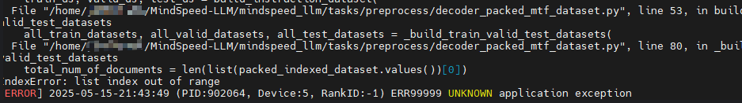
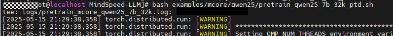

# MindSpeed LLM FAQ

- **Question 1**

  Q: Why does the training log show "Checkpoint path not found"?

  A: Check if `CKPT_LOAD_DIR` points to the correct weight conversion path. Confirm that the folder contains `.ckpt` or `.bin` files. Otherwise, correct the weight path setting.

- **Question 2**

  Q: Why does dataset loading show an "out of range" error?

  A: The fine-tuning script fails to load the dataset. Check if `DATA_PATH` in the script conforms to the example specifications.

  

- **Question 3**

  Q: Why is no runtime log file generated?

  A: You need to create the `logs` folder manually.

  

- **Question 4**

  Q: Why does training startup report "dataset xxx not exists" or "AssertionError: alpaca_text_document not exists"?

  A: Complete the data preprocessing workflow first and confirm that `DATA_PATH` or `--data-path` in the training script is correctly configured. For pretraining scenarios, ensure that the `.bin`/`.idx` files are successfully generated.

- **Question 5**

  Q: Why does weight conversion report "number of layers should be divisible by the pipeline parallel size"?

  A: The number of model layers must be divisible by the Pipeline Parallel Size. Check the `target_pipeline_parallel_size` configuration in the weight conversion script, or adjust the PP configuration and re-run the conversion.

- **Question 6**

  Q: Why does an NPU out of memory (OOM) error occur during training?

  A: Reduce memory usage by decreasing the `micro-batch-size`, shortening the `seq-length`, reducing the parallelism scale, or enabling recomputation. Also confirm that the current hardware specifications meet the training requirements of the corresponding model.

- **Question 7**

  Q: The documentation only mentions the Alpaca dataset format. Are other formats supported?

  A: Multiple instruction data formats are supported, including Alpaca, ShareGPT, Pairwise, and so on. File formats such as `.parquet`, `.json`, `.jsonl`, `.csv`, `.arrow`, and `.txt` are also supported, adapted through different `handler-name` settings.

- **Question 8**

  Q: Why does training startup report "Invalid device ID", "SetDevice failed", or NPU initialization failure?

  A: The number of visible NPUs does not match the startup parameters. For example, using `torchrun --nproc_per_node=8` when only 2 NPUs are available. Check the `npu-smi info` output and ensure `nproc_per_node` matches the actual number of devices.
