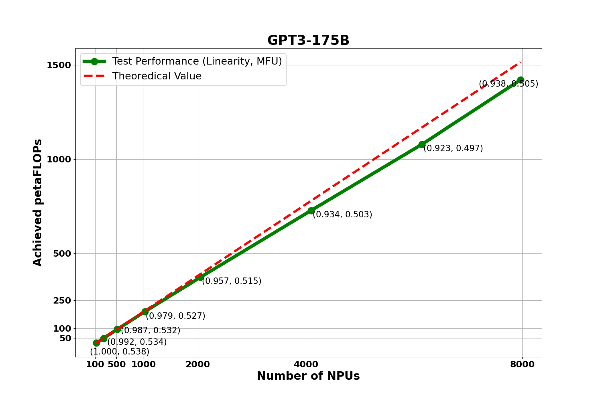

# Appendix

## FAQ

- **Question 1**

  Q: The training log shows "Checkpoint path not found"?
  A: Check whether `CKPT_LOAD_DIR` points to the correct path after weight conversion, and confirm that the folder contains `.ckpt` or `.bin` files. Otherwise, correct the weight path setting.

- **Question 2**

  Q: The dataset loading shows "out of range"?
  A: The fine-tuning script could not read the dataset. Check whether `DATA_PATH` in the script follows the sample format.

  

- **Question 3**

  Q: No runtime log file is generated?
  A: You need to create the `logs` folder yourself.

  

## Join the Ascend Developer Ecosystem

- 🌐 **Community resources**: Visit the [Ascend Open Source Community](https://gitcode.com/ascend) to get the latest model support.
- 📈 **Performance optimization**: Refer to [Profiling Data Collection](./pytorch/tools/profiling.md) to analyze bottlenecks.
- 💡 **Customization needs**: Extend custom models through `model_cfg.json`.

## Linearity

Based on the dense `GPT3-175B` LLM, we scaled the MFU and linearity experiments from 128 NPUs to 7,968 NPUs. The experimental data is shown below.

  

The figure shows the `MFU` values and the overall `linearity` of the cluster at the corresponding scale. You can click the following links to refer to the calculation formulas:

- [MFU calculation formula](https://gitcode.com/Ascend/MindSpeed-LLM/wiki/%E6%9C%AF%E8%AF%AD%E5%AE%9A%E4%B9%89%2F%E5%A4%A7%E6%A8%A1%E5%9E%8B%20MFU%20%E8%AE%A1%E7%AE%97%E5%85%AC%E5%BC%8F.md)
- [Linearity calculation formula](https://gitcode.com/Ascend/MindSpeed-LLM/wiki/%E6%9C%AF%E8%AF%AD%E5%AE%9A%E4%B9%89%2F%E7%BA%BF%E6%80%A7%E5%BA%A6%E5%85%AC%E5%BC%8F.md)
