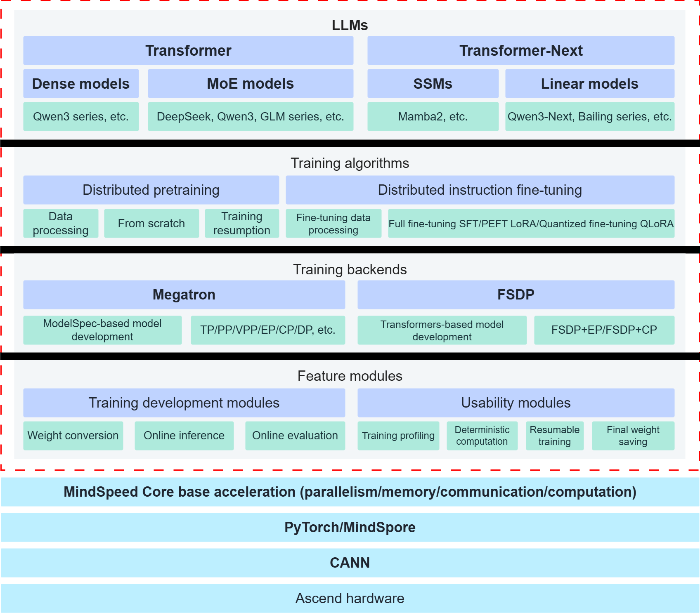

# Introduction

## Overview

MindSpeed LLM, as the Ascend LLM training framework, aims to provide Huawei Ascend hardware with an end-to-end large language model (LLM) training solution, including distributed pretraining, distributed instruction fine-tuning, and the corresponding development toolchain.

MindSpeed LLM supports LLMs built on the Transformer architecture, and it also supports the training and tuning of MoE models. It provides more than 100 mainstream reference models and ready-to-use model training scripts.

MindSpeed LLM is a distributed training framework for LLMs based on the MindSpeed training acceleration library. It integrates natively with the MindSpeed Core training acceleration library and delivers extreme optimization for LLM training on Ascend hardware from four aspects: parallel optimization, memory optimization, communication optimization, and computation optimization.

## MindSpeed LLM Architecture

The MindSpeed LLM architecture is shown in [Figure 1](#architecture) and consists of four layers:

- **MindSpeed LLM functional modules**.
  MindSpeed LLM provides a complete set of functional modules, including:
  - Megatron <-> Hugging Face weight conversion.
  - Distributed evaluation and inference for LLMs.
  - Profiling data collection for performance analysis and deterministic computation.
  - Checkpoint-based training resumption and final weight saving at the end of training.
- **MindSpeed LLM training backends**.
  - **Megatron training backend**: Based on Megatron-LM, it provides an incremental model development solution that uses ModelSpec as the template. You can develop a new model in weeks.
  - **FSDP2 training backend**: Based on MindSpeed-FSDP, it provides an incremental model development solution that directly integrates with third-party Transformers libraries. You can develop a new model in days.
- **MindSpeed LLM training algorithms**.
  - **Distributed pretraining**: Supports end-to-end distributed pretraining, including data processing and mainstream model and data partitioning schemes.
  - **Distributed instruction fine-tuning**: Supports multiple mainstream fine-tuning algorithms in the industry to achieve competitive training results.
- **Models supported by MindSpeed LLM**.
  - **More than 100 prebuilt reference models**: Covers mainstream Dense, MoE, and SSM families and provides high-performance model training scripts that are ready to use.
  - **Compatible with multiple mainstream LLM architectures**: Supports LLMs based on Transformer and SSM architectures.

**Figure 1** MindSpeed LLM architecture

## Features

- Mainstream LLMs: Supports more than 100 mainstream LLM models, including the Qwen3, DeepSeek, and Mamba2 family. It covers LLM architectures such as Dense, MoE, and SSM, and provides high-performance training scripts tailored for the Ascend architecture that are ready to use.

- Distributed pretraining: Supports distributed pretraining and provides a data preprocessing solution and multi-dimensional parallel strategies, including TP, PP, DP, CP, and EP.

- Distributed instruction fine-tuning: Supports mainstream industry fine-tuning algorithms such as full-parameter fine-tuning, LoRA, and QLoRA, and provides methods for fine-tuning performance and memory optimization.

- Model weight conversion: Supports weight conversion between Megatron and Hugging Face formats, as well as independent and merged conversion of LoRA fine-tuning weights.

- Online inference and evaluation: Supports distributed online inference for models and online evaluation on reference datasets.
