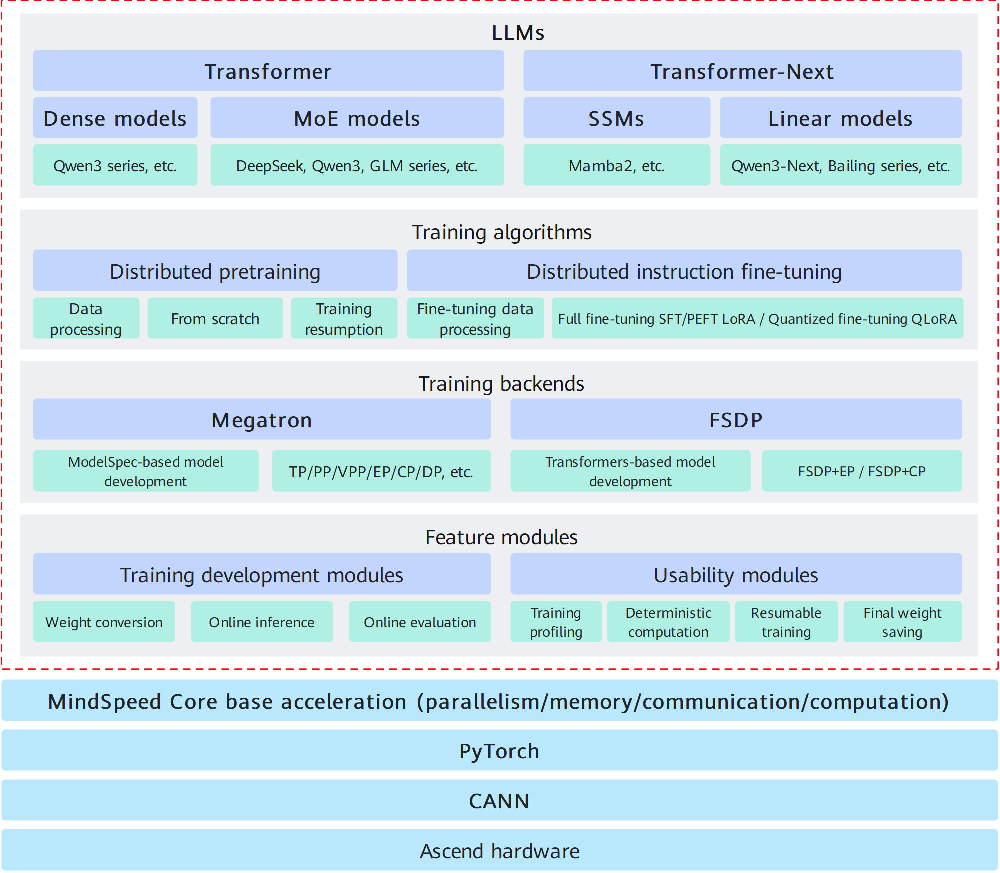

# Introduction

## Overview

MindSpeed LLM, as the Ascend large language model (LLM) training framework, aims to provide Huawei Ascend hardware with an end-to-end LLM training solution, including distributed pretraining, distributed instruction fine-tuning, and the corresponding development toolchain.

MindSpeed LLM supports multiple LLMs based on Transformer, including Dense models and MoE models, and provides more than 100 mainstream open-source models and ready-to-use training scripts, supporting model pretraining, fine-tuning, and efficient distributed training.

MindSpeed LLM is a distributed training framework for LLMs within the MindSpeed ecosystem. It integrates natively with the MindSpeed Core training acceleration library and is designed for Ascend hardware to optimize LLM training from four aspects: parallel optimization, memory optimization, communication optimization, and computation optimization.

## MindSpeed LLM Architecture

The MindSpeed LLM architecture is shown in [Figure 1](#architecture) and consists of four layers:

- **MindSpeed LLM functional modules**.
  MindSpeed LLM provides a complete set of functional modules, including:
  - Megatron <-> Hugging Face weight conversion.
  - Distributed evaluation and inference for LLMs.
  - Profiling data collection for performance analysis and deterministic computation.
  - Checkpoint-based training resumption and final weight saving at the end of training.
- **MindSpeed LLM training backends**.
  - **Megatron training backend**: Based on Megatron-LM, it provides an incremental model development solution that uses ModelSpec as the template. You can develop a new model in weeks or days.
  - **FSDP2 training backend**: Based on MindSpeed-FSDP, it provides an incremental model development solution that directly integrates with third-party Transformers libraries. You can develop a new model in days.
- **MindSpeed LLM training workflows**.
  - **Distributed pretraining**: Supports end-to-end distributed pretraining, including data processing and mainstream model and data partitioning schemes.
  - **Distributed instruction fine-tuning**: Supports multiple mainstream fine-tuning algorithms in the industry to achieve competitive training results.
- **MindSpeed LLM model support**.
  - **More than 100 prebuilt open-source models**: Covers mainstream Dense, MoE, and State Space Model (SSM) families and provides high-performance model training scripts that are ready to use.
  - **Compatible with multiple mainstream LLM architectures**: Supports LLMs based on Transformer and SSM architectures.

**Figure 1** MindSpeed LLM architecture

## Features

- Mainstream LLMs: Supports more than 100 mainstream LLM models, including the Qwen3, DeepSeek, and Mamba2 family. It covers LLM architectures such as dense, MoE, and SSM, and provides high-performance training scripts tailored for the Ascend architecture that are ready to use.

- Distributed pretraining: Provides end-to-end distributed pretraining, including a data preprocessing solution and multi-dimensional parallel strategies, including tensor parallelism (TP), pipeline parallelism (PP), data parallelism (DP), context parallelism (CP), and expert parallelism (EP).

- Distributed instruction fine-tuning: Supports mainstream industry fine-tuning algorithms such as full-parameter fine-tuning and LoRA, and provides methods for fine-tuning performance and memory optimization.

- Model weight conversion: Supports weight conversion between Megatron and Hugging Face formats, as well as independent and merged conversion of LoRA fine-tuning weights.

- Online inference and evaluation: Supports distributed online inference for models, as well as online evaluation based on public datasets and standard benchmark datasets.
