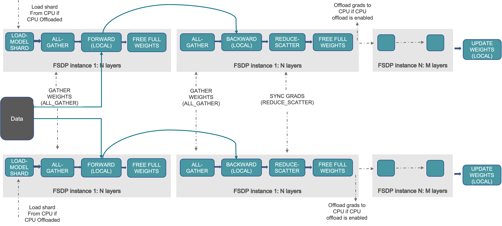
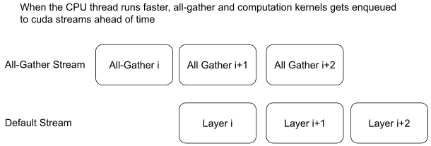

# Introduction to PyTorch FSDP2 Backend Features

FSDP2 is the next-generation paradigm for PyTorch distributed parallelism. It aims to address the pain points of FSDP1, which uses the `FlatParameter` wrapper pattern, in flexibility and composability. Instead of wrapping a model with a Python class, it performs in-place parallelization through the **`torch.distributed.fsdp.fully_shard`** API.

---

## FSDP2 vs. FSDP1: from FlatParameter to Per-Parameter Sharding

Unlike FSDP1, which flattens multiple parameters into one large `FlatParameter`, FSDP2 adopts the **Per-Parameter Sharding** strategy.

* **FSDP1 (legacy)**: It flattens and concatenates all parameters within a layer, then splits the resulting large 1D vector. This breaks the original parameter structure of the model, which makes some parameter operations, such as custom initialization and fine-tuning of specific layers, more complex.
* **FSDP2 (new)**: It keeps the original parameter structure of the model unchanged. Each parameter (`nn.Parameter`) is sharded and managed separately. This design gives FSDP2 extremely strong composability, which makes it easy to combine with Tensor Parallel (TP) or checkpointing.

## Working Principle

In **DistributedDataParallel (DDP)** training, each rank holds a complete copy of the model and processes an independent data batch. Then, it synchronizes gradients across all ranks through **All-Reduce**.

Compared with DDP, **Fully Sharded Data Parallel (FSDP)** significantly reduces memory usage by sharding model parameters, gradients, and optimizer states. Therefore, it makes it possible to train extremely large LLMs when single-GPU memory is limited.

FSDP parameter lifecycle:

As shown in the following figure, FSDP decomposes the DDP All-Reduce operation into Reduce-Scatter and All-Gather:

<div align="center">

</div>

1. **Fully Sharded (Quiescent State)**: Outside forward and backward computation, parameters are fully sharded. Each GPU stores only 1/N of them.
2. **All-Gather (Preparation State)**: Before forward and backward passes begin, the sharded parameters are gathered into complete parameters through broadcast.
3. **Compute (Computation State)**: Use the complete parameters for computation.
4. **Reduce-Scatter (Synchronization State)**: During the backward pass, the computed full gradient is immediately reduced and sharded into gradient slices through Reduce-Scatter.
5. **Update (Update State)**: The optimizer uses gradient slices to update sharded parameters. Therefore, the optimizer states are also sharded.

## DTensor

FSDP2's underlying foundation is **DTensor (`torch.distributed.tensor.DTensor`)**.

* **Logical and physical view separation**:
* **Logically**: The parameter still appears to be a complete tensor, for example `[4096, 4096]`, which preserves the same programming experience as single-GPU training.
* **Physically**: The parameter is actually sharded and distributed across the device group defined by the `DeviceMesh`, for example, each GPU holds only a `[512, 4096]` local tensor.
* **DeviceMesh**: FSDP2 relies on `DeviceMesh` to describe the topology of devices. Therefore, it natively supports multidimensional parallelism, for example 2D FSDP or FSDP + TP, by defining different mesh dimensions.

## Mixed Precision

FSDP2 provides flexible precision control through `MixedPrecisionPolicy`, which strictly distinguishes storage precision, compute precision, and communication precision.

* **Param Dtype (Compute)**: Before forward and backward computation, FSDP2 automatically casts parameters to low precision, such as `bfloat16`.
* **Reduce Dtype (Communication)**: During gradient synchronization in the Reduce-Scatter stage, gradients are usually cast to high precision, such as `float32`, for accumulation to ensure numerical stability.
* **Buffer Dtype**: It independently controls the precision of buffers, such as BatchNorm statistics, to prevent overflow.

```python
# FSDP2 mixed-precision conversion process
mp_policy = MixedPrecisionPolicy(param_dtype=torch.bfloat16, reduce_dtype=torch.float32)
# Forward: Parameters (FP32 storage) -> Cast to BF16 -> Compute
# Backward: Gradients (BF16) -> Cast to FP32 -> All-Reduce
```

## Communication and Compute Overlap

To maximize training efficiency, FSDP2 implements a highly optimized communication-compute overlap mechanism, namely **prefetching**.

<div align="center">

</div>

Reference: https://docs.pytorch.org/docs/2.7/distributed.fsdp.fully_shard.html#pytorch-fsdp2-fully-shard
