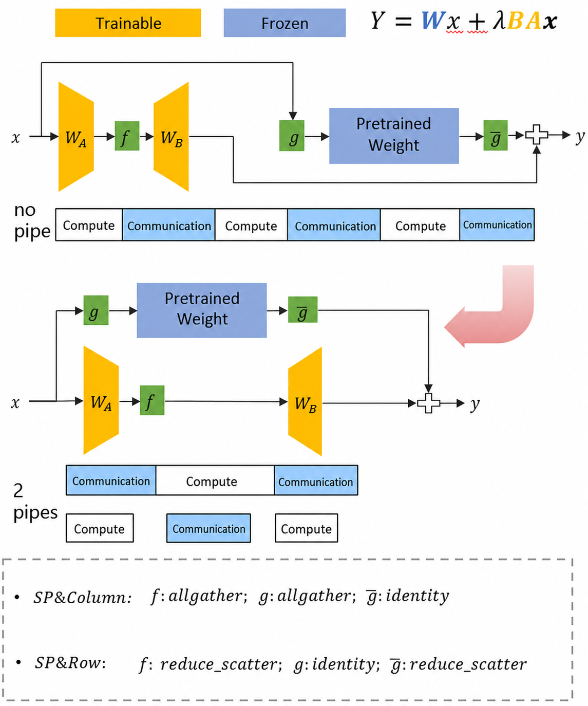

# CCLoRA

## Problem Analysis

The LoRA fine-tuning algorithm updates low-rank matrices attached to frozen pretrained model weights, which enables efficient model fine-tuning. During this process, the forward and backward passes of the frozen pretrained weights and the low-rank weights run serially. In distributed scenarios, this creates redundant communication overhead. The pretrained branch and the update branch are independent. Therefore, asynchronous execution can optimize compute and communication. In addition, by identifying mathematically equivalent computation paths, you can cover a wide range of scenarios and achieve the highest possible performance.

## Solution

1. Optimize the single pipeline into a dual pipeline for communication and computation:

   

2. Merge communication through mathematically equivalent transformations:

   In the SP and Row scenarios, $B$ is a standard linear layer, and the parameters are identical on each device. The backward gradient of $A$ can be transformed as follows:
   $$
   \mathrm{grad}_a = all\_gather(\mathrm{grad}_y * B) = all\_gather(\mathrm{grad}_y) * B \\
   $$
   The gradient computation for $x$ can reuse $all_gather(\mathrm{grad}_y)$ obtained during MC2 computation:
   $$
   \mathrm{grad}_x = all\_gather(\mathrm{grad}_y) * X \\
   $$
   Therefore, after the transformation, you can omit the following communication:
   $$
   all\_gather(\mathrm{grad}_y * B)
   $$

3. Optimize the scaling logic through mathematically equivalent transformations.

$$
  Input: x\in\mathbb{R}^{B\times S\times H}, \quad Output: Y = Wx + \lambda BAx = \begin{cases}
  Y=Wx+B(\lambda A)x, & \text{if } BS < H \\
  Y=(W+B\lambda A)x, & \text{if } BS\geq H
  \end{cases}
$$

## Usage

For RC2 and later versions, the LoRA fine-tuning scenario is compatible with PP, VPP, distributed optimizers, and similar scenarios.

Enable CCLoRA acceleration by setting `--lora-fusion`.

Note: CCLoRA conflicts with the `--overlap-param-gather` feature. Do not use them together.

## Results

The hardware used for the following validation is an Atlas 900 A2 PODc cluster at a scale of 1 x 8.

| Model | NPU | TP | PP | SP | Baseline Throughput | CCLoRA+ Throughput | Performance Gain |
| :---: | :--: | :--: | :--: | :--: | :------: | :---------: | :------: |
| Llama-2-7B dynamic | 8 | 8 | 1 | √ | 9.72 | 13.64 | 40.3% |
| Llama-2-7B pack | 8 | 8 | 1 | √ | 5.97 | 6.65 | 11.5% |
| Mixtral-7*8B dynamic | 8 | 1 | 4 | × | 13.97 | 20.55 | 47.1% |
| Llama-2-70B dynamic | 8 | 1 | 4 | × | 13.50 | 14.75 | 9.3% |
