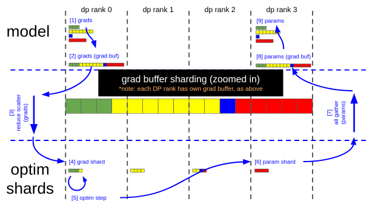
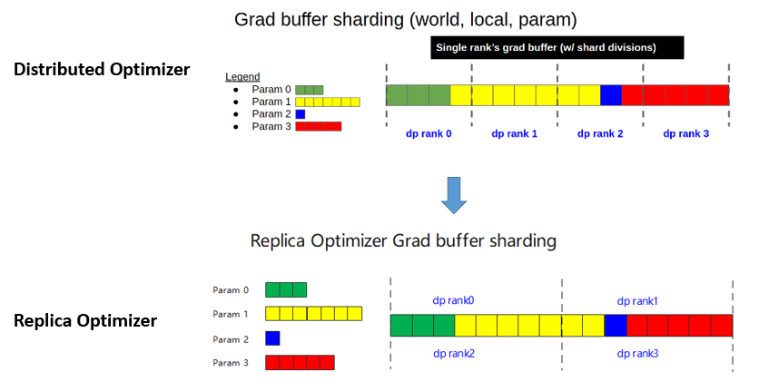

# Ascend High Availability

## Overview

This document provides an introduction to this feature only. If you need the full high-availability feature set, refer to the official [MindCluster Guide](https://www.hiascend.com/software/mindcluster).

## Use Cases

The idea behind the distributed optimizer is to save memory by distributing optimizer states evenly across data parallel groups. Based on this idea, MindIO designed a scheme that splits the data parallel group into two replica data parallel groups. The replica optimizer distributes optimizer states evenly across the replica data parallel groups and backs up each optimizer state. Because this feature increases on-chip memory use to some extent, you are advised to use it in large-scale clusters with 1,000 devices or more to reduce machine-time loss caused by failures. Together with the in-house high-availability framework from Huawei, it supports the following features.

### Try-To-Persist (TTP) Checkpoint

After a failure occurs during training, the system checks the integrity and consistency of the intermediate data of the optimizer and generates a last-gasp checkpoint. When you resume training, the system can restore the state from that checkpoint to the moment just before the failure, which reduces the training iteration loss caused by the failure.

### UCE Step-Level Recomputation Feature

Ascend chips support real-time detection of uncorrectable errors (UCEs) in NPU memory. When a UCE is detected, the system uses the optimizer-state replica mechanism to repair the affected device online and resume training, minimizing training loss.

### Elastic Training Feature

After a failure occurs during training, if the cluster has no idle resources available for replacement, the system shrinks some nodes and continues training based on the optimizer-state replica mechanism. When idle resources become available in the training cluster, the system expands back to the original size and continues training based on the optimizer-state replica mechanism.

Currently, the system supports only data parallel-level elastic training. That is, it shrinks or expands some data parallel domains at data parallel granularity.

### Working Principle

The following figure shows the data flow and working principle of the native distributed optimizer in Megatron.

The replica optimizer backs up optimizer states by designing optimizer parameters to distribute evenly across the replica DP groups. Therefore, it provides mechanism-level support for the TTP and UCE features.

Compared with the distributed optimizer, the replica optimizer increases memory use. The relative footprint is as follows.

|                                  | Non-distributed Optimizer | Distributed Optimizer | Replica Optimizer |
|----------------------------------|---------------------------|-----------------------|-------------------|
| fp16/bf16 params, fp16/bf16 grads | 20                        | 4 + 16/d              | 4 + 32/d          |
| fp16/bf16 params, fp32 grads      | 18                        | 6 + 12/d              | 6 + 24/d          |

## How to Use

### Prerequisites

MindIO features are provided as a wheel package.

`mindio_ttp` download link: [MindIO TTP package download - Ascend Community](https://gitcode.com/Ascend/mind-cluster/blob/branch_v26.0.0/docs/zh/scheduling/fault_recovery_acceleration/02_installation_and_deployment.md#%E5%87%86%E5%A4%87%E8%BD%AF%E4%BB%B6%E5%8C%85).

### Adding Launch Arguments to the Startup Script

`--enable-high-availability`: enables the global switch for high-availability features and the TTP checkpoint feature. When saving a checkpoint, the system requires at least one complete copy of the optimizer data globally.

`--enable-hbmfault-repair`: enables the on-chip memory fault and step-level recomputation feature. This feature performs online worker-level repair. When repairing a failure, the system requires at least one replica device for the faulty device to exist globally.

`--enable-worker-reboot`: enables the air-refueling feature. When you enable it together with the MindCluster components that support the related features, the system performs process-level restart-based repair and continues training during general failures. This feature restarts the node that hosts the faulty device. When repairing a failure, the system requires at least one complete copy of the optimizer data to exist on the non-faulty nodes.

`--distributed-optimizer-no-replica`: uses checkpoint files for recomputation and air-refueling repair instead of the replica optimizer. A checkpoint file must exist when a failure occurs.

`--enable-elastic-training`: enables elastic training. When you enable it together with the MindCluster components that support the related features, the system shrinks some nodes and continues training during general failures when no idle chip resources are available. When chip resources become available, the system expands back to the original size and continues training. This feature removes the node that corresponds to the data parallel domain of the faulty device. When repairing a failure, the system requires at least one complete copy of the optimizer data to exist on the non-faulty nodes.

### Adding Environment Variables to the Startup Script

To avoid configuring switches for multiple components when you use MindX, add environment variables. Environment variables take precedence over CLI arguments. If you set an environment variable, the system uses it first.

`export HIGH_AVAILABILITY=dump`: enables `--enable-high-availability`.

`export HIGH_AVAILABILITY=retry`: enables `--enable-high-availability` and `--enable-hbmfault-repair`.

`export HIGH_AVAILABILITY=recover`: enables `--enable-high-availability` and `--enable-worker-reboot`.

`export HIGH_AVAILABILITY=elastic-training`: enables `--enable-high-availability` and `--enable-elastic-training`.

## Usage Constraints

Because of the fundamental limitations, ensure that the data parallel size is greater than 1 when you perform 3D parallel partitioning (P+T+D) so that complete optimizer state data remains available after a failure. When you use the MoE feature, you also need the data parallel size of both the dense layers and the sparse layers to be greater than 1. When you use long-sequence parallelism, `dp_cp_size` must also be greater than 1.

### Elastic Training Usage Constraints

In addition to the usage constraints above, elastic training also requires the following constraints.

1. Currently, the system supports only `enable-high-availability` and `use-distributed-optimizer`.

2. Currently, the system supports only scenarios where `use-custom-fsdp` and `reuse-fp32-param` are disabled.

3. Currently, the system supports only data parallelism, tensor parallelism, and pipeline parallelism.

4. After a scale-down, the system cannot scale down again. Scaling out supports only a direct return to the original size.

See: [MindIO TTP Constraints and Limitations - Ascend Community](https://gitcode.com/Ascend/mind-cluster/blob/branch_v26.0.0/docs/zh/scheduling/fault_recovery_acceleration/02_installation_and_deployment.md#%E7%BA%A6%E6%9D%9F%E9%99%90%E5%88%B6)

### Checkpoint Saving and Loading Optimization

When `enable-high-availability` is enabled and the MindIO ACP SDK is installed in the environment, the system uses the first-level asynchronous checkpoint saving and loading optimization from `mindio_acp`.

See: [MindIO TTP Constraints and Limitations - Ascend Community](https://gitcode.com/Ascend/mind-cluster/blob/branch_v26.0.0/docs/zh/scheduling/fault_recovery_acceleration/02_installation_and_deployment.md#%E7%BA%A6%E6%9D%9F%E9%99%90%E5%88%B6)
