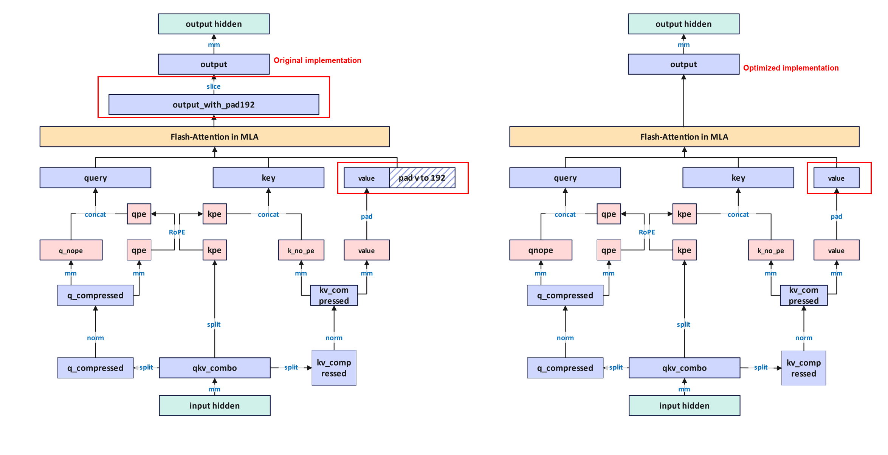
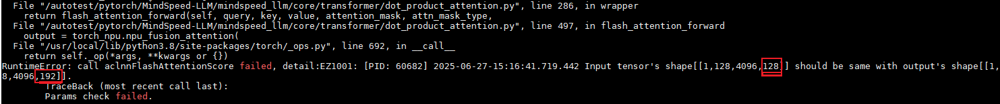
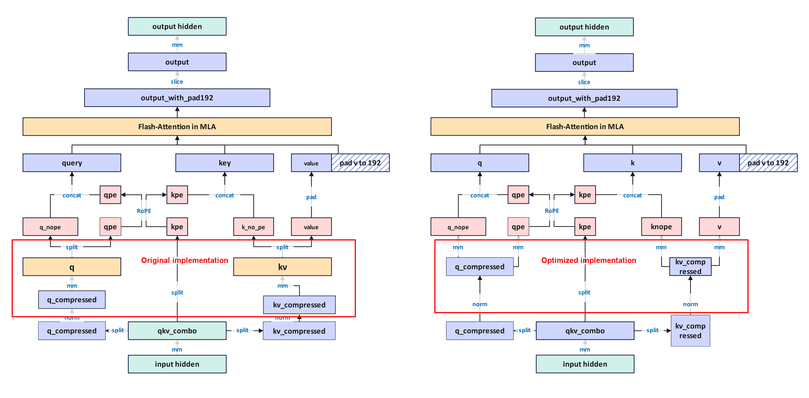

# Multi-Latent Attention

## Usage Scenarios

### Problem Description

The DeepSeek series models introduced Multi-Head Latent Attention (MLA) to replace traditional multi-head attention.
Specifically, MLA uses low-rank joint key-value compression to reduce KV cache overhead during inference, and its model quality remains comparable to traditional MHA.

The evolution from MHA to MLA is shown in the figure.

### Feature Description

`--multi-latent-attention`

Use this flag to enable MLA. When you enable this parameter in a script, it replaces the attention module with the MLA architecture.

`--mla-fa-without-pad`

As shown in the figure, when this feature is disabled and the dimensions of `query` and `key` do not match the dimension of `value`, the system pads the `value` dimension to the same size as `query` and `key` before it enters FA for computation. When you enable this feature, the system skips padding before FA. Therefore, it reduces padding operations, lowers extra memory usage, and improves training performance.

**CANN 8.2.RC1 or later is recommended. If you encounter a shape mismatch error during the FA computation shown in the figure, update the CANN package.**

`--mla-mm-split`

When the system upsamples the compressed `q_compressed` and `kv_compressed` tensors, `q_compressed` becomes `q_no_pe` and `q_pos_emb`, and `kv_compressed` becomes `k_no_pe` and `value`. Therefore, the system can use two approaches for the upsampling operation, as shown below.

- When you enable `--mla-mm-split`, the matrix used to multiply `q_compressed` is initialized as two matrices, `linear_qk_nope` and `linear_qk_rope`. Multiplying `q_compressed` by these two matrices directly produces `q_no_pe` and `q_pos_emb`. The matrix used to multiply `kv_compressed` is initialized as two matrices, `linear_kv_nope` and `linear_v`. Multiplying `kv_compressed` by these two matrices produces `k_no_pe` and `value`. This approach removes two `split` operations, which avoids non-contiguous tensors and optimizes the cost of converting tensors to contiguous layout. However, because it splits one large matrix multiplication into two, it reduces matrix multiplication efficiency. At the same time, in scenarios with heavy TP communication, it may introduce additional communication overhead.
- Without `--mla-mm-split`, the matrix used to multiply `q_compressed` is initialized as one matrix, `linear_q_up_proj`. Multiplying `q_compressed` by this large matrix produces the result, and then the system splits it into `q_no_pe` and `q_pos_emb`. The matrix used to multiply `kv_compressed` is initialized as one matrix, `linear_kv_up_proj`. Multiplying `kv_compressed` by this large matrix produces the result, and then the system splits it into `k_no_pe` and `value`. Compared with enabling `--mla-mm-split`, disabling this feature improves matrix computation efficiency, but it may introduce the cost of converting tensors to contiguous layout.

**You are advised to this feature in scenarios without TP or in scenarios with low TP communication volume.**

`--enable-mla-absorb`

Matrix absorption is an optimization technique in MLA. It merges the upsampling matrices and the output projection matrix, which converts the original MHA-based attention mechanism in MLA into MQA and therefore reduces memory overhead. In the MLA attention flow, the system would normally first use the upsampling matrices to restore the low-rank latent representation to the full dimension, then perform attention computation, and finally use the output projection matrix to produce the final output. Matrix absorption merges the `q` and `k` upsampling matrices, the `v` upsampling matrix, and the output projection matrix in advance, and it performs attention computation directly in the low-rank latent space.

- At present, you must use matrix absorption together with `--use-sparse-flash-attn`.

`--use-sparse-flash-attn`

Uses `sparse_flash_attention`, the sparse attention mechanism. It uses Lightning Indexer to select the top `k` most relevant tokens for attention computation. Therefore, it significantly reduces computation while maintaining model quality. Use it together with `--enable-dsa-indexer`.

`--mla-swap-core-attn-out`

When `--multi-latent-attention` is enabled, enable `--mla-swap-core-attn-out` to prefetch the core attention output and reduce memory overhead.

## Usage Constraints

`--multi-latent-attention`

If you use the MLA feature, specify a spec that supports MLA in the shell script. The specs that currently support MLA in the repository are `deepseek_spec` and `minicpm_spec`. Also add `--multi-latent-attention` to the shell script.

`--mla-swap-core-attn-out`

If you use `--mla-swap-core-attn-out`, also enable `--moe-fb-overlap` and `dualpipev`.
