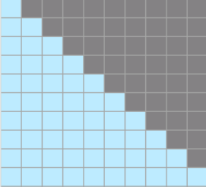
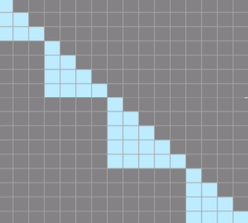

# Variable-Length FlashAttention Training Scenarios

## Training Scenarios

Within a batch, the input text sequence usually comes from concatenating multiple documents (docs). By default, the system treats multiple documents as a single sequence, and it does not mask self-attention between them. In some cases, the documents must remain independent, and self-attention must not cross document boundaries. In this case, the attention mask and position IDs must be reset at each end-of-document (EOD) position.

## Solution

The variable-length mode of the underlying FlashAttention operator supports this training scenario.

## Usage

### 1. Data Preparation

First, ensure that you add an EOD token to the end of each document.

```shell
python ./preprocess_data.py \
   --input ./dataset/train-00000-of-00001-a09b74b3ef9c3b56.parquet \
   --tokenizer-name-or-path ./model_from_hf/Llama3-hf/ \
   --output-prefix ./dataset/enwiki \
   --workers 4 \
   --log-interval 1000  \
   --append-eod \ # To enable TND, you must add EOD.
   --tokenizer-type PretrainedFromHF
```

### 2. Training Parameter Settings

Add the `--reset-attention-mask` parameter to the model training script.

After you enable it, the system generates the `actual_seq_len` variable based on the EOD positions to indicate the actual length of the concatenated documents.

## How It Works

### 1. before Enablement

Initialize `attn_mask` as a compressed lower-triangular matrix (`2048*2048`).



Multiple documents are treated as a single sequence, self-attention between them is not masked, and all tokens participate in the computation.

### 2. after Enablement

Do not initialize a mask. Instead, generate `actual_seq_len` based on the EOD positions. Suppose the true text lengths in one sequence are `[2, 2, 0, 2, 2]`. Then `actual_seq_len` is `[2, 4, 4, 6, 8]`.
The actual compute cost depends on `actual_seq_len`.

`attn_mask` can be represented as follows, although the system does not generate it during actual computation:



The blank area in the lower left does not participate in the computation.
