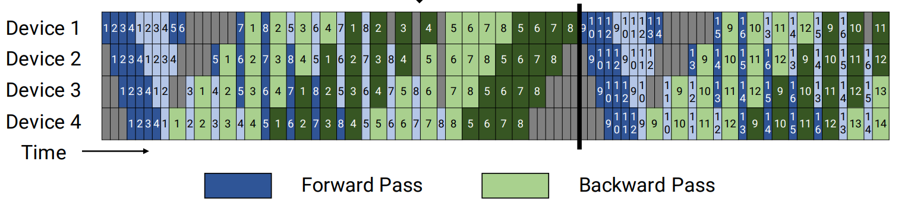

# Virtual Pipeline Parallelism

## Problem Analysis

PipeDream pipeline parallelism uses a chunk size that is too large. During execution, many pipeline bubbles remain, and there is still room to improve compute resource utilization.

## Solution

Further subdivide the computation to reduce bubbles.

### Approach

With the number of devices unchanged, divide the workload into more pipeline stages and trade additional communication for a lower bubble ratio.

[Original paper link](https://people.eecs.berkeley.edu/~matei/papers/2021/sc_megatron_lm.pdf)

For ease of understanding, here is an example. Assume that the model has 16 layers, the tensor parallel size is 1, the pipeline parallel size is 4, and the virtual pipeline parallel size is 2. The model is divided into 4 * 2 = 8 stages, and each stage has 16 / 8 = 2 layers.

    Device 0: [1, 2] [9, 10]
    Device 1: [3, 4] [11, 12]
    Device 2: [5, 6] [13, 14]
    Device 3: [7, 8] [15, 16]

The forward order is `device 0 -> device 1 -> device 2 -> device 3 -> device 0 -> device 1 -> device 2 -> device 3`.

## Use Cases

To further reduce the bubble ratio and improve performance.

## Usage

Set `--num-layers-per-virtual-pipeline-stage N`. This specifies the number of layers in each stage. The total number of layers must satisfy `L % N == 0`.

## Effects

The bubble ratio decreases further.

## Notes

Megatron virtual pipeline parallelism (VPP) affects the weight sharding scheme. When you save and load weights, ensure that the VPP configuration stays consistent so the weights load correctly.
