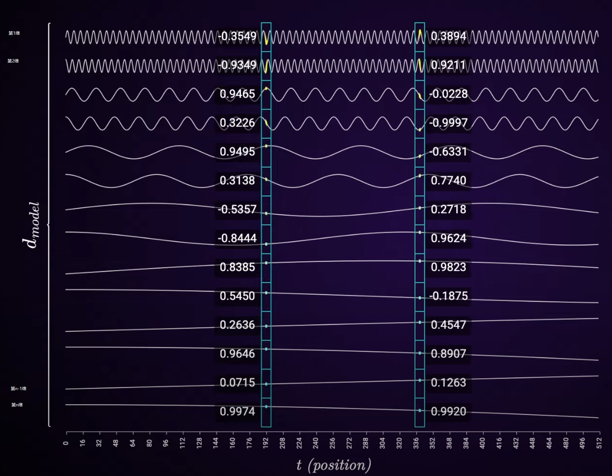

# YaRN

## Feature Introduction

Transformer-based LLMs have become the default choice for many natural language processing tasks, where long-range capabilities such as in-context learning are essential. One of the main limitations of pretrained LLMs in these tasks is the maximum sequence length, that is, the context window, which the training process determines. Traditional Transformer models have O(n^2) computational and memory complexity, where n is the sequence length. As the sequence length grows, compute and memory costs rise sharply. Therefore, technologies that can dynamically extend the context window with little fine-tuning, or even no fine-tuning, become very important.

YaRN adjusts positional encoding through `ntk-by-part` to improve accuracy after sequence expansion.

As shown in the figure, for a token embedding, the rotary positional encoding `θ` increases gradually from lower dimensions to higher dimensions, that is, the frequency decreases gradually. The lower-frequency periods are less than 1, while the higher-frequency periods are far greater than 1. YaRN extrapolates the high-frequency part directly, linearly interpolates the low-frequency part, and linearly transitions through the middle region between them.

## Usage

For models that use RoPE as positional encoding, you can use YaRN to extend the context length during inference. The following example uses the DeepSeek V2 configuration.

On the DeepSeek V2 series, enable YaRN with `--rope-scaling-type yarn`. Other configuration parameters are as follows.

- `--beta-fast` The number of high-frequency rotation periods. The default value is 32.
- `--beta-slow` The number of low-frequency rotation periods. The default value is 1.
- `--rope-scaling-factor` The context extension factor. The high-frequency dimensions use it for extrapolation. For example, if the pretrained model has a 4K context and you extend it to 160K tokens, the factor is 40.
- `--rope-scaling-mscale` The input parameter of the attention scaling coefficient function `yarn_get_mscale`.
- `--rope-scaling-mscale-all-dim` The input parameter of the attention scaling coefficient function `yarn_get_mscale`.
- `--rope-scaling-original-max-position-embeddings` The context length before the pretrained model is extended.

## Effects

Using the default YaRN configuration in the DeepSeek V2 series, the MMLU accuracy results are as follows.

| Model | Task | MindSpeed LLM | Community Version |
|------|------|---------------|-----------|
| DeepSeek-V2-Lite-16B | MMLU | 57.4% | [58.3%](https://huggingface.co/deepseek-ai/DeepSeek-V2-Lite) |
| DeepSeek-Math-7B | MMLU-STEM | 56.5% | [56.5%](https://github.com/deepseek-ai/DeepSeek-Math) |
| DeepSeek-V2-236B | MMLU | 78.1% | [78.5%](https://huggingface.co/deepseek-ai/DeepSeek-V2) |
| DeepSeek-V2.5 | MMLU | 79.3% | [80.6%](https://huggingface.co/deepseek-ai/DeepSeek-V2.5) |
