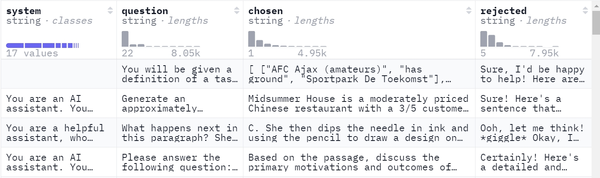

# Pairwise Dataset Processing

In post-training tasks for LLMs, such as RLHF, you usually need datasets based on human preference feedback. These corpora contain human preferences or evaluations of different answers or different phrasings for the same question. In DPO tasks, the commonly used dataset format is pairwise. As the name suggests, a pairwise dataset contains paired examples. For the same question, it contains two answers, one preferred (`chosen`) and one rejected (`rejected`). For example, the [orca_dpo_pairs](https://huggingface.co/datasets/Intel/orca_dpo_pairs) dataset contains four fields: `system`, `question`, `chosen`, and `rejected`.



Example pairwise dataset entry:

```json
{"system": "You are an AI assistant. You will be given a task. You must generate a detailed and long answer.",
 "question": "Generate an approximately fifteen-word sentence that describes all this data: Midsummer House eatType restaurant; Midsummer House food Chinese; Midsummer House priceRange moderate; Midsummer House customer rating 3 out of 5; Midsummer House near All Bar One",
 "chosen": "Midsummer House is a moderately priced Chinese restaurant with a 3/5 customer rating, located near All Bar One.",
 "rejected": " Sure! Here's a sentence that describes all the data you provided:\n\n\"Midsummer House is a moderately priced Chinese restaurant with a customer rating of 3 out of 5, located near All Bar One, offering a variety of delicious dishes.\""
 }
```

## Common Pairwise Datasets

Common pairwise datasets include:

- [orca_dpo_pairs](https://huggingface.co/datasets/Intel/orca_dpo_pairs)
- [orpo-dpo-mix-40k](https://huggingface.co/datasets/mlabonne/orpo-dpo-mix-40k)
- [alpaca_messages_2k_dpo_test](https://huggingface.co/datasets/fozziethebeat/alpaca_messages_2k_dpo_test)

## Downloading a Pairwise Dataset

You can download a pairwise dataset directly from the web page or from the CLI. For example:

```shell
mkdir -p dataset
cd dataset/
wget https://huggingface.co/datasets/Intel/orca_dpo_pairs/resolve/main/orca_rlhf.jsonl
cd ..
```

## How to Process a Pairwise Dataset

Pairwise-format data preprocessing script:

```shell
source /usr/local/Ascend/cann/set_env.sh # Change this to the actual Toolkit package path.
mkdir ./pairwise_dataset

python ./preprocess_data.py \
    --input ./dataset/orca_rlhf.jsonl \
    --tokenizer-type PretrainedFromHF \
    --tokenizer-not-use-fast \
    --tokenizer-name-or-path ./model_from_hf/Meta-Llama-3-8B-Instruct/ \
    --output-prefix ./pairwise_dataset/orca_rlhf_llama3 \
    --workers 4 \
    --log-interval 1000 \
    --handler-name AlpacaStylePairwiseHandler \
    --prompt-type llama3 \
    --map-keys '{"prompt":"question", "query":"", "system":"system"}'
```

`--prompt-type`

Use this to specify the model template. It helps the base model develop stronger conversational ability after fine-tuning. You can find the available `prompt-type` values in the [templates](../../../../mindspeed_llm/tasks/preprocess/templates.py) file.

`--handler-name`

When preprocessing a pairwise dataset, you can set `--handler-name` to `AlpacaStylePairwiseHandler` or `SharegptStylePairwiseHandler` to process Alpaca-style and ShareGPT-style pairwise datasets, respectively. It extracts the corresponding columns from the data according to the `--map-keys` parameter. For details about Alpaca-style and ShareGPT-style datasets and their corresponding `map-keys` parameters, see [Alpaca-Style Datasets](data_process_sft_alpaca_style.md) and [ShareGPT Datasets](data_process_sft_sharegpt_style.md).

### Launching the Script

MindSpeed LLM fine-tuning dataset processing scripts use the following naming convention and launch method:

```shell
# Mcore
# Naming and launch: examples/mcore/model_name/data_convert_xxx_pairwise.sh
bash examples/mcore/llama3/data_convert_llama3_pairwise.sh
```

The processed instruction-tuning dataset files are as follows:

```shell
./pairwise_dataset/orca_rlhf_llama3_packed_chosen_input_ids_document.bin
./pairwise_dataset/orca_rlhf_llama3_packed_chosen_input_ids_document.idx
./pairwise_dataset/orca_rlhf_llama3_packed_chosen_labels_document.bin
./pairwise_dataset/orca_rlhf_llama3_packed_chosen_labels_document.idx
./pairwise_dataset/orca_rlhf_llama3_packed_rejected_input_ids_document.bin
./pairwise_dataset/orca_rlhf_llama3_packed_rejected_input_ids_document.idx
./pairwise_dataset/orca_rlhf_llama3_packed_rejected_labels_document.bin
./pairwise_dataset/orca_rlhf_llama3_packed_rejected_labels_document.idx
```

When you run the DPO training task, set the dataset path to `./pairwise_dataset/orca_rlhf_llama3` and set the `--is-pairwise-dataset` parameter.
