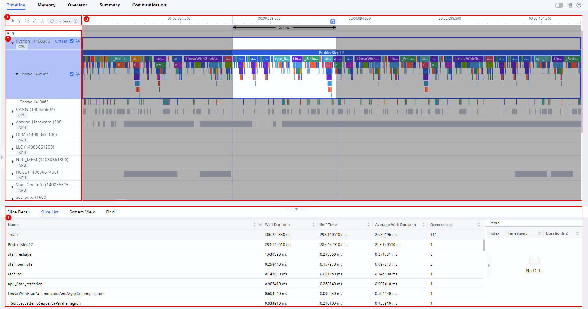
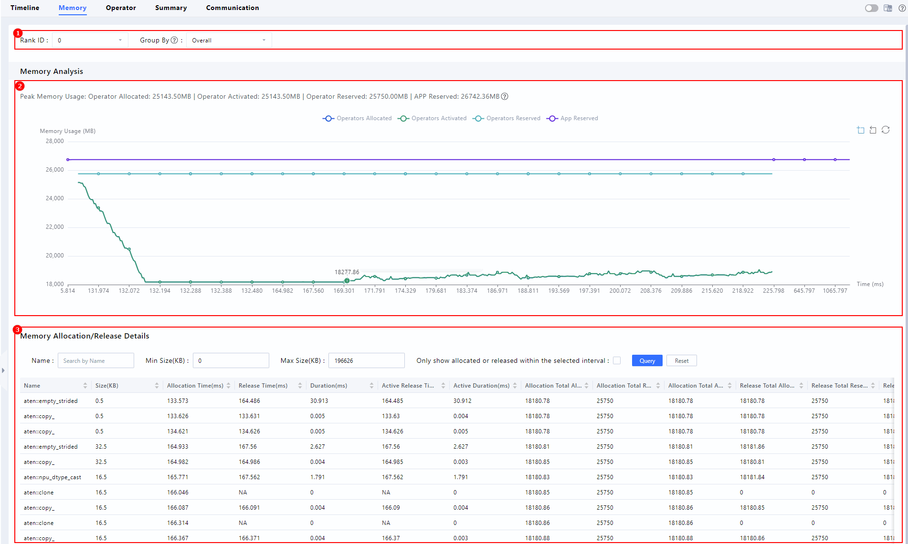
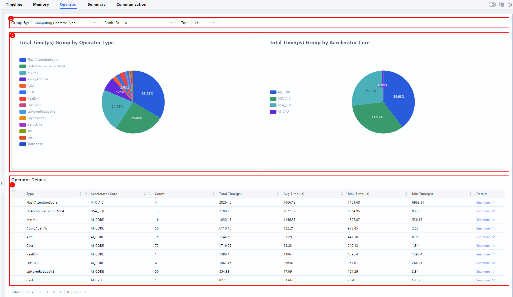

# Profiling Data Collection

## Overview

MindSpeed LLM supports profiling data collection on Ascend chips to help analyze model runtime behavior. To use it, add the corresponding parameters to the training script and run the script to start collecting data.

## MCore Backend Profiling

### Recommended Usage

Here are two configuration examples that show common usage scenarios.

- For a quick initial performance analysis, you can collect only CPU information from device 0 to inspect the ratio of communication time to computation time, the proportion of each operator, and operator scheduling information. The recommended configuration is as follows:

    ```shell
    --profile                            # Enable profiling data collection.
    --profile-step-start  5              # Start collecting from step 5.
    --profile-step-end 6                 # End at step 6, excluding step 6.
    --profile-ranks 0                    # Collect data from device 0.
    --profile-level level1               # Collect application-layer data, lower-level NPU data, NPU operator latency and communication operator latency, AscendCL data at the CANN layer, NPU AI Core performance metrics, and latency information for small communication operators.
    --profile-with-cpu                   # Collect CPU data for communication and scheduling analysis.
    --profile-save-path ./profile_dir    # Path to save the profiling data.
    ```

- If you want to view more detailed information, such as operator memory usage and detailed operator invocation information, you can add parameters such as `--profile-with-stack`, `--profile-with-memory`, and `--profile-record-shapes`. However, this increases data volume and degrades performance. The specific configuration is as follows:

    ```shell
    --profile                                       # Enable profiling data collection.
    --profile-step-start  5                         # Start collecting from step 5.
    --profile-step-end 6                            # End at step 6, excluding step 6.
    --profile-ranks 0                               # Collect data from device 0.
    --profile-level level1                          # Collect application-layer data, lower-level NPU data, NPU operator latency and communication operator latency, AscendCL data at the CANN layer, NPU AI Core performance metrics, and latency information for small communication operators.
    --profile-with-cpu                              # Collect CPU data for communication and scheduling analysis.
    --profile-with-stack                            # Collect instruction execution stack information.
    --profile-with-memory                           # Collect operator memory information.
    --profile-record-shapes                         # Collect operator shape information.
    --profile-save-path ./profile_dir_with_stack    # Path to save the profiling data.
    ```

### MCore Profiling Parameters

| Parameter | Type | Default | Description |
|------|------|--------|------|
| --profile | bool | false | Indicates whether to enable profiling. |
| --profile-step-start | int | 0 | Step at which to start collecting data, inclusive. |
| --profile-step-end | int | -1 | Step at which to stop collecting data, exclusive. Set it to `-1` to collect until training ends. |
| --profile-ranks | List[int] | [0] | Device IDs to collect. Set it to `-1` to collect profiling data from all ranks. |
| --profile-level | str | level0 | Data collection level:<br>• `level0`: Basic operator latency.<br>• `level1`: Adds AI Core utilization and communication operators. Recommended.<br>• `level2`: More detailed data, including cache and memory. |
| --profile-export-type | str | text | Export format for the profiling result file:<br>• `text`: Text format.<br>• `db`: Database format. |
| --profile-data-simplification | bool | false | Indicates whether to enable data simplification mode to reduce the size of the trace file. |
| --profile-with-cpu | bool | false | Indicates whether to collect CPU activity as well, such as data loading and scheduling. |
| --profile-with-stack | bool | false | Indicates whether to collect the instruction execution stack, which helps locate the code position. |
| --profile-with-memory | bool | false | Indicates whether to collect NPU memory allocation and release events, which help analyze memory peaks, fragmentation, and memory leaks. |
| --profile-record-shapes | bool | false | Indicates whether to collect compute shapes, which helps analyze memory usage and compute volume. |
| --profile-save-path | str | ./profile | Directory to save the profiling data. Each rank writes to its own file. |

## FSDP2 Backend Profiling

This tool is built on `torch_npu.profiler` and integrated into the MindSpeed FSDP2 training workflow. By configuring YAML or CLI parameters, you can automatically collect performance data at specified training steps and on specified ranks, and generate profiling files.

### Recommended Usage

Here are two configuration examples that show common usage scenarios. Add the profiling parameters under the `training` field in the YAML training configuration file:

1. For an initial performance analysis, you can collect only CPU information from device 0 to inspect the ratio of communication time to computation time, the proportion of each operator, and operator scheduling information. The recommended configuration is as follows:

    ```yaml
    training:
      # ... other training parameters ...

      # --- Profiling: initial performance analysis ---
      profile: true
      profile_step_start: 5
      profile_step_end: 6 # Collect [5, 6), left-closed and right-open.
      profile_ranks: [0] # Collect only device 0.
      profile_level: level1
      profile_with_cpu: true
      profile_save_path: ./profile_dir
    ```

2. If you want to further inspect operator memory usage and detailed operator invocation information, you can add `profile_with_stack`, `profile_with_memory`, and `profile_record_shapes`. However, this increases data volume and degrades performance. The specific configuration is as follows:

    ```yaml
    training:
      # ... other training parameters ...

      # --- Profiling: deep analysis (stack/memory/shape) ---
      profile: true
      profile_step_start: 5
      profile_step_end: 6 # Collect [5, 6), left-closed and right-open.
      profile_ranks: [0] # Collect only device 0.
      profile_level: level1
      profile_with_cpu: true
      profile_with_stack: true # Collect detailed operator invocation information.
      profile_with_memory: true # Collect memory usage information.
      profile_record_shapes: true # Record tensor shapes.
      profile_save_path: ./profile_dir_with_stack
    ```

### FSDP2 Profiling Parameters

| Parameter | Type | Default | Description |
|------|------|--------|------|
| profile | bool | false | Indicates whether to enable profiling. |
| profile_step_start | int | 0 | Global step at which to start collecting data, inclusive. |
| profile_step_end | int | -1 | Global step at which to stop collecting data, exclusive. `-1` means collect until training ends. |
| profile_ranks | List[int] | [-1] | List of ranks to collect. `[-1]` means all ranks. |
| profile_level | str | level0 | Collection level:<br>• `level_none`: Disabled.<br>• `level0`: Basic operator latency.<br>• `level1`: Adds AI Core utilization and communication operators. Recommended.<br>• `level2`: More detailed data, including cache and memory. |
| profile_export_type | str | text | Export format:<br>• `text`: Text format.<br>• `db`: Database format. |
| profile_data_simplification | bool | false | Indicates whether to enable data simplification to reduce the size of the trace file. |
| profile_with_cpu | bool | false | Indicates whether to collect CPU activity as well, such as data loading and scheduling. |
| profile_with_stack | bool | false | Indicates whether to record the function call stack, which helps locate the code position. |
| profile_with_memory | bool | false | Indicates whether to collect NPU memory allocation and release events, which help analyze memory peaks, fragmentation, and memory leaks. |
| profile_record_shapes | bool | false | Indicates whether to record tensor shapes, which helps analyze memory usage and compute volume. |
| profile_save_path | str | ./profile | Directory to save the trace file. Each rank writes to its own file. |

## Output Files

After training ends, a profiling file is generated in the specified path. Example:

```shell
localhost.localdomain_3687609_20260129150104894_ascend_pt
```

The directory structure of this file is as follows:

```shell
 localhost.localdomain_3687609_20260129150104894_ascend_pt
    ├─ASCEND_PROFILER_OUTPUT
    ├─logs
    └─PROF_000001_20260129150104896_KRPBOALLPQHOIAOA
        ├─device_0
        │  └─data
        ├─host
        │  └─data
        ├─mindstudio_profiler_log
        └─mindstudio_profiler_output
```

## Visual Performance Analysis

Using the MindStudio Insight tool as an example, refer to the [MindStudio Insight installation guide](https://gitcode.com/Ascend/msinsight/blob/26.0.0/docs/en/user_guide/mindstudio_insight_install_guide.md) to deploy the tool, then import the generated profiling file into the tool for performance breakdown analysis.

The following briefly introduces the main interfaces of MindStudio Insight:

- **Timeline**

    The **Timeline** page consists of four parts: the toolbar (area 1), the timeline tree view (area 2), the graphical pane (area 3), and the data pane (area 4), as shown in the figure.

    

- **Memory**

    The **Memory** page consists of three parts: the parameter configuration bar (area 1), the operator memory line chart (area 2), and the memory allocation and release details table (area 3), as shown in the figure.

    

- **Operator**

    The **Operator** page consists of three parts: the parameter configuration bar (area 1), the latency percentage pie chart (area 2), and the latency statistics and detail data table (area 3), as shown in the figure.

    

> [!NOTE]
>
> - If you want to learn more about how to use the tool, refer to the [MindStudio Insight system tuning](https://gitcode.com/Ascend/msinsight/blob/26.0.0/docs/en/user_guide/system_tuning.md#basic-functions) section in the official MindStudio Insight documentation.
> - If you need a more customized profiling collection method, refer to the "Performance Data Collection and Automatic Parsing" section in the [CANN Performance Tuning Tool User Guide](https://www.hiascend.com/document/detail/zh/canncommercial/900/devaids/Profiling/atlasprofiling_16_0033.html) to customize data collection and analysis by modifying the collection code.
