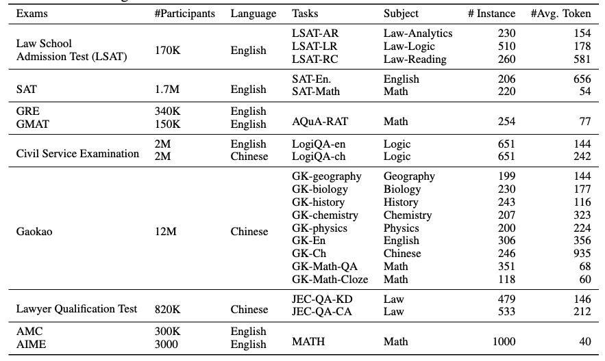

# AGI Evaluation

## Use Cases

### Problem Description

**AGIEval** is a human-centric benchmark designed to evaluate the overall capabilities of foundation models on tasks related to human cognition and problem solving. The benchmark draws from 20 official, public, and high-standard admission and qualification exams for general test takers, including China's college entrance examination (Gaokao) and the SAT, law school admission tests, math competitions, bar exams, and civil service exams.

### Features

The new version updates the Chinese Gaokao datasets for chemistry, biology, and physics, adds 2023 questions, and fixes annotation issues. For easier evaluation, all multiple-choice tasks now have a single correct answer. The Gaokao physics and JEC-QA datasets previously had multiple correct answers. AGIEval contains 20 tasks, including 18 multiple-choice tasks and two cloze tasks, Gaokao math cloze and MATH.

Currently, the MindSpeed LLM repository provides the following AGI evaluation modes.

## Usage

### 1. Direct Evaluation Mode (Default)

#### Impact

- This mode concatenates the [template prompt](../../../../../../mindspeed_llm/tasks/evaluation/eval_impl/fewshot_template/AGI_fewshot.json) with the question the model needs to answer, then feeds the result to the model for evaluation.

#### Recommended Parameters

`--max-new-tokens`

Set this to 3.

### 2. Alternative Template Output Mode

#### Impact

- Unlike `Direct Evaluation Mode`, this mode also uses the fixed template in [agi_utils](../../../../../../mindspeed_llm/tasks/evaluation/eval_utils/agi_utils.py) from `template_mapping`. It concatenates that template with the question the model needs to answer, then feeds the result to the model for evaluation.

#### Recommended Parameters

`--max-new-tokens`

Set this to 5 or higher.

`--alternative-prompt`

Enable `Alternative Template Output Mode`.

## References

Zhong, W., Cui, R., Guo, Y., Liang, Y., Lu, S., Wang, Y., Saied, A., Chen, W., & Duan, N. (2023). AGIEval: A Human-Centric Benchmark for Evaluating Foundation Models [Preprint]. arXiv. <https://arxiv.org/abs/2304.06364>
