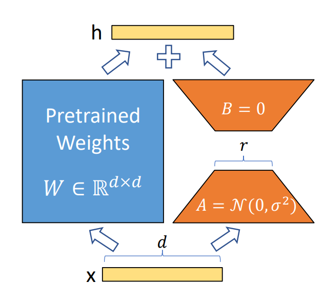

# LoRA Fine-Tuning

## Use Cases

Low-Rank Adaptation (LoRA) is an efficient model fine-tuning method that is widely used for pretrained deep learning models. By adding low-rank matrices to the weights, LoRA makes the fine-tuning process lighter and reduces compute and storage overhead. The core idea of LoRA is to decompose model parameter updates into a low-rank form. The specific steps are as follows:

- **Decompose weight updates**: In traditional fine-tuning methods, you update the model weights directly. LoRA instead introduces two low-rank matrices, $A$ and $B$, into each the weight matrix of layer as a replacement. That is:
$
W' = W + A \cdot B
$



   Here, $W'$ is the updated weight, $W$ is the original weight, and $A$ and $B$ are the low-rank matrices that need to be learned.

- **Reduce parameter count**: Because $A$ and $B$ have low rank, the number of required parameters drops significantly, which reduces storage and compute cost.2026年5月25日

## How to Use

This document provides a simple LoRA fine-tuning example based on a pretrained LLM and uses single-sample-format data. The following example uses the Qwen3-8B model and a single Atlas 900 A2 PoD, which is a 1x8 cluster, for LoRA fine-tuning. LoRA fine-tuning for LLMs mainly includes the following process:


Step 1: Refer to the [MindSpeed LLM Installation Guide](../../install_guide.md) to complete the environment setup. Before training starts, configure the environment variables related to the Ascend NPU Toolkit as follows:

```shell
source /usr/local/Ascend/cann/set_env.sh     # Replace this with the actual Toolkit installation path.
source /usr/local/Ascend/nnal/atb/set_env.sh # Replace this with the actual nnal package installation path.
```

Step 2: Prepare the model weights and fine-tuning dataset. For model weight downloads, refer to the download links for the corresponding models in the [Supported Models in the PyTorch Framework](../../../models/supported_models.md) document. Using the [Qwen3-8B](https://huggingface.co/Qwen/Qwen3-8B/tree/main) model as an example, the complete model folder should include the following contents:

```shell
.
├── README.md                    # Model documentation.
├── config.json                  # Model architecture configuration file.
├── generation_config.json       # Configuration for text generation.
├── merges.txt                   # Tokenizer merge rules file.
├── model-00001-of-00005.safetensors  # Part 1 of 5 model weight files.
├── model-00002-of-00005.safetensors  # Part 2 of 5 model weight files.
├── model-00003-of-00005.safetensors  # Part 3 of 5 model weight files.
├── model-00004-of-00005.safetensors  # Part 4 of 5 model weight files.
├── model-00005-of-00005.safetensors  # Part 5 of 5 model weight files.
├── model.safetensors.index.json      # Weight shard index file that indicates which file corresponds to each weight parameter.
├── tokenizer.json              # Hugging Face-format tokenizer.
├── tokenizer_config.json       # Tokenizer-related configuration file.
└── vocab.json                  # Model vocabulary file.
```

Step 3: Perform weight conversion, which converts the original Hugging Face weights of the model into Megatron weights. The LoRA fine-tuning script can use standard base Megatron weights. Using the Qwen3-8B model with `TP=1` and `PP=2` as an example, see the [Qwen3 Weight Conversion Script](../../../../../../examples/mcore/qwen3/ckpt_convert_qwen3_hf2mcore.sh) for detailed configuration. You need to modify the related path parameters and model partition settings:

```shell
source /usr/local/Ascend/cann/set_env.sh # Replace this with the actual Toolkit installation path.
......
--target-tensor-parallel-size 1          # TP partition size.
--target-pipeline-parallel-size 2        # PP partition size.
--load-dir ./model_from_hf/qwen3_hf/     # Hugging Face weight path.
--save-dir ./model_weights/qwen3_mcore/   # Megatron weight save path.
```

After you confirm that the paths are correct, run the weight conversion script:

```shell
bash examples/mcore/qwen3/ckpt_convert_qwen3_hf2mcore.sh
```

Step 4: Perform data preprocessing. The following example uses the [Alpaca dataset](https://huggingface.co/datasets/tatsu-lab/alpaca/blob/main/data/train-00000-of-00001-a09b74b3ef9c3b56.parquet). For detailed configuration, see the [Qwen3 Data Preprocessing Script](../../../../../../examples/mcore/qwen3/data_convert_qwen3_instruction.sh). You need to modify the following paths in the script:

```shell
source /usr/local/Ascend/cann/set_env.sh # Replace this with the actual Toolkit installation path.
......
--input ./dataset/train-00000-of-00001-a09b74b3ef9c3b56.parquet # Raw dataset path.
--tokenizer-name-or-path ./model_from_hf/qwen3_hf # Hugging Face tokenizer path.
--output-prefix ./finetune_dataset/alpaca  # Save path.
......
```

Parameters for data preprocessing:

- `handler-name`: Specifies the dataset handler class. Common options include `AlpacaStyleInstructionHandler`, `SharegptStyleInstructionHandler`, and `AlpacaStylePairwiseHandler`.
- `tokenizer-type`: Specifies the tokenizer used to process the data. A common value is `PretrainedFromHF`.
- `workers`: Number of parallel workers used to process the dataset.
- `log-interval`: Number of steps between progress updates.
- `enable-thinking`: Enables the fast-thinking and slow-thinking template switch. You can set it to `[true, false, none]`, and the default value is `none`. When you enable it, `<think>` and `</think>` are added to model responses in the dataset and are included in the loss calculation. Therefore, all data is treated as slow-thinking data. When you disable it, an empty CoT marker is added to the user input in the dataset and is excluded from the loss calculation. Therefore, all data is treated as fast-thinking data. Setting it to `none` is suitable when the original dataset mixes fast-thinking and slow-thinking data. **Currently, this option supports only Qwen3 series models.**
- `prompt-type`: Specifies the model template, which helps the base model develop stronger conversational ability after fine-tuning. You can find the available `prompt-type` options in the [`templates`](../../../../../../configs/finetune/templates.json) file.

After you finish configuring the parameters, run the data preprocessing script:

```shell
bash examples/mcore/qwen3/data_convert_qwen3_instruction.sh
```

Step 5: Configure the LoRA fine-tuning script. For detailed parameter settings, see the [Qwen3-8B LoRA Fine-Tuning Script](../../../../../../examples/mcore/qwen3/tune_qwen3_8b_4K_lora_ptd.sh). For environment variable settings in the script, see the [Model Script Environment Variables](../../../features/mcore/environment_variable.md) document. Note that the parallelism configuration for training parameters, such as TP and PP, must match the configuration used during weight conversion.

LoRA fine-tuning can run on a single node or multiple nodes. The following is the parameter configuration for single-node execution:

```shell
# Single-node configuration.
NPUS_PER_NODE=8
MASTER_ADDR=localhost
MASTER_PORT=6000
NNODES=1
NODE_RANK=0
WORLD_SIZE=$(($NPUS_PER_NODE * $NNODES))
```

After you confirm that the environment variables are correct, modify the related path parameters and model partition settings:

```shell
CKPT_LOAD_DIR="your model ckpt path"      # Weight load path. Enter the path saved during weight conversion.
CKPT_SAVE_DIR="your model save ckpt path" # Weight save path after LoRA fine-tuning finishes.
DATA_PATH="your data path"                # Dataset path. Enter the path saved during data preprocessing, and note that you need to add the suffix.
TOKENIZER_PATH="your tokenizer path"      # Vocabulary path. Enter the vocabulary path from the downloaded open-source weights.
TP=1                                      # The value of target-tensor-parallel-size used during weight conversion.
PP=2                                      # The value of target-pipeline-parallel-size used during weight conversion.
```

Parameters for the fine-tuning script:

- `DATA_PATH`: Dataset path. Note that the actual file generated by data preprocessing adds suffixes such as `_input_ids_document` to the end. Therefore, set this parameter to the dataset prefix only. For example, if the actual dataset relative path is `./finetune_dataset/alpaca/alpaca_packed_input_ids_document.bin`, you only need to set `./finetune_dataset/alpaca/alpaca`.
- `is-instruction-dataset`: Specifies that instruction fine-tuning data is used during fine-tuning, which ensures that the model is fine-tuned according to the specified instructions.
- `prompt-type`: Specifies the model template and helps the base model develop stronger conversational ability after fine-tuning.
- `no-pad-to-seq-lengths`: Supports dynamic sequence-length fine-tuning. By default, padding is applied in multiples of 8. You can change the padding multiple with the `--pad-to-multiple-of` parameter.
- `lora-r`: LoRA rank. This indicates the dimension of the low-rank matrices. A lower rank uses fewer parameter updates during training, which reduces compute and memory consumption. However, a rank that is too low may limit model expressiveness.
- `lora-alpha`: Controls the influence of the LoRA weights on the original weights. Higher values increase the effect. In general, keep `α/r` at 2.
- `lora-fusion`: Whether to enable the [CCLoRA](../../../features/mcore/cc_lora.md) algorithm. This algorithm improves performance by overlapping communication with computation. The current GLM-4.5 model does not support this parameter.
- `lora-target-modules`: Selects the modules to which LoRA is added. The currently available modules are `linear_qkv`, `linear_proj`, `linear_fc1`, and `linear_fc2`.

Step 6: Start the LoRA fine-tuning script. After you finish configuring the parameters, if you are running on a single node, start the LoRA fine-tuning script on one machine only:

```shell
bash examples/mcore/qwen3/tune_qwen3_8b_4K_lora_ptd.sh
```

If you are running on multiple nodes, modify the following parameters in the single-node script:

```shell
# Multi-node configuration.
# Configure the distributed parameters according to the actual cluster.
NPUS_PER_NODE=8  # Number of NPUs on each node.
MASTER_ADDR="your master node IP address"  # Change this to the IP address of the master node. Do not use localhost.
MASTER_PORT=6000
NNODES=2  # Number of nodes in the cluster. Fill in the actual value.
NODE_RANK="current node ID"  # Current node RANK. It must be unique across nodes. Set the master node to 0 and other nodes to 1, 2, and so on.
WORLD_SIZE=$(($NPUS_PER_NODE * $NNODES))
```

Step 7: After you confirm that the model path and dataset path on each machine are correct, start the LoRA fine-tuning script on multiple terminals at the same time to begin training.

Seventh, validate the model. After LoRA fine-tuning completes, you need to further verify whether the model produces the expected outputs. The repository provides a base inference script, the [Qwen3-8B Inference Script](../../../../../../examples/mcore/qwen3/generate_qwen3_8b_ptd.sh). LoRA inference requires you to add LoRA-related parameters on top of this script. Therefore, you can observe the model's responses under different generation parameter settings. Using Qwen3-8B as an example, you can name the corresponding LoRA inference script `generate_qwen3_8b_lora_ptd.sh`.

Modify the path parameters and add the LoRA-related parameters to the inference script:

```shell
TOKENIZER_PATH="your tokenizer directory path"   # Vocabulary path. Enter the vocabulary path from the downloaded open-source weights.
CHECKPOINT="your model directory path"           # Weight load path. Enter the path saved during weight conversion.
CHECKPOINT_LORA="your lora model directory path" # Weight save path after LoRA fine-tuning finishes.
......
--lora-load ${CHECKPOINT_LORA}  \
--lora-r 16 \
--lora-alpha 32 \
--lora-fusion \
--lora-target-modules linear_qkv linear_proj linear_fc1 linear_fc2 \
--prompt-type qwen3 \
......
| tee logs/generate_qwen3_8b_lora_ptd.log # Corresponding log file name.
```

Parameter descriptions:

- `lora-load`: Loads LoRA weights to resume training from a checkpoint or for inference. For inference, use it together with `--load` to load the LoRA weights under the `CKPT_SAVE_DIR` path.

After you finish configuring the parameters, run the inference script:

```shell
bash examples/mcore/qwen3/generate_qwen3_8b_lora_ptd.sh
```

The expected result is that the model answers the questions in the dataset correctly, without garbled output or repetition.
