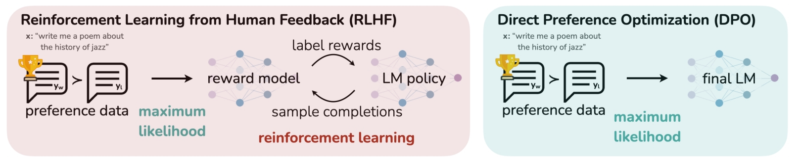

# DPO for Post-Training

Direct preference optimization (DPO) is a training method used to optimize LLMs. Its goal is to adjust model parameters with human preference data. Compared with other complex RLHF methods such as PPO, which update multiple models during training, DPO updates only the policy model during training. Therefore, it is more efficient.



This implementation uses the standard DPO algorithm. During training, it neither uses the policy model for inference nor includes it in weight updates. Therefore, it runs in offline mode.

## Usage

### Data Preprocessing

DPO uses a pairwise dataset of positive and negative samples. The preprocessing command is as follows:

```shell
python ./preprocess_data.py \
    --input ./dataset/orca_rlhf.jsonl \
    --tokenizer-type PretrainedFromHF \
    --tokenizer-not-use-fast \
    --tokenizer-name-or-path ./model_from_hf/Meta-Llama-3-8B-Instruct/ \
    --output-prefix ./pair_dataset/orca_rlhf_llama3 \
    --workers 4 \
    --log-interval 1000 \
    --handler-name AlpacaStylePairwiseHandler \
    --prompt-type llama3 \
    --map-keys '{"prompt":"question", "query":"", "system":"system"}'
```

For more information about pairwise dataset preprocessing, see [Pairwise Dataset Processing](../../../tools/data_process_dpo_pairwise.md).

### Training Parameters

The DPO training script is [dpo_qwen3_30b_a3b_16K_A3_ptd.sh](../../../../../../examples/mcore/qwen3_moe/dpo_qwen3_30b_a3b_16K_A3_ptd.sh).

Compared with ordinary pretraining, DPO requires the following additional parameters:

- **`--stage`**

  Required. Specifies DPO as the training method.

- **`--is-pairwise-dataset`**

  Required. Specifies that DPO uses a pairwise dataset.

- **`--dpo-loss-type`**

  Optional. Specifies the loss calculation method. Currently supported values are `sigmoid` (the original DPO scheme), `hinge`, and `ipo`.

- **`--dpo-beta`**

  Optional. Regularization parameter that balances the reward score and KL divergence. Default: `0.1`.

- **`--dpo-label-smoothing`**

  Optional. A smoothing parameter used when calculating the loss to account for sample noise. The value range is 0 to 0.5. Default: `0.0`.

- **`--pref-ftx`**

  Optional. A multiplier used when adding SFT loss to the DPO loss. Default: `0.0`.

- **`--ref-model`**

  Optional. Specifies the reference model path. Default: `None`, which means it is the same as the training model.

- **`--refer-model-iter`**

  Optional. Specifies the iteration step count for the initial weights of the reference model. Default: `1`. In DPO checkpoint resume scenarios, use this parameter to distinguish the weights loaded by the reference model and the training model when training resumes. The training model loads the weights saved before training stopped, and the reference model loads the weights at the iteration step specified by `refer-model-iter`, which ensures that the reference model weights loaded during checkpoint resume remain the initial weights instead of the trained ones.

### DPO-LoRA

DPO also supports LoRA fine-tuning. As with ordinary LoRA fine-tuning, you only need to add the LoRA-related parameters:

- **`--lora-r`**

  LoRA rank. This indicates the dimension of the low-rank matrices. A lower rank uses fewer parameter updates during training, which reduces compute and memory consumption.

- **`--lora-alpha`**

  Controls how much the LoRA weights influence the original weights. The higher the value, the greater the influence. In general, keep `α/r` at 2.

- **`--lora-target-modules`**

  Selects the modules to which LoRA is added. Available modules for mcore models are `linear_qkv`, `linear_proj`, `linear_fc1`, and `linear_fc2`.

- **`--lora-load`**

  Path to the LoRA weights.

## References

- [Direct Preference Optimization](https://export.arxiv.org/abs/2305.18290)
