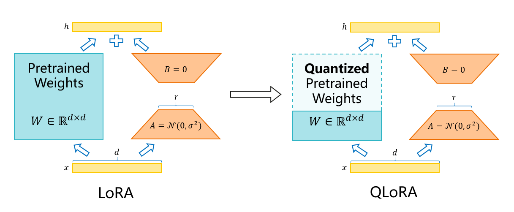

# QLoRA

  

    
  

  
QLoRA quantizes the frozen part of the weights on top of LoRA.

## Feature Overview

### LoRA

The linear layers in a model usually perform a matrix multiplication between the activation value $x$ and the transpose of the weight matrix $W^T$, and then add $bias$:

$$
y = xW^T + bias
$$

The **rank** of a matrix reveals its "information content." The weight matrices of these linear layers in pretrained models are usually full rank.

For a pretrained weight matrix $W_0\in \mathbb{R}^{n\times m}$, you can think of it as changing during fine-tuning into $W_0 + \Delta W = W_0 + AB$, where $A\in \mathbb{R}^{n\times r}$ and $B\in \mathbb{R}^{r\times m}$. Then $\Delta W = AB\in \mathbb{R}^{n\times m}$, and $rank(\Delta W)\in[0, min(n, m, r)]$. We choose $r\ll min(n, m)$, so $rank(\Delta W)\in[0, r]$.

This makes training highly efficient because it freezes part of $W_0$ and updates only the lightweight bypass matrices $A$ and $B$. It greatly reduces the redundant space and compute overhead of the low-rank matrices.

During the forward pass, the linear layer with LoRA added to it computes the following matrix operation:

$$
y = xW_0^T + x B^T A^T
$$

The input to the backward pass is the gradient of the loss with respect to the current layer output $y$, namely $\frac{\partial \mathcal{L}}{\partial y}$. To update the parameters of the bypass matrices $A$ and $B$, you need to compute the gradients $\frac{\partial \mathcal{L}}{\partial A}$ and $\frac{\partial \mathcal{L}}{\partial B}$. When you take the partial derivative with respect to either $A$ or $B$, you can treat $xW_0^T$ as a constant term, and this process does not involve $W_0$. However, to continue backpropagation, the current layer still needs to return the gradient of $\mathcal{L}$ with respect to the input:

$$
\frac{\partial \mathcal{L}}{\partial x}=\frac{\partial \mathcal{L}}{\partial y} \frac{\partial y}{\partial x} = \frac{\partial \mathcal{L}}{\partial y} W_0 + \frac{\partial \mathcal{L}}{\partial y} AB
$$

Therefore, the parameters of $W_0$ do not need to be updated, but they still participate in one matrix multiplication during the forward pass and one matrix multiplication during the backward pass.

### QLoRA

#### Linear Layer Quantization

Quantization can compress the model size while maintaining high accuracy. Weight-only quantization without a calibration set aims to make

$$
\phi \big(W - Q^{-1}(Q(W))\big)
$$

as small as possible, with the error kept within an acceptable range. Here, $W$ denotes floating-point weights, $Q(*)$ and $Q^{-1}(*)$ represent the quantization and dequantization functions, respectively, and $\phi$ represents a loss function such as mean absolute error.

We use **NF4 quantization** for weight quantization. This is also the QLoRA quantization method widely used in the open-source community. The algorithm is implemented in [bitsandbytes](https://github.com/bitsandbytes-foundation/bitsandbytes), a popular open-source project.

> We have contributed NF4 quantization support for NPU hardware to the bitsandbytes multi-backend refactoring branch. However, because the official bitsandbytes project has not yet released this branch on PyPI, this repository currently uses the NPU version of bitsandbytes. You can install it with `pip3 install bitsandbytes-npu-beta`.

NF4 is a lookup-table quantization method. The NF4 table is close to the best representation for data under a Gaussian distribution. Before QLoRA fine-tuning, you can quantize the weight $W_0$ first:

$$
W_0^{NF4} = Q(W_0)
$$

Then, whenever $W_0$ needs to participate in the operation during fine-tuning, you dequantize it. That is, compute the following in the forward pass:

$$
y = x\big(Q^{-1}(W_0^{NF4})\big)^T + x A^T B^T
$$

Compute the following in the backward pass:

$$
\frac{\partial \mathcal{L}}{\partial x} = \frac{\partial \mathcal{L}}{\partial y} Q^{-1}(W_0^{NF4}) + \frac{\partial \mathcal{L}}{\partial y} BA
$$

On top of LoRA, QLoRA quantizes the backbone weights, which significantly reduces the memory used during LoRA fine-tuning.

## Usage

### 1. Converting Weights

When you convert the original-precision Hugging Face weights to MG weights, you can enable the NF4 quantization used by QLoRA by adding the `--qlora-nf4` option. This produces quantized and compressed MG weights. At present, other quantization methods are not supported.

> A fix for a newer version is in progress. Therefore, you are advised not to enable this feature for now. At present, the QLoRA feature supports the `--moe-grouped-gemm` GMM operator and the `--moe-alltoall-overlap-comm` feature.

### 2. Performing QLoRA Fine-Tuning

When you fine-tune, add `--qlora` to enable QLoRA fine-tuning. When you enable it, ensure that the configured weight path points to the NF4-quantized MG weights.

### 3. Merging LoRA Weights into the Backbone Model (Optional)

By default, the weights saved after QLoRA fine-tuning are still quantized weights and cannot be merged directly with the floating-point LoRA part. If you need the floating-point dequantized weights, that is, $Q^{-1}(W_0^{NF4})$ from the preceding section, you can enable the **save while dequantizing** option `--qlora-save-dequantize` during fine-tuning. The method for merging weights and running inference is the same as for LoRA.

## Effects

Because only the weight matrices of the linear layers are quantized while activations, gradients, optimizer states, and similar components remain at the original precision, the overall memory savings from QLoRA depend on factors such as batch size and sequence length.

For reference, we ran quantization tests on Llama-2-70b and Mixtral-8x7b:

| Model        | Original Weight Size | Weight Size After NF4 Quantization | Memory Saved |
| ------------ | -------------------- | ---------------------------------- | ------------ |
| Llama-2-70b  | 129 GB               | 35 GB                              | 94 GB        |
| Mixtral-8x7b | 87 GB                | 24 GB                              | 63 GB        |

Both can use a single 64 GB device for QLoRA fine-tuning. In our measurements, the NPU memory usage during single-batch fine-tuning of Llama-2-70b is about 50 GB. You are advised to use two devices to avoid OOM if the dataset contains longer sequences.

Note that QLoRA is a LoRA algorithm that quantizes model weights. Therefore, it will inevitably affect model behavior and accuracy. You should evaluate the feature fully before using it.

## Usage Limitations

* QLoRA currently does not support the `lora-fusion` feature. There is no performance gain when you enable it.

> A fix for a newer version is in progress. Therefore, you are advised not to enable this feature for now. At present, the QLoRA feature supports the `--moe-grouped-gemm` GMM operator and the `--moe-alltoall-overlap-comm` feature.
> At present, QLoRA fine-tuning must load weights and does not support randomly initialized weights.
> QLoRA supports the LoRA features that are supported by distributed LoRA, PP, TP, VPP, CP, SP, recomputation, and so on, and the accuracy is normal. The compatibility of more features is still being verified.
