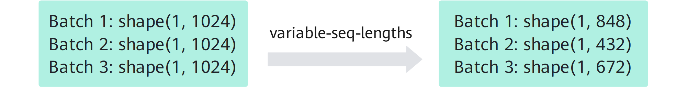

# Single-Sample Fine-Tuning

## Use Cases

Single-sample fine-tuning is the most basic and most common form of instruction fine-tuning. Each sample consists of an independent "instruction" and "target response" pair and does not depend on any context information. This mode suits **single-turn, context-free** tasks such as the following:

- Question answering, including knowledge-based Q&A and common-sense reasoning
- Text translation
- Text summarization and rewriting
- Sentiment analysis and intent classification
- Code generation and mathematical computation

Its strengths are simple data construction, clear task boundaries, and easy large-scale expansion of instruction data. It is the main way to train a model to master basic task capabilities.

## Usage

This section explains how to use single-sample data to perform instruction fine-tuning with a pretrained language model. For other data formats, see [Multi-Sample Pack Fine-Tuning](./multi_sample_pack_finetune.md) and [MindSpeed LLM Multi-Turn Conversation Fine-Tuning](./multi_turn_conversation.md). This procedure uses the Qwen3-8B model and a single Atlas 900 A2 PoD, which is a 1x8 cluster, for full-parameter fine-tuning. The fine-tuning workflow mainly includes the following steps:

**Figure 1** Single-sample fine-tuning flowchart


1. Environment setup.

    Before you start fine-tuning, refer to the [MindSpeed LLM Installation Guide](../../install_guide.md) to complete environment setup, and ensure that you have configured the Ascend NPU suite environment variables as follows:

    ```shell
    source /usr/local/Ascend/cann/set_env.sh # Replace this with the actual Toolkit installation path.
    source /usr/local/Ascend/nnal/atb/set_env.sh # Replace this with the actual nnal package installation path.
    ```

2. Model and dataset preparation.

    - Model preparation.
        For model weight downloads, see the download links for the corresponding models in the [Supported Models in the PyTorch Framework](../../../models/supported_models.md) document. Using [Qwen3-8B](https://huggingface.co/Qwen/Qwen3-8B/tree/main) as an example, the complete model directory should contain the following files:

        ```shell
        .
        ├── README.md                      # Model documentation.
        ├── config.json                    # Model architecture configuration file.
        ├── generation_config.json         # Configuration for text generation.
        ├── merges.txt                     # tokenizer merge rules file.
        ├── model-00001-of-00005.safetensors  # Part 1 of the model weight files, 5 parts in total.
        ├── model-00002-of-00005.safetensors  # Part 2 of the model weight files.
        ├── model-00003-of-00005.safetensors  # Part 3 of the model weight files.
        ├── model-00004-of-00005.safetensors  # Part 4 of the model weight files.
        ├── model-00005-of-00005.safetensors  # Part 5 of the model weight files.
        ├── model.safetensors.index.json      # Weight shard index file that maps each parameter to its file.
        ├── tokenizer.json               # Tokenizer in the Hugging Face format.
        ├── tokenizer_config.json        # Tokenizer-related configuration.
        └── vocab.json                   # Model vocabulary file.
        ```

    - Dataset preparation.
        For dataset preparation, see the related content in [Alpaca-Style Datasets](../../../tools/data_process_sft_alpaca_style.md) and [ShareGPT Datasets](../../../tools/data_process_sft_sharegpt_style.md). At present, `.parquet`, `.csv`, `.json`, `.jsonl`, `.txt`, and `.arrow` data files are supported.

3. Model weight conversion.

    Refer to [Weight Conversion v1](../../../tools/checkpoint_convert_hf_mcore.md) and [Weight Conversion v2](../../../tools/checkpoint_convert_hf_mcore_large_params.md) to convert the original Hugging Face weights to Megatron weights. Using the Qwen3-8B model with a TP1PP4 split as an example, see the [Qwen3-8B weight conversion script](../../../../../../examples/mcore/qwen3/ckpt_convert_qwen3_hf2mcore.sh) for detailed configuration.

    First, modify the following parameters in the script:

    ```bash
    --load-dir ./model_from_hf/qwen3_hf/    # Hugging Face weight path.
    --save-dir ./model_weights/qwen3_mcore/ # Path to save the Megatron weights.
    --tokenizer-model ./model_from_hf/qwen3_hf/tokenizer.json # Hugging Face tokenizer path.
    --target-tensor-parallel-size 1   # TP partition size.
    --target-pipeline-parallel-size 4 # PP partition size.
    ```

    Then verify that the paths are correct and run the weight conversion script:

    ```shell
    bash examples/mcore/qwen3/ckpt_convert_qwen3_hf2mcore.sh
    ```

4. Data preprocessing.

    Because each dataset uses a different processing method, first confirm the preprocessing data format. For detailed usage, see the following documents:

    - [Alpaca-Style Datasets](../../../tools/data_process_sft_alpaca_style.md)
    - [ShareGPT Datasets](../../../tools/data_process_sft_sharegpt_style.md)
    - [Pairwise Dataset Processing](../../../tools/data_process_dpo_pairwise.md)

    Next, use the Alpaca dataset as an example for data preprocessing. For detailed configuration, see the [Qwen3 data preprocessing script](../../../../../../examples/mcore/qwen3/data_convert_qwen3_instruction.sh). Modify the paths in the script:

    ```shell
    source /usr/local/Ascend/cann/set_env.sh # Replace this with the actual Toolkit installation path.
    ......
    --input ./dataset/train-00000-of-00001-a09b74b3ef9c3b56.parquet # Path to the original dataset.
    --tokenizer-name-or-path ./model_from_hf/qwen3_hf # Hugging Face tokenizer path.
    --output-prefix ./finetune_dataset/alpaca  # Save path.
    ......
    ```

    Parameters for data preprocessing:

    - `handler-name`: Specifies the dataset handler class. Common options include `AlpacaStyleInstructionHandler`, `SharegptStyleInstructionHandler`, and `AlpacaStylePairwiseHandler`.
    - `tokenizer-type`: Specifies the tokenizer used to process the data. A common value is `PretrainedFromHF`.
    - `workers`: The number of parallel workers used to process the dataset.
    - `log-interval`: The number of steps between progress updates.
    - `enable-thinking`: Enables or disables the fast-thinking or slow-thinking template. You can set it to `[true, false, none]`, and the default value is `none`. When you enable it, dataset responses include `<think>` and `</think>`, and these tokens participate in loss calculation. Therefore, all data is treated as slow-thinking data. When you disable it, an empty CoT marker is added to the user input in the dataset, and it does not participate in loss calculation. Therefore, all data is treated as fast-thinking data. Setting it to `none` works well when the original dataset contains a mix of fast-thinking and slow-thinking data. **Currently, this option supports only Qwen3 series models.**
    - `prompt-type`: Specifies the model template. It helps the base model gain stronger conversational ability after fine-tuning. You can find the available `prompt-type` options in the [`templates.json`](../../../../../../configs/finetune/templates.json) file.

    After you finish configuring the parameters, run the data preprocessing script:

    ```shell
    bash examples/mcore/qwen3/data_convert_qwen3_instruction.sh
    ```

5. Configure the single-node or multi-node fine-tuning script.

    For detailed parameter configuration, see the [Qwen3-8B fine-tuning script](../../../../../../examples/mcore/qwen3/tune_qwen3_8b_4K_full_ptd.sh). See [Model Script Environment Variables](../../../features/mcore/environment_variable.md) for the script environment variable configuration.

    After you verify that the environment variables are correct, modify the node-related settings in the script. The single-node and multi-node configurations are as follows:

    - Single-node configuration

        ```bash
        NPUS_PER_NODE=8 # Number of devices on a single node.
        MASTER_ADDR=localhost
        MASTER_PORT=6000
        NNODES=1
        NODE_RANK=0
        WORLD_SIZE=$(($NPUS_PER_NODE * $NNODES))
        ```

    - Multi-node configuration

        ```bash
        # Configure distributed parameters according to the actual cluster.
        NPUS_PER_NODE=8                    # Number of devices per node.
        MASTER_ADDR="your master node IP"  # You must change this to the master node IP address. It cannot be localhost.
        MASTER_PORT=6000
        NNODES=2                     # Number of nodes in the cluster. Enter the actual value.
        NODE_RANK="current node id"  # Current node rank. Each node must have a unique value. The master node is 0, and the other nodes can be 1, 2, and so on.
        WORLD_SIZE=$(($NPUS_PER_NODE * $NNODES))
        ```

    Then modify the related path parameters and model partitioning configuration in the script:

    ```bash
    CKPT_LOAD_DIR="your model ckpt path"      # Points to the path where the converted weights are saved.
    CKPT_SAVE_DIR="your model save ckpt path" # Points to the user-specified save path for the fine-tuned weights.
    DATA_PATH="your data path"                # Specifies the processed data path.
    TOKENIZER_PATH="your tokenizer path"      # Specifies the model tokenizer path.
    TP=1 # TP size used during model weight conversion. In this example, it is 1.
    PP=4 # PP size used during model weight conversion. In this example, it is 4.
    ```

    Parameters for the fine-tuning script:

    - `DATA_PATH`: Dataset path. Note that the actual data preprocessing output adds suffixes such as `_input_ids_document` to the file name. You only need to specify the dataset prefix. For example, if the actual dataset relative path is `./finetune_dataset/alpaca/alpaca_packed_input_ids_document.bin`, you only need to specify `./finetune_dataset/alpaca/alpaca`.
    - `is-instruction-dataset`: Specifies that instruction fine-tuning data is used during fine-tuning so the model can be fine-tuned according to the specified instruction data.
    - `no-pad-to-seq-lengths`: Supports dynamic sequence-length fine-tuning across mini-batches. By default, padding is rounded up to a multiple of 8, and you can change the multiple with `pad-to-multiple-of`. If you set the sequence length to 1024 during fine-tuning and enable `--no-pad-to-seq-lengths`, the sequence length is padded to the smallest value that is greater than or equal to the true data length and is a multiple of 8.

        **Figure 2** Variable sequence lengths

        

    > [!NOTE]
    >
    > - The provided paths must be enclosed in double quotation marks.
    > - For multi-node training, ensure that the model path and dataset path on each machine are correct.
    > - The parallel configuration of training parameters, such as TP, PP, EP, and VPP, must match Step 3. For the complete list, see [Weight Conversion](../../../tools/checkpoint_convert_hf_mcore_large_params.md#21-converting-hugging-face-weights-to-the-mcore-format).

6. Start fine-tuning.

    After you finish configuring the parameters, run the script to start fine-tuning. For multi-node scenarios, you need to start the script simultaneously in multiple terminals:

    ```shell
    bash examples/mcore/qwen3/tune_qwen3_8b_4K_full_ptd.sh
    ```

7. Inference verification.

    After fine-tuning completes, you need to further verify whether the model produces the expected output. We provide a simple model generation script. You only need to load the fine-tuned model weights to observe the model responses under different generation parameter configurations. For detailed configuration, see the [Qwen3-8B inference script](../../../../../../examples/mcore/qwen3/generate_qwen3_8b_ptd.sh).

    First, modify the following parameters in the script:

    ```shell
    CKPT_DIR="your model save ckpt path" # Points to the save path of the fine-tuned weights.
    TOKENIZER_PATH="your tokenizer path" # Points to the model tokenizer path.
    ```

    Then run the inference script:

    ```shell
    bash examples/mcore/qwen3/generate_qwen3_8b_ptd.sh
    ```

    In addition, if you want to verify model performance on different tasks, refer to [Evaluation Guide](../../evaluation/evaluation_guide.md) for a more comprehensive assessment of the fine-tuning results.
