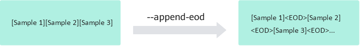

# Pack Mode for Distributed LLM Pretraining

## Use Cases

In LLM pretraining tasks, the input sequence in a training batch usually consists of multiple documents concatenated together. By default, the model treats these documents as one continuous sequence and does not mask self-attention between them. Therefore, different documents can build contextual dependencies with one another.

However, in some scenarios, documents must remain independent and cannot share contextual information. For example, when documents are semantically unrelated or when the training objectives must stay isolated, self-attention between them must be disabled. In that case, the model needs to reset the attention mask and position IDs at each end of document (EOD) to isolate attention at the document level. To improve token utilization, pretraining can use pack mode, which concatenates multiple short samples into one complete training sequence. In this process, the model cannot identify sample boundaries automatically. Therefore, you need to explicitly insert an EOD token at the end of each sample to mark the boundary and guide subsequent attention mask construction. To enable this feature, you only need to set the corresponding parameters in the data preprocessing and training scripts. Therefore, you can achieve an efficient and semantically clear pretraining process.

## Usage Instructions

The process for distributed LLM pretraining in pack mode is as follows:

**Figure 1**  Pretraining process diagram


1. Environment setup

    Before you start pretraining, follow the [MindSpeed LLM Installation Guide](../../install_guide.md) to complete the environment setup, and ensure that the Ascend NPU toolkit environment variables are configured as follows:

    ```shell
    source /usr/local/Ascend/cann/set_env.sh      # Modify to the actual installed Toolkit package path.
    source /usr/local/Ascend/nnal/atb/set_env.sh  # Modify to the actual installed nnal package path.
    ```

2. Pretraining data preprocessing

    First, prepare the raw dataset. Common pretraining datasets include:
    - [Alpaca Dataset](https://huggingface.co/datasets/tatsu-lab/alpaca)
    - [Enwiki Dataset](https://huggingface.co/datasets/lsb/enwiki20230101)
    - [C4 Dataset](https://huggingface.co/datasets/allenai/c4)
    - [ChineseWebText](https://huggingface.co/datasets/CASIA-LM/ChineseWebText)

    Then, use the [Enwiki Dataset](https://huggingface.co/datasets/lsb/enwiki20230101) as an example to run data preprocessing. For detailed script configuration, see the [Qwen3 pretraining data processing script](../../../../../../examples/mcore/qwen3/data_convert_qwen3_pretrain.sh). You need to modify the following content in the script:

    ```bash
    source /usr/local/Ascend/cann/set_env.sh # Modify to the actual installed Toolkit package path.

    ......
    --input ./dataset/train-00000-of-00042-d964455e17e96d5a.parquet # Raw dataset path.
    --tokenizer-name-or-path ./model_from_hf/qwen3_hf               # Hugging Face tokenizer path.
    --output-prefix ./dataset/enwiki                                # Save path.
    --append-eod                                                    # Add this parameter to enable pack mode data preprocessing.
    ......
    ```

    Parameters for data preprocessing:

    - `input`: You can point this parameter to a dataset directory or a specific file. If it is a directory, the tool processes all files. It supports the `.parquet`, `.csv`, `.json`, `.jsonl`, `.txt`, and `.arrow` formats. Files in the same folder must use the same format.
    - `handler-name`: The current pretraining pipeline uses `GeneralPretrainHandler` by default. It supports pretraining-style data and extracts the `text` column, as shown here:

        ```shell
        [
            {"text": "document"},
            {"other keys": "optional content"}
        ]
        ```

    - `json-keys`: The list of column names to extract from the file. The default is `text`. You can use multiple inputs such as `text`, `input`, and `title` depending on your needs and the dataset contents, for example:

        ```shell
        --json-keys text input output
        ```

    - `n-subs`: A parallel acceleration parameter for data preprocessing. When the dataset is large, you can speed up preprocessing by setting `--n-subs` to the number of parallel workers. The preprocessing process splits the raw dataset into `n-subs` subsets, processes the subsets in parallel, and then merges them to improve speed. Add this parameter when the dataset is larger than 1 GB.
    - `append-eod`: This parameter explicitly appends the document end marker `<EOD>` to the end of each sample to prevent the model from learning meaningless associations. The effect after enabling this parameter is as follows:

        

    Finally, after you set the relevant parameters, run the data preprocessing script:

    ```shell
    bash examples/mcore/qwen3/data_convert_qwen3_pretrain.sh
    ```

3. Configuring single-node or multi-node pretraining scripts

    For detailed parameter configuration, see the [Qwen3-8B pretraining script](../../../../../../examples/mcore/qwen3/pretrain_qwen3_8b_4K_ptd.sh). The environment variable configuration in the script is described in [Model Script Environment Variables](../../../features/mcore/environment_variable.md).

    After you confirm the environment variables, modify the node-related configuration in the script. The single-node and multi-node configurations are as follows:

    - Single-node configuration

        ```shell
        NPUS_PER_NODE=8   # Number of devices on a single node.
        MASTER_ADDR=localhost
        MASTER_PORT=6000
        NNODES=1
        NODE_RANK=0
        WORLD_SIZE=$(($NPUS_PER_NODE * $NNODES))
        ```

    - Multi-node configuration

        ```shell
        # Configure the distributed parameters based on the actual cluster.
        NPUS_PER_NODE=8                     # Number of devices on each node.
        MASTER_ADDR="your master node IP"  # Change this to the IP address of the master node. It cannot be localhost.
        MASTER_PORT=6000
        NNODES=2                             # Number of nodes in the cluster. Fill in the actual value.
        NODE_RANK="current node id"         # The current node rank. Ranks must be unique across nodes. The master node is 0, and other nodes can be 1, 2, and so on.
        WORLD_SIZE=$(($NPUS_PER_NODE * $NNODES))
        ```

    Then, modify the related path parameters and the model partition configuration in the script:

    ```shell
    CKPT_SAVE_DIR="your model save ckpt path"  # Weight save path after training.
    DATA_PATH="your data path"                 # Dataset path. Fill in the path saved during data preprocessing.
    TOKENIZER_PATH="your tokenizer path"       # Vocabulary path. Fill in the path to the vocabulary from the downloaded open-source weights.
    CKPT_LOAD_DIR="your model ckpt path"       # Weight load path. Fill in the path saved during weight conversion.

    TP=1 # TP size for model weight conversion. In this example, it is 1.
    PP=4 # PP size for model weight conversion. In this example, it is 4.
    ```

    After you finish the common configuration, to enable pack mode training, add the `--reset-attention-mask` parameter based on the [Qwen3-8B pretraining script](../../../../../../examples/mcore/qwen3/pretrain_qwen3_8b_4K_ptd.sh). When this parameter is enabled, it computes sentence boundary positions from the EOD token and generates `actual_seq_len`. Passing that value to the FA operator has the same effect as jagged mask computation. The effect is as follows:

    

    Also, note the use of `--attention-mask-type`. The default is `causal`, and both `causal` and `general` are supported.
    1. When `--attention-mask-type` is `general`, the attention mask is generated from the data.
    2. When `--attention-mask-type` is `causal`, the attention mask is generated before FA as a compressed fixed-length mask of 2048 tokens. It offers better performance and memory use than the `general` option. Therefore, use it.

    Optional parameter: the `--reset-position-ids` parameter. After you enable the EOD feature, each sample contains multiple concatenated segments. Therefore, its position IDs are not continuous. This parameter generates position IDs based on the EOD boundary instead of continuous position IDs. After each EOD, the model renumbers the position IDs from 0, thereby isolating positional computation across different sentences and affecting the positional encoding of attention queries and keys.

    Other parameters in the script:

    - `DATA_PATH`: Dataset path. Note that the file generated by actual data preprocessing adds `_text_document` to the end. You only need to fill in the dataset file prefix. For example, if the actual relative dataset path is `./dataset/enwiki/enwiki_text_document.bin`, you only need to fill in `./dataset/enwiki/enwiki_text_document`.
    - `CKPT_LOAD_DIR`: Weight load path. During pretraining, you can choose to initialize the model weights randomly. In that case, you do not need to configure this parameter, and you must comment out the `--load ${CKPT_LOAD_DIR} \` line in the pretraining script.
    - `tokenizer-type`: When the parameter value is `PretrainedFromHF`, the tokenizer path only needs to point to the model folder and does not need to point to the `tokenizer.model` file. When the parameter value is not `PretrainedFromHF`, for example `Qwen3Tokenizer`, you need to point to the `tokenizer.model` file. The example is as follows:

        ```bash
        # tokenizer-type is PretrainedFromHF.
        TOKENIZER_PATH="./model_from_hf/Qwen3-8B/"
        --tokenizer-name-or-path ${TOKENIZER_PATH}

        # tokenizer-type is not PretrainedFromHF.
        TOKENIZER_MODEL="./model_from_hf/Qwen3-8B/tokenizer.model"
        --tokenizer-model ${TOKENIZER_MODEL}
        ```

    > [!NOTE]
    >
    > - Enclose the provided paths in double quotes.
    > - In multi-node training, ensure that the model path and dataset path on each machine are correct. If you do not configure data sharing, add the `no-shared-storage` parameter to the training launch script. After you set this parameter, the system determines whether a non-master node needs to load data based on the distributed parameters, and it checks the corresponding cache and generated data.

4. Starting pretraining

    After you finish configuring the pretraining script, run it to start pretraining. In multi-node scenarios, you need to start the script simultaneously in multiple terminals:

    ```shell
    bash examples/mcore/qwen3/pretrain_qwen3_8b_4K_ptd.sh
    ```

## Usage Constraints

The `append-eod` parameter in data preprocessing must be used together with the `reset-attention-mask` parameter in pretraining:

- If you enable only `append-eod`, `<EOD>` is appended to the end of the document, but FA loses the document length information. When FA computes, it treats the sequence as cross-document input. Therefore, the model still learns dependencies across documents.
- If you enable only `reset-attention-mask`, FA does capture document length information, but because the data lacks `<EOD>` separators, FA still computes across document boundaries. Therefore, the model still learns dependencies across documents.
- If you enable `append-eod` during data preprocessing and `reset-attention-mask` during pretraining, FA can capture the length of each document separated by `<EOD>`. FA then computes each document independently, and the model learns only intra-document information.
