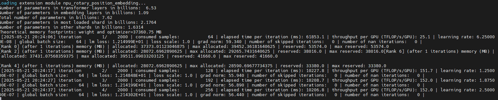
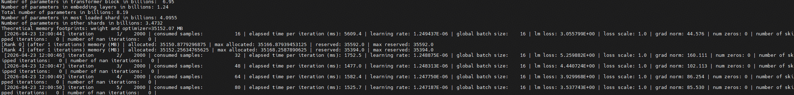

# Quick Start: Qwen3-8B Model Pretraining and Fine-Tuning

## Overview

This document provides a simple example to help developers who are new to MindSpeed LLM quickly start model training tasks and complete instruction fine-tuning with single-sample format data based on a pre-trained language model.
Using Qwen3-8B as an example, this document guides you through the pretraining and fine-tuning tasks for a large language model. The main steps are:

- Prepare the environment: Set up the environment according to the installation guide.
- Prepare weights and datasets: Download the Qwen3-8B open-source model weights from Hugging Face and obtain the Alpaca dataset.
- Start training tasks: Run pretraining and fine-tuning on Ascend NPUs.

> [!NOTE]
>
> MindSpeed LLM supports <term>Ascend 950 products</term>, <term>Atlas A3 training products</term>, and <term>Atlas A2 training products</term>. Single-NPU on-chip memory of 64 GB or more is required. For details, see [Supported Models in the PyTorch Framework](../models/supported_models.md).
>
> The current Qwen3-8B example script uses `NPUS_PER_NODE=8`, which requires 8 NPUs. If your actual configuration is lower than this, you may encounter OOM (Out of Memory) issues.

Developer prerequisites:

- Basic experience with PyTorch.
- Basic Python development experience.
- Basic understanding of [Megatron-LM](https://github.com/NVIDIA/Megatron-LM).

## Environment Preparation

Click [MindSpeed Quick Installation](https://www.hiascend.com/en/developer/software/mindspeed/download) and follow the guidance to set up the environment. For detailed installation instructions, see [MindSpeed LLM Installation](install_guide.md).

## Weight and Dataset Preparation

1. Obtain open-source model weights.

    Create a directory to store the weight files.

    ```shell
    mkdir -p ./model_from_hf/qwen3_hf
    cd ./model_from_hf/qwen3_hf
    ```

    Obtain model weight files from Hugging Face or ModelScope (choose one).

    Method 1: From Hugging Face

    ```shell
    # Use wget to download the weight files
    wget https://huggingface.co/Qwen/Qwen3-8B/resolve/main/config.json
    wget https://huggingface.co/Qwen/Qwen3-8B/resolve/main/generation_config.json
    wget https://huggingface.co/Qwen/Qwen3-8B/resolve/main/merges.txt
    wget https://huggingface.co/Qwen/Qwen3-8B/resolve/main/model-00001-of-00005.safetensors
    wget https://huggingface.co/Qwen/Qwen3-8B/resolve/main/model-00002-of-00005.safetensors
    wget https://huggingface.co/Qwen/Qwen3-8B/resolve/main/model-00003-of-00005.safetensors
    wget https://huggingface.co/Qwen/Qwen3-8B/resolve/main/model-00004-of-00005.safetensors
    wget https://huggingface.co/Qwen/Qwen3-8B/resolve/main/model-00005-of-00005.safetensors
    wget https://huggingface.co/Qwen/Qwen3-8B/resolve/main/model.safetensors.index.json
    wget https://huggingface.co/Qwen/Qwen3-8B/resolve/main/tokenizer.json
    wget https://huggingface.co/Qwen/Qwen3-8B/resolve/main/tokenizer_config.json
    wget https://huggingface.co/Qwen/Qwen3-8B/resolve/main/vocab.json
    ```

    Method 2: From ModelScope (recommended for China)

    ```shell
    # Use wget to download the weight files (from ModelScope)
    wget https://www.modelscope.cn/models/Qwen/Qwen3-8B/resolve/master/config.json
    wget https://www.modelscope.cn/models/Qwen/Qwen3-8B/resolve/master/generation_config.json
    wget https://www.modelscope.cn/models/Qwen/Qwen3-8B/resolve/master/merges.txt
    wget https://www.modelscope.cn/models/Qwen/Qwen3-8B/resolve/master/model-00001-of-00005.safetensors
    wget https://www.modelscope.cn/models/Qwen/Qwen3-8B/resolve/master/model-00002-of-00005.safetensors
    wget https://www.modelscope.cn/models/Qwen/Qwen3-8B/resolve/master/model-00003-of-00005.safetensors
    wget https://www.modelscope.cn/models/Qwen/Qwen3-8B/resolve/master/model-00004-of-00005.safetensors
    wget https://www.modelscope.cn/models/Qwen/Qwen3-8B/resolve/master/model-00005-of-00005.safetensors
    wget https://www.modelscope.cn/models/Qwen/Qwen3-8B/resolve/master/model.safetensors.index.json
    wget https://www.modelscope.cn/models/Qwen/Qwen3-8B/resolve/master/tokenizer.json
    wget https://www.modelscope.cn/models/Qwen/Qwen3-8B/resolve/master/tokenizer_config.json
    wget https://www.modelscope.cn/models/Qwen/Qwen3-8B/resolve/master/vocab.json
    ```

    Verify the model weight file integrity with `sha256sum`.

    ```shell
    # Open the file details page to obtain the SHA-256 value at https://huggingface.co/Qwen/Qwen3-8B/blob/main/model-00001-of-00005.safetensors or https://www.modelscope.cn/models/Qwen/Qwen3-8B/file/view/master/model-00001-of-00005.safetensors
    sha256sum ./model-00001-of-00005.safetensors
    sha256sum ./model-00002-of-00005.safetensors
    sha256sum ./model-00003-of-00005.safetensors
    sha256sum ./model-00004-of-00005.safetensors
    sha256sum ./model-00005-of-00005.safetensors
    cd ../..
    ```

2. Obtain the dataset.

    Obtain the Alpaca dataset from Hugging Face.

    ```shell
    mkdir dataset
    cd dataset/
    # Hugging Face dataset link. Choose one
    wget https://huggingface.co/datasets/tatsu-lab/alpaca/resolve/main/data/train-00000-of-00001-a09b74b3ef9c3b56.parquet
    # ModelScope dataset link. Choose one
    wget https://www.modelscope.cn/datasets/angelala00/tatsu-lab-alpaca/resolve/master/train-00000-of-00001-a09b74b3ef9c3b56.parquet
    cd ..
    ```

3. Set environment variables.

    ```shell
    source /usr/local/Ascend/cann/set_env.sh
    source /usr/local/Ascend/nnal/atb/set_env.sh
    ```

    The preceding commands use the default installation paths after installation by the root user. Replace them with the actual `set_env.sh` paths in your environment.

## Launching Pretraining

At this stage, we modify the pretraining example script and launch model pretraining. The specific steps are:

1. Edit the pretraining example script.

    ```shell
    vi examples/mcore/qwen3/pretrain_qwen3_8b_4K_ptd.sh
    ```

2. Modify and save the pretraining parameter configuration.

    The following example shows the configuration:

    ```bash
    NPUS_PER_NODE=8           # Number of NPUs on a single node
    MASTER_ADDR=localhost     # On a single node, use the IP address of this node. For multi-node training, set all nodes to the master node IP address
    MASTER_PORT=6000          # Port number of this node
    NNODES=1                  # Configure this according to the number of participating nodes. Use 1 for a single node. For multiple nodes, set the number of nodes
    NODE_RANK=0               # On a single node, the rank is 0. For multi-node training, use 0 to NNODES-1. Do not reuse the same value on different nodes. The node with NODE_RANK 0 is the master node
    WORLD_SIZE=$(($NPUS_PER_NODE * $NNODES))

    # Configure the weight save path, weight load path, vocabulary path, and dataset path according to the actual environment. All nodes in a multi-node setup must have the following data
    CKPT_SAVE_DIR="./ckpt/qwen3-8b"                # Weight save path after training completes
    DATA_PATH="./dataset/train-00000-of-00001-a09b74b3ef9c3b56.parquet"     # Dataset path. Use the path of the downloaded Hugging Face raw data
    TOKENIZER_PATH="./model_from_hf/qwen3_hf/"     # Vocabulary path. Use the vocabulary path from the downloaded open-source weights
    CKPT_LOAD_DIR="./model_from_hf/qwen3_hf/"      # Weight load path. Use the path of the downloaded Hugging Face weights
    ```

3. Run the pretraining script.

    ```shell
    bash examples/mcore/qwen3/pretrain_qwen3_8b_4K_ptd.sh
    ```

    **Figure 1** Launching pretraining

    

    The script includes training parameters and optimization features. The following table explains some of them.

    **Table 1** Training script parameters

    | Parameter | Description |
    |----|----|
    | `--use-mcore-models` | Use the MCore branch to run the model. |
    | `--disable-bias-linear` | Remove the linear bias term to match the original Qwen model. |
    | `--group-query-attention` | Enable the GQA attention mechanism. |
    | `--num-query-groups 8` | Use with GQA to set the number of groups to 8. |
    | `--position-embedding-type rope` | Use RoPE for positional encoding. |
    | `--untie-embeddings-and-output-weights` | Untie the weights of the output layer and the embedding layer as required by the original model. |
    | `--bf16` | Ascend chips support the `bf16` precision type well, which can significantly improve training speed. |

> [!NOTE]
>
> - For multi-node training, start the pretraining script in multiple terminals at the same time. The pretraining script in each terminal differs only in the `NODE_RANK` parameter. `MASTER_ADDR` is the IP address of the master node for all terminals. All other parameters stay the same.
> - If you use multi-node training and have not configured shared storage such as NFS between the nodes, you must add the `--no-shared-storage` parameter to the training launch script. After you set this parameter, non-master nodes will automatically generate and cache data preprocessing results locally to avoid errors when reading data across nodes.

## Launching Fine-Tuning

At this stage, we modify the fine-tuning example script and launch model fine-tuning. The specific steps are:

1. Edit the fine-tuning example script.

    ```shell
    vi examples/mcore/qwen3/tune_qwen3_8b_4K_full_ptd.sh
    ```

2. Modify and save the fine-tuning parameter configuration.

    The following example shows the configuration:

    ```bash
    NPUS_PER_NODE=8           # Number of NPUs on a single node
    MASTER_ADDR=localhost     # On a single node, use the IP address of this node. For multi-node training, set all nodes to the master node IP address
    MASTER_PORT=6000          # Port number of this node
    NNODES=1                  # Configure this according to the number of participating nodes. Use 1 for a single node. For multiple nodes, set the number of nodes
    NODE_RANK=0               # On a single node, the rank is 0. For multi-node training, use 0 to NNODES-1. Do not reuse the same value on different nodes. The node with NODE_RANK 0 is the master node
    WORLD_SIZE=$(($NPUS_PER_NODE * $NNODES))

    # Configure the weight save path, weight load path, vocabulary path, and dataset path according to the actual environment. All nodes in a multi-node setup must have the following data
    CKPT_LOAD_DIR="./model_from_hf/qwen3_hf/"     # Use the downloaded Hugging Face open-source weight path
    CKPT_SAVE_DIR="./ckpt/qwen3-8b"               # Use the weight save path after fine-tuning completes
    DATA_PATH="./dataset/train-00000-of-00001-a09b74b3ef9c3b56.parquet"         # Specify the downloaded raw dataset path
    TOKENIZER_PATH="./model_from_hf/qwen3_hf/"    # Specify the tokenizer path of the model
    ```

3. Run the fine-tuning script.

    ```shell
    bash examples/mcore/qwen3/tune_qwen3_8b_4K_full_ptd.sh
    ```

    **Figure 2** Launching fine-tuning

    

    The script includes fine-tuning parameters and optimization features. The following table explains some of them.

    **Table 2** Fine-tuning script parameters

    | Parameter | Description |
    |----|----|
    | `--finetune` | Start fine-tuning mode. |
    | `--stage` | Training method, such as supervised fine-tuning (SFT) or DPO. |
    | `--is-instruction-dataset` | Specify the instruction fine-tuning dataset to use so that the model is fine-tuned on the specified instruction data. |
    | `--prompt-type` | Specify the model template so that the base model can develop better conversational ability after fine-tuning. You can view the available options in the [templates.json](../../../../configs/finetune/templates.json) file. |
    | `--no-pad-to-seq-lengths` | Disable fixed sequence-length padding to support dynamic sequence-length fine-tuning. By default, padding is applied in multiples of 8. |
    | `--sequence-parallel` | Enable sequence parallelism. |
    | `--use-distributed-optimizer` | Enable the distributed optimizer. |
    | `--use-flash-attn` | Enable Flash Attention. |
    | `--bf16` | Ascend chips support the `bf16` precision type well, which can significantly improve training speed. |
