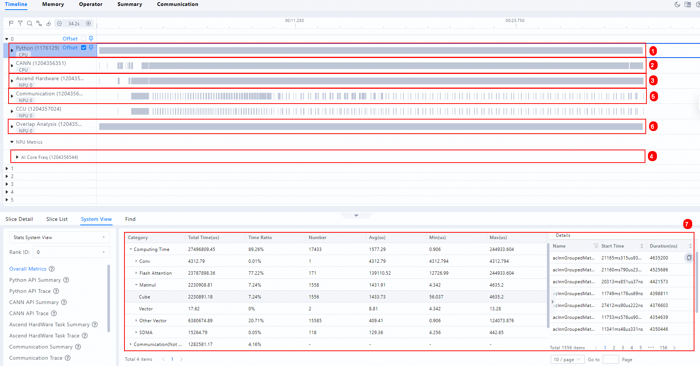
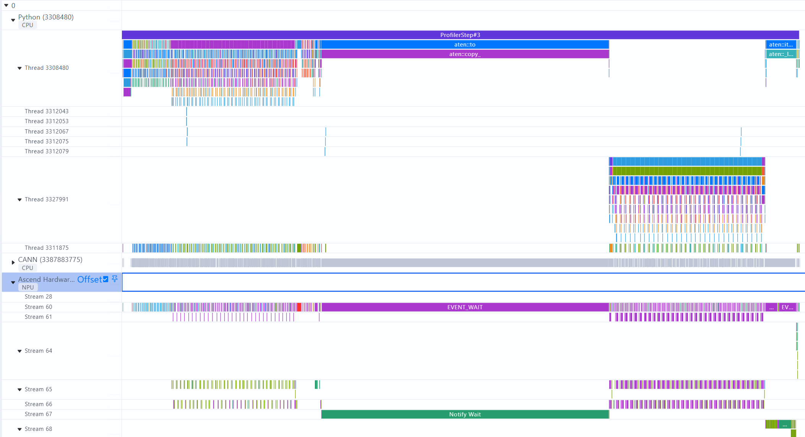
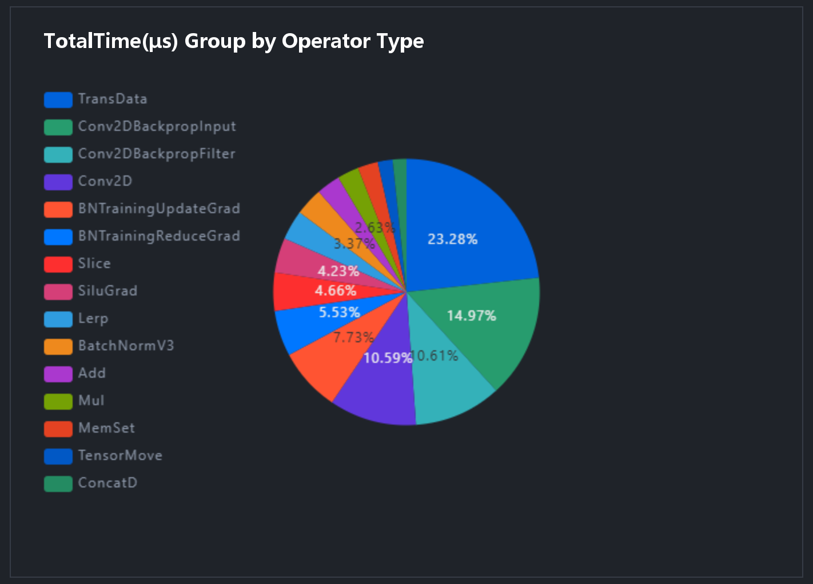
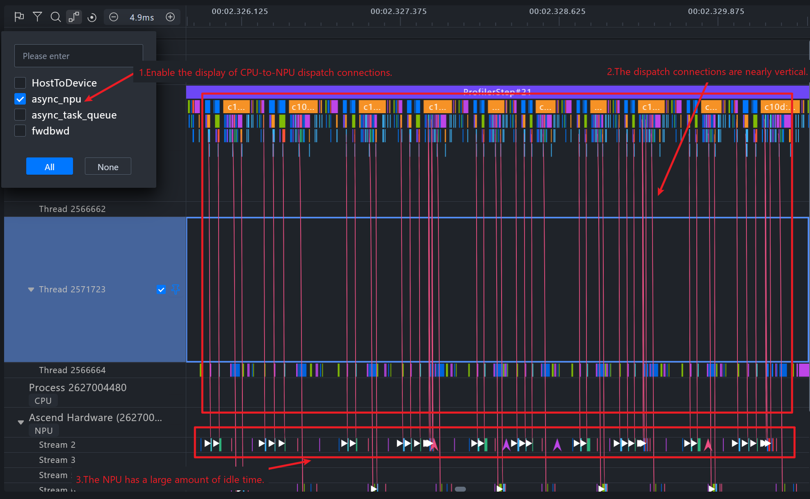
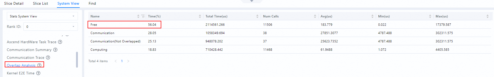

# FSDP2 Backend Model Performance Optimization Guide

This document focuses on MindSpeed LLM Fully Sharded Data Parallel 2 (FSDP2) distributed training and describes performance metrics, profiling capture, bottleneck identification, and optimization feature selection methods. It does not apply to online inference, KV Cache, inference quantization, or service scheduling. You cannot directly apply the metrics and conclusions in this document to inference performance.

## Performance Metrics and Evaluation References

### Core Metrics

For FSDP2 training, observe the following metrics first:

| Metric | Definition | Use |
| --- | --- | --- |
| Steady-state single-step time | Time to complete one optimizer step, including all micro batches for gradient accumulation | Evaluates end-to-end performance. The log field is `elapsed time per iteration (ms)`. |
| Effective token throughput | Number of effective tokens participating in training divided by the step time | The log field is `tokens/s`. |
| MFU | Ratio of the measured FLOPS of the model to the theoretical peak of the hardware | Evaluates compute resource utilization. Compare only between models that use the same FLOPS estimation methodology. |
| Peak memory | `max_memory_allocated` and `max_memory_reserved` | Distinguishes real tensor usage from allocator reservation/fragmentation. |

### Observing Performance Metrics

The following example applies to lightweight performance observation during online or long-running training. You can continuously view the single-step time, throughput, and MFU from the training logs. Because no full trace is generated, you cannot break down operator, communication, or Device Free time.

```shell
torchrun ${DISTRIBUTED_ARGS} train_fsdp2.py ${CONFIG_YAML} \
  --training.logging_steps 1 \
  --training.log_throughput true
```

| Parameter | Value | Effect |
| --- | --- | --- |
| --training.logging_steps | `1` | You are advised to print one training log per optimizer step. The log contains `elapsed time per iteration (ms)`, loss, grad norm, and peak memory. |
| --training.log_throughput | `true` | Enables throughput statistics and adds `tokens/s` and `mfu` to the training logs. |

## Calculating Single-Step Iteration Time

A more accurate expression of the FSDP2 step is:

```text
step_time = computation_time
          + unhidden_communication_time
          + device_free_time
```

Operators in the optimizer, gradient processing, and post-processing count toward computation time, and collective communication in these phases counts toward communication time. Do not directly add up all computation events and all communication events in the timeline. FSDP parameter all-gather, gradient reduce-scatter, EP/CP communication, and asynchronous D2H/H2D copies may overlap with computation. Therefore, the sum of events in each category may exceed the total step time.

### Items to Watch in Time Analysis

Unhidden communication time is a metric observed during time analysis. It represents the duration for which communication does not overlap with computation. When a communication event lasts a long time but is completely covered by computation, it does not count toward unhidden communication time.

| Critical Path Item | Reference Range | Pay Attention When | Common Causes |
| --- | --- | --- | --- |
| Unhidden communication | `<= 10%` | `> 20%` | FSDP all-gather/reduce-scatter, EP all-to-all, or CP send/recv cannot be covered by computation. |
| Free time | `< 3%` | `>= 3%` | Slow host dispatch, CPU contention, frequent small operators, synchronous APIs, or improper thread configuration |
| Computation | Usually the major part | Low utilization with many gaps | Fused operators not used, unfriendly shapes, too little workload, or expert imbalance |

`Free` indicates the period during which the device executes neither computation nor communication. Its proportion should be less than 3%. If the proportion is high, it usually indicates that the NPU is waiting for the host to dispatch tasks. In this case, check the host-to-device connections, Runtime APIs, and CPU/PyTorch traces to confirm Host Bound.

### Phases and Events in Profiling

Display names may differ slightly across CANN, TorchNPU, and MindStudio Insight versions. When locating bottlenecks, check the CPU/PyTorch tracks, NPU Kernel tracks, and HCCL tracks at the same time.

| Phase | Start and End Boundaries | Common Fields or Events in Profiling | Description |
| --- | --- | --- | --- |
| Forward | From the launch of the first model operator to the end of the loss computation | `Module`/`PyTorch Op`, `aten::*`, and the NPU Kernels corresponding to Attention, MatMul, RMSNorm, RoPE, and CrossEntropy | FSDP forward all-gather may appear before the computation of each layer. |
| Backward | From the launch of `loss.backward()` to the completion of the last gradient | `autograd::engine::evaluate_function`, `AccumulateGrad`, and backward NPU Kernels | FSDP reduce-scatter usually overlaps with the backward pass layer by layer. |
| FSDP communication | From parameter prefetch until the parameters can be computed, or from the start of gradient reduction until the dependency is released | `HcclAllGather`, `HcclReduceScatter`, and the corresponding HCCL tasks | Count only the tails or waits not covered by computation as unhidden communication. |
| EP communication | From the start of token dispatch until local experts can compute, and from the start of combine until tokens are restored | `HcclAllToAll`/`HcclAllToAllV`, GroupedMatMul, permute/unpermute | Check the token counts and end times on different ranks to identify expert load imbalance. |
| CP communication | From the start of the sequence/Head rearrangement or Ring exchange of Attention until the next dependent operator can execute | `HcclAllToAll`, `HcclSend`, `HcclRecv`, and Attention Kernels | Ulysses commonly uses all-to-all. Ring commonly uses send/recv pipelined with Attention. |
| Optimizer | From the start of gradient clipping until parameter updates and `zero_grad` complete | `Optimizer.step`, `AdamW.step`, `aten::_foreach_*`, grad norm/all-reduce | With the swap optimizer, H2D/D2H copies and wait events also appear. |
| Post-processing and synchronization | From the completion of parameter updates until the next step can safely start | loss/grad norm `all_reduce`, `barrier`, logging, saving, and cache clearing | Checkpoint steps should not enter regular performance statistics. |
| Host dispatch and Device Free | From the launch of framework calls by the CPU until the Runtime dispatches NPU tasks. The device side has no computation or communication tasks | `aclrtLaunchKernel`, Runtime APIs, Task Queue, HostToDevice connections, `Free` | When `Free` accounts for a large proportion, consider it Host Bound and continue to check CPU contention, small operators, and synchronous calls. |

## Collecting Performance Data

For detailed parameters, see [Profiling Data Collection](../tools/profiling.md). For the collection methods and applicable scenarios of the official tool, refer to the ["Using Performance Tools"](https://www.hiascend.com/document/detail/en/mindstudio/2610/practicalcases/GeneralPerformanceIssue/MindStudio/26.1.0/en/cases/general_performance_issue_troubleshooting_guide/performance_tool_usage.md) section in the *General Performance Issue Troubleshooting Guide*.

### Selecting a Collection Method

Ascend performance tools provide multiple collection methods, including CLI collection, the framework Profiler, dynamic collection, and online monitoring. For FSDP2 training, prefer the Ascend PyTorch Profiler tuning tool encapsulated in MindSpeed LLM. For Profiling parameter configuration, see [Profiling Data Collection](../tools/profiling.md). Choose other tools only when you need to supplement low-level data or perform long-term monitoring.

Select the FSDP2 Profiler collection items according to the analysis objective:

| Analysis Objective | Recommended Configuration |
| --- | --- |
| Routine performance analysis | `profile_level=level1`, and collect CPU and NPU data at the same time. |
| Compare execution time on the NPU side | Disable additional items such as stack, memory, and shape. |
| Locate the code position of hotspot operators | Add `profile_with_stack=true` to the routine configuration. |
| Analyze operator memory allocation | Add `profile_with_memory=true`, and record shapes as well when necessary. |
| Analyze cluster communication | `profile_level=level1`, and collect data from several representative ranks. |

**Collection levels and corresponding data**

| Collection Level | Generated Files | Views | Description |
| --- | --- | --- | --- |
| `ProfilerLevel.Level0` | `trace_view.json`, `msprof_*.json`, `operator_details.csv`, `kernel_details.csv` (without AI Core performance metrics), `memory_record.csv`, `operator_memory.csv` | Timeline, Memory, Operator | Basic collection level. It does not collect communication data or AI Core performance metrics. |
| `ProfilerLevel.Level1` | All Level0 files plus `communication.json`, `communication_matrix.json`, and `kernel_details.csv` (including AI Core performance metrics, which require the `aic_metrics` parameter) | All Level0 views plus Summary and Communication | Medium collection level. It additionally collects communication data and AI Core performance metrics. |

### Minimal Trace Collection

In the first round, collect only one steady-state step on rank 0, and enable CPU and NPU activities:

```shell
torchrun ${DISTRIBUTED_ARGS} train_fsdp2.py ${CONFIG_YAML} \
  --training.profile true \
  --training.profile_step_start 5 \
  --training.profile_step_end 6 \
  --training.profile_ranks 0 \
  --training.profile_level level1 \
  --training.profile_with_cpu true \
  --training.profile_save_path ./profile_fsdp2_rank0
```

The collection interval is left-closed and right-open: [`profile_step_start`, `profile_step_end`). After you confirm communication or slow-rank issues, select a few representative ranks or all ranks. When locating performance issues, enabling stack, memory, and shape collection increases the data volume and introduces additional collection overhead.

### Deep Trace Collection

Enable these items only when you need to locate code, shapes, or memory allocation:

```shell
torchrun ${DISTRIBUTED_ARGS} train_fsdp2.py ${CONFIG_YAML} \
  --training.profile true \
  --training.profile_step_start 5 \
  --training.profile_step_end 6 \
  --training.profile_ranks 0 \
  --training.profile_level level1 \
  --training.profile_with_cpu true \
  --training.profile_with_stack true \
  --training.profile_with_memory true \
  --training.profile_record_shapes true \
  --training.profile_save_path ./profile_fsdp2_deep
```

These switches increase collection overhead and result size. You can import the collection results into [MindStudio Insight](https://www.hiascend.com/document/detail/en/mindstudio/2610/GUI_baseddevelopmenttool/MindStudioInsight/docs/en/user_guide/overview.md) to view Timeline, Operator, Communication, and Memory.

### Performance Data File Structure

The FSDP2 Profiler generates a collection directory named with the host name, process ID, and timestamp in the `profile_save_path` directory. The specific files vary with `profile_export_type`, the collection level, the collection switches, and the tool version. A typical structure is as follows:

```text
profile_save_path/
└── <host>_<pid>_<timestamp>_ascend_pt/
    ├── ASCEND_PROFILER_OUTPUT/
    │   ├── trace_view.json
    │   ├── msprof_*.json
    │   ├── operator_details.csv
    │   ├── memory_record.csv
    │   ├── operator_memory.csv
    │   ├── kernel_details.csv
    │   ├── step_trace_time.csv
    │   ├── communication.json
    │   ├── communication_matrix.json
    │   ├── op_statistic.csv
    │   ├── ascend_pytorch_profiler_<rank_id>.db
    │   └── analysis.db
    ├── logs/
    └── PROF_<id>_<timestamp>_<suffix>/
```

PyTorch training data supports importing performance data directories that end with `_ascend_pt`. The files commonly used for performance analysis are `trace_view.json`, `op_statistic.csv`, and `kernel_details.csv`.

**PyTorch training performance data files**

| File Name | Description | View |
| --- | --- | --- |
| `trace_view.json` | Includes application-layer data, CANN-layer data, and low-level NPU data | Timeline |
| `msprof_*.json` | Master table of Timeline data. If frequency scaling data exists, the AI Core Freq level is displayed. | Timeline |
| `operator_details.csv` | Statistics of PyTorch operator time on the host side (dispatch) and the device side (execution) | Timeline |
| `memory_record.csv` | Process-level memory allocation information | Memory |
| `operator_memory.csv` | Operator memory allocation information | Memory |
| `kernel_details.csv` | Information about all operators executed on the NPU | Operator |
| `step_trace_time.csv` | Time statistics of computation and communication in an iteration | Summary |
| `communication.json` | Detailed information such as communication operator time and bandwidth | Communication |
| `communication_matrix.json` | Basic information about small communication operators | Communication |
| `ascend_pytorch_profiler_<rank_id>.db` | Performance data collected by the Ascend PyTorch Profiler interface | Timeline, Memory, Operator, Summary, Communication |
| `analysis.db` | Data collected in multi-device or cluster communication scenarios | Timeline, Memory, Operator, Summary, Communication |
| `op_statistic.csv` | Call counts and time of operators such as AI Core, AI CPU, and AI Vector | Operator |

### Timeline

The Timeline lays out the runtime status of the host and device during training on a time axis, visually presenting the API time on the host side and the Task time on the device side.

**Figure 1**  Common lanes and views of the timeline



**Information about common lanes and views of the timeline**

| No. | Name | Description |
| --- | --- | --- |
| 1 | Python lane (first-level pipeline) | View Python-layer code. Enable `with_stack` during collection to view the code call stack. |
| 2 | CANN lane (second-level pipeline) | Collects data such as ACL interface execution, GE fusion, and Runtime. Python-side operators are dispatched from the first-level pipeline to this lane, and tasks are dispatched to the NPU layer after being dequeued. |
| 3 | Ascend Hardware (NPU layer) | Also called the device side. Records the execution sequence of computation, communication, and other tasks on the NPU. |
| 4 | AI Core Freq | Used to observe downclocking issues. |
| 5 | Communication | Formerly called the HCCL lane. Records communication events at the NPU layer and corresponds one-to-one with the communication sub-lanes of Ascend Hardware. |
| 6 | Overlap Analysis | Vertically projects the computation and communication tasks of Ascend Hardware to obtain a breakdown of computation, communication, and idle time. |
| 7 | Stats System View | Summary statistics at the single-device level. Use the device number drop-down list on the left to switch between devices. |

The preceding table lists the Timeline lanes most commonly used during analysis. You can expand each lane to view details. For a complete introduction to the interface, see [MindStudio Insight Timeline](https://www.hiascend.com/document/detail/en/mindstudio/2610/GUI_baseddevelopmenttool/MindStudioInsight/docs/en/user_guide/system_tuning.md#timeline).

**Figure 2**  Detailed information after expanding a lane



### Data in the `op_statistic.csv` File

Analyze the total call time and call count of each operator type to determine whether any operator type takes too long, and then analyze whether those operators have optimization potential. During optimization, start with the operators that account for the largest proportion of time and optimize them step by step.

**Field description**

| Field | Description |
| --- | --- |
| `Device_id` | device ID |
| `Model Name` | Model name. This field may not be displayed by default or in single-operator scenarios. |
| `OP Type` | Operator type |
| `Core Type` | Core type, including `AI_CORE`, `AI_VECTOR_CORE`, `AI_CPU`, and so on |
| `Count` | Number of operator calls |
| `Total Time(us)` | Total time of operator calls, in us |
| `Avg Time(us)`, `Min Time(us)`, `Max Time(us)` | Average, minimum, and maximum time of operator calls, in us |

### Data in the `kernel_details.csv` File

`kernel_details.csv` records information about all operators executed on the NPU. The fields are defined as follows:

| Field | Description |
| --- | --- |
| `Step Id` | Iteration number |
| `Model ID` | Model ID |
| `Task ID` | Task ID |
| `Stream ID` | Stream ID |
| `Name` | Operator name |
| `Type` | Operator type, for example, `Conv2D`, `MatMulV2`, `TransData` |
| `OP State` | Operator state, for example, `dynamic` |
| `Accelerator Core` | Accelerator core, for example, `AI_CORE`, `AI_VECTOR_CORE`, `DSA_SQE`, `MIX_AIV` |
| `Start Time(μs)` | Start time, in μs |
| `Duration(μs)` | Duration, in μs |
| `Wait Time(μs)` | Wait time, in μs |
| `Input Shapes`/`Output Shapes` | Input/output shapes |
| `Input Data Types`/`Output Data Types` | Input/output data types |
| `Input Formats`/`Output Formats` | Input/output data formats, for example, `NCHW`, `NC1HWC0`, `FRACTAL_Z`, `FORMAT_ND` |
| `Context ID` | Context ID |
| `aicore_time(μs)` to `aic_icache_miss_rate` | AI Core performance metrics. You must configure `aic_metrics=PipeUtilization` and `profiler_level >= Level1`. See the "AI Core performance metric fields" section. |
| `aiv_time(μs)` to `cube_utilization(%)` | AI Vector Core performance metrics. You must configure `aic_metrics=PipeUtilization` and `profiler_level >= Level1`. See the "AI Vector Core performance metric fields" section. |

**AI Core performance metric fields**

| Field | Description | Interpretation |
| --- | --- | --- |
| `aicore_time(μs)` | AI Core execution time | Actual execution time of the operator on the AI Core, excluding wait time |
| `aic_total_cycles` | Total AI Core cycles | Total clock cycles of execution, which you can use to estimate instruction execution efficiency |
| `aic_mac_time(μs)` | MAC unit time | Time of the matrix multiplication unit. The MAC unit handles matrix multiply-accumulate operations. |
| `aic_mac_ratio` | MAC unit ratio | Ratio of MAC time to total time. A high value indicates that compute-intensive operators achieve high compute resource utilization. |
| `aic_scalar_time(μs)` | Scalar unit time | Time of the scalar processing unit. Scalar handles control flow and scalar operations. |
| `aic_scalar_ratio` | Scalar unit ratio | Ratio of Scalar time to total time. A high value may indicate complex control logic. |
| `aic_mte1_time(μs)` | MTE1 time | Time of memory transfer engine 1, which reads data from the L1 cache |
| `aic_mte1_ratio` | MTE1 ratio | Ratio of MTE1 time to total time. A high value indicates frequent L1 cache reads. |
| `aic_mte2_time(μs)` | MTE2 time | Time of memory transfer engine 2, which reads data from DDR/L2 to L1 |
| `aic_mte2_ratio` | MTE2 ratio | Ratio of MTE2 time to total time. A high value may indicate a memory bandwidth bottleneck. |
| `aic_fixpipe_time(μs)` | FixPipe unit time | Time of the data post-processing unit, which handles format conversion and precision processing |
| `aic_fixpipe_ratio` | FixPipe unit ratio | Ratio of FixPipe time to total time |
| `aic_icache_miss_rate` | AI Core iCache miss rate | A high value indicates a low instruction cache hit rate, and you may need to optimize the instruction layout. |

**AI Vector Core performance metric fields**

| Field | Description | Interpretation |
| --- | --- | --- |
| `aiv_time(μs)` | AI Vector execution time | Actual execution time of the operator on the AI Vector Core |
| `aiv_total_cycles` | Total AI Vector cycles | Total clock cycles of execution |
| `aiv_vec_time(μs)` | Vector unit time | Time of the vector computation unit |
| `aiv_vec_ratio` | Vector unit ratio | Ratio of Vector time to total time. A high value indicates intensive vector computation. |
| `aiv_scalar_time(μs)` | Vector Scalar unit time | Time of the vector scalar processing unit |
| `aiv_scalar_ratio` | Vector Scalar unit ratio | Ratio of Vector Scalar time to total time |
| `aiv_mte2_time(μs)` | Vector MTE2 time | Time of vector memory transfer engine 2, which reads data from DDR/L2 |
| `aiv_mte2_ratio` | Vector MTE2 ratio | Ratio of Vector MTE2 time to total time. A high value may indicate a memory bandwidth bottleneck. |
| `aiv_mte3_time(μs)` | Vector MTE3 time | Time of vector memory transfer engine 3, which writes data back to DDR/L2 |
| `aiv_mte3_ratio` | Vector MTE3 unit ratio | Ratio of Vector MTE3 time to total time |
| `aiv_icache_miss_rate` | AI Vector iCache miss rate | Miss rate of the vector instruction cache |
| `cube_utilization(%)` | Cube utilization | Utilization of the matrix multiplication unit, reflecting how efficiently the Cube unit is used |

**Key fields**

- Cube operators: `aic_mac_ratio`, `aic_mte2_ratio`
- Vector operators: `aiv_vec_ratio`, `aiv_mte2_ratio`

By analyzing the MAC/MTE2 ratios, you can determine whether an operator is compute-bound or memory-bound. A high MAC ratio usually indicates a compute-bound operator, and a high MTE2 ratio usually indicates a memory-bound operator. For Cube operators, expect a high `aic_mac_ratio` and a low `aic_mte2_ratio`. For Vector operators, expect a high `aiv_vec_ratio` and a low `aiv_mte2_ratio`.

## Standardized Bottleneck Troubleshooting Process

Handle only one main bottleneck at a time, and re-measure with the same criteria.

### Communication Bottlenecks

1. Analyze the communication lanes in the Timeline:
   - In Communication, check the time and actual bandwidth of FSDP all-gather/reduce-scatter, EP all-to-all, CP all-to-all, and send/recv. Pay special attention to communication operations with abnormal time or actual bandwidth significantly lower than the theoretical bandwidth.
   - In the Timeline, observe the overlap between communication and computation to confirm whether communication is on the critical path, and evaluate whether the unhidden communication time still has optimization potential.
2. Based on the preceding observations, focus on the following issues:
   - If the FSDP unhidden communication time is too long, try forward/backward prefetch first and check the FSDP module granularity.
   - If the MoE unhidden communication time is too long, evaluate the EP size, fused dispatcher, GroupedMatMul, or EP MC2.
   - If long-sequence Attention has excessive computation or activation memory, evaluate CP-Ulysses or CP-Ring.

### Operator Computation Bottlenecks

1. Locate hotspot operators: In the Operator tab of [MindStudio Insight](https://www.hiascend.com/document/detail/en/mindstudio/2610/GUI_baseddevelopmenttool/MindStudioInsight/docs/en/user_guide/overview.md), sort by total time. Combine the call count, average time per call, shape, and dtype to identify operators with high total time or excessively frequent calls, and analyze whether you can further optimize the computation logic.
2. Evaluate fusion opportunities: For hotspot operators whose model code has already been adapted, evaluate Flash Attention, Fused RMSNorm, Fused RoPE, MoE GroupedMatMul, the fused dispatcher, and model-specific fusion operators first. After enabling them, compare the end-to-end step time, kernel count, peak memory, and accuracy results to confirm the actual benefit.

**Common computation optimization cases**

For the latest details, see [Operator Performance Issue Optimization Solutions](https://www.hiascend.com/document/detail/en/mindstudio/2610/practicalcases/GeneralPerformanceIssue/MindStudio/26.1.0/en/cases/general_performance_issue_troubleshooting_guide/solution_to_top2.md).

**Table 1**  Common optimization cases

| Problem Type | Model Problem | Code Optimization Suggestion |
| --- | --- | --- |
| Format conversion | Based on operator data, if the TransData operator accounts for a high proportion of time, the specific behavior is shown in Figure 3. | Try to disable automatic format conversion.<br/>`torch_npu.npu.config.allow_internal_format = False` |
| Format conversion | `x1` is the result of a non-contiguous conversion, and every subsequent call introduces a `transpose`.<br/>`def forward(self, x):`<br/>`x=self.fc1(x)`<br/>`x1=F.relu(x).transpose(1,2)#.contiguous()`<br/>`x2_1=self.fc2_1(x1)`<br/>`x2_2=self.fc2_2(x1)`<br/>`x3=torch.add(x2_1,x2_2)`<br/>`x4=self.fc3(x3)[:,0,]`<br/>`return x4` | Eliminate the redundant `transpose` introduced by the calls, and explicitly call a contiguous-conversion function after the conversion.<br/>`x1 = F.relu(x).transpose(1, 2).contiguous()` |
| Redundant code | An unused variable definition causes extra memory operation overhead.<br/>`tasks = torch.tensor(tasks).to(self.device)    # variable is not used after definition` | Remove the redundant code. |
| Redundant code | Small-batch repeated memory copies generate many memory operators. You can improve performance by combining the copies.<br/>`tasks = torch.cat([self.task_tokenizer(x["task"]).to(self.device).unsqueeze(0) for x in batched_inputs], dim=0)` | Complete the operations on the CPU, and then copy the data to the NPU as a whole for execution.<br/>`tasks = torch.cat([self.task_tokenizer(x["task"]).unsqueeze(0) for x in batched_inputs], dim=0)`<br/>`tasks=tasks.to(self.device)` |
| Code lacking hardware affinity | Operators may degrade significantly under extreme shapes. Take the SelectV2 operator as an example. The specific behavior is shown in Figure 4.<br/>`fg_scores_mask = fg_mask[:, :, None].repeat(1, 1, self.num_classes)`<br/>`target_scores=torch.where(fg_scores_mask>0,target_scores,0)` | Avoid calling this operator and replace it with matrix operations.<br/>`fg_scores_mask = fg_mask.unsqueeze(-1)`<br/>`target_scores*=(fg_scores_mask>0).float()` |

**Figure 3**  TransData operator accounting for a high proportion of time



**Figure 4**  Performance degradation of the SelectV2 operator under extreme shapes


### Host Dispatch Bottlenecks

When the `Free` time proportion reaches or exceeds 3%, check the host-to-device connections, CPU core binding and contention, Python small operators, synchronous calls, logging, GC, frequent `empty_cache` calls, and software stack compatibility.

**About Host Bound**

In TorchNPU training scenarios, operator scheduling, memory allocation, and task dispatch on the host side (CPU) run asynchronously with task execution on the device side (NPU). When the Host dispatches tasks more slowly than the Device executes them, the Device enters an idle state waiting for new tasks, which forms Host Bound. For detailed analysis methods, see [Host Bound Issue Location and Resolution](https://www.hiascend.com/document/detail/en/mindstudio/2610/practicalcases/GeneralPerformanceIssue/MindStudio/26.1.0/en/cases/general_performance_issue_troubleshooting_guide/solution_to_top3.md).

**Typical symptoms**

- Dense and nearly vertical host-to-device connections indicate that the NPU is waiting for the CPU to dispatch tasks.
- The `Free` time proportion is too high and significantly exceeds the normal range.
- Long gaps, synchronous calls, or massive small-operator dispatch appear in the CPU/PyTorch tracks or Runtime tracks.

**Figure 5**  Performance data of a typical Host Bound scenario



**Figure 6**  Dispatch bottleneck with an excessively high Free time proportion


**Figure 7**  Another dispatch bottleneck with an excessively high Free time proportion



**Figure 8**  Nearly vertical host-to-device connections


**Common optimization directions**

| Optimization Direction | Handling Method |
| --- | --- |
| Reduce the number of operator dispatches | Prefer logic optimization, equivalent computation replacement, and operator fusion to reduce frequent small-operator calls. |
| Increase task dispatch speed | Enable the task queue and bind CPU cores appropriately. Evaluate compilation optimization when necessary. |
| Reduce CPU computation | Reduce AI CPU operators and prefer NPU-affinity operators. |
| Improve CPU/NPU parallelism | Reduce synchronous operations such as `item()`, `cpu()`, and `npu()`, and merge calls that can run in batches. |
| Troubleshoot dispatch anomalies | Check CPU resource preemption, cross-NUMA access, OS scheduling, and background task interference. |

**Task queue optimization**

When Host Bound is obvious, enable the task queue with the following environment variable:

```shell
export TASK_QUEUE_ENABLE=2
```

- Setting `ASCEND_LAUNCH_BLOCKING=1` forcibly disables the task queue, making the `TASK_QUEUE_ENABLE` configuration ineffective.
- `TASK_QUEUE_ENABLE=2` increases memory access concurrency and may increase the NPU peak memory at runtime.
- For detailed configuration, see [`TASK_QUEUE_ENABLE`](https://www.hiascend.com/document/detail/en/Pytorch/2610/apiref/ENV/docs/en/environment_variable_reference/TASK_QUEUE_ENABLE.md).

**CPU core binding optimization**

When task scheduling capability is insufficient or cross-NUMA access or fast/slow device imbalance is prominent, configure CPU affinity:

```shell
export CPU_AFFINITY_CONF=<mode>,npu<value1>:<value2>-<value3>
```

- `mode=0` or no configuration: disables core binding.
- `mode=1`: coarse-grained core binding, which binds all threads associated with one NPU to the specified CPU core range.
- `mode=2`: fine-grained core binding, which binds the main threads associated with one NPU to independent CPU cores.
- `npu<value1>:<value2>-<value3>`: sets the CPU core range for the specified NPU. It takes effect only when `mode` is not 0.
- For detailed configuration, see [`CPU_AFFINITY_CONF`](https://www.hiascend.com/document/detail/en/Pytorch/2610/apiref/ENV/docs/en/environment_variable_reference/CPU_AFFINITY_CONF.md).

**Configuration examples**

Coarse-grained core binding:

```shell
export CPU_AFFINITY_CONF=1
```

Fine-grained core binding:

```shell
export CPU_AFFINITY_CONF=2
```

Custom core binding (NPU 0 to CPU 0-1, NPU 1 to CPU 2-5, NPU 3 to CPU 6):

```shell
export CPU_AFFINITY_CONF=1,npu0:0-1,npu1:2-5,npu3:6-6
```

### Memory Bottlenecks

1. Analyze memory: When memory is insufficient, collect a memory snapshot or run deep-trace profiling to determine whether the OOM is caused by parameters/gradients/optimizer states, activations, or oversized logits, and then select the corresponding memory optimization feature.
2. Optimize using features: Evaluate them in the order of ChunkLoss/fused operators -> CP/EP/FSDP partitioning -> recomputation -> asynchronous activation offload -> optimizer swap, and prefer solutions that have less impact on performance.

## Selecting FSDP2 Optimization Features

### Selecting Optimization Directions by Bottleneck

| Bottleneck Type | Typical Symptoms | Recommended Order to Try | What Not to Prioritize |
| --- | --- | --- | --- |
| Computation bottleneck | Operators such as Attention, Norm, RoPE, or expert GEMM take a long time. | Model-specific fusion -> Flash Attention -> Fused RMSNorm/RoPE -> MoE GroupedMatMul | Increasing partitioning or offload without confirming the hotspot operators |
| Memory bottleneck | Logits, activations, expert parameters, or optimizer states occupy too much memory. | ChunkLoss -> CP/EP/FSDP within EP -> activation recomputation -> asynchronous activation offload -> Swap Optimizer | Enabling offload or swap without distinguishing the memory source |
| Communication bottleneck | Unhidden time of FSDP or EP communication is too long. | FSDP forward/backward prefetch -> fused dispatcher -> EP MC2 -> check parallel groups and topology | Adjusting only the parallelism without checking expert load and communication overlap |
| Host dispatch bottleneck | Device Free time is high, and host-to-device connections are dense and nearly vertical. | Task queue -> CPU core binding. When there are too many small operators, also evaluate computation fusion features. | Introducing more Host/Device copies and scheduling through offload |

### Features, Applicable Scenarios, and Constraints

The following features are classified into computation, memory, communication, and host dispatch by the primary bottleneck they address, corresponding to the bottleneck selection directions in the preceding section. One feature may improve multiple metrics at the same time. For example, Flash Attention both reduces computation time and lowers intermediate memory. This section classifies features by their primary optimization objective.

Except for the task queue and CPU core binding, all other features require the corresponding code adaptation for the model first. CLI or YAML parameters only enable already-adapted feature implementations. They cannot replace model code adaptation.

**Computation bottleneck optimization features**

| Feature | Applicable Model/Service | Primary Benefit | How to Enable | Constraints and Risks |
| --- | --- | --- | --- | --- |
| Model-specific fusion | DeepSeek/GLM DSA, Qwen3-Next GDN, DeepSeek-V4 MHC, and so on | Optimizes sparse Attention, Indexer, GDN, or MHC hotspots. | `--optimization.use_sparse_flash_attn`, `--optimization.use_fused_lightning_indexer*`, `--optimization.use_flash_gdn`, `--optimization.use_triton_gdn`, `--optimization.use_ascend_mhc` | Available only for the corresponding models. Some options are mutually exclusive and depend on specific CANN/operator packages. |
| Flash Attention | Standard Attention or model-specific Attention where Attention is a computation/memory hotspot | Fuses QK, Softmax, and AV, and reduces intermediate memory. | `--optimization.use_flash_attn true` | Masks, variable lengths, head dim, and sparse structures must be supported. CP usually depends on fused Attention. |
| Fused RMSNorm | LLM/MoE models that use RMSNorm, where Norm small operators and scheduling account for a high proportion | Reduces kernels and intermediate reads/writes. | `--optimization.use_fused_rmsnorm true` | The model must have the adaptation. Perform loss/gradient consistency checks. |
| Fused RoPE | Attention models that use RoPE, with long sequences or many layers | Reduces position encoding small operators. | `--optimization.use_fused_rotary_pos_emb true` | RoPE variants, layout, and dtype must be supported. |
| MoE GroupedMatMul | Multiple local experts on each rank, with fragmented expert GEMMs | Merges or runs expert GEMMs concurrently to improve utilization. | `--optimization.moe_grouped_gemm true` | Limited benefit when tokens are very few or extremely unbalanced. Applies only to adapted MoE models. |

**Memory bottleneck optimization features**

| Feature | Applicable Model/Service | Primary Benefit | How to Enable | Constraints and Risks |
| --- | --- | --- | --- | --- |
| ChunkLoss | Causal LM pretraining, where [`batch`, `seq`, `vocab`] logits cause memory spikes. Especially effective for large vocabularies or long sequences | Computes the LM Head and loss in chunks to lower the logits peak. | `--optimization.chunk_loss_size 1024` | The current training entry uses it only with `stage=pt`. The model forward/LM Head must support `loss_ctx`. |
| CP-Ulysses | Long sequences where the number of heads is divisible by CP, and Attention activations or computation are excessive | Splits the sequence and rearranges Heads with all-to-all. | `--parallel.cp_size N --parallel.cp_type ulysses` | `num_attention_heads % N == 0`. For short sequences, communication may outweigh the benefit. |
| CP-Ring | Extremely long sequences where you expect Attention computation to cover point-to-point communication | Splits the sequence and pipelines the KV exchange. | `--parallel.cp_size N --parallel.cp_type ring` | The current fixed-length splitting usually requires the sequence to be divisible by `2 * N`. You are advised to enable it only when the local sequence on each rank is long enough. |
| EP | MoE expert parameters or expert computation is too large. | Splits parameters and computation along the expert dimension. | `--parallel.ep_size N` | The total number of experts must be divisible by `N`. It introduces token dispatch/combine. |
| FSDP within EP | Local expert parameters/optimizer states on a single rank remain too large after EP. | Further splits expert parameters, gradients, and states. | `--parallel.ep_fsdp_size N` | Adds expert parameter all-gather/reduce-scatter. The mesh divisibility of the world size must be satisfied. |
| Activation recomputation | Activations account for a high proportion of memory, and re-executing part of the forward computation in the backward pass is acceptable. | Exchanges extra computation for lower activation memory. | Use the activation recomputation configuration adapted for the model. | Increases computation. Expand the recomputation scope layer by layer or module by module. |
| Asynchronous activation offload | Activation memory dominates, host memory and H2D/D2H bandwidth are sufficient, and enough computation exists before the backward pass to cover the copies. | Offloads activations D2H and prefetches them H2D before the backward pass. | Use `async_save_on_cpu` in model blocks. | Requires hooking into each block and filtering tensors. It becomes slower when the copies cannot be covered. |
| Swap Optimizer | AdamW states cause insufficient device memory, host memory is sufficient, and the optimizer step proportion is acceptable. | Swaps optimizer states between Host and Device. | Use a version configuration with the integrated swap optimizer. | Must handle EP multiple optimizers, checkpoint save/load, and prefetch timing. |

**Communication bottleneck optimization features**

| Feature | Applicable Model/Service | Primary Benefit | How to Enable | Constraints and Risks |
| --- | --- | --- | --- | --- |
| FSDP forward prefetch | Long unhidden communication time for per-layer parameter all-gather, with available memory | Fetches parameters of subsequent modules in advance so that computation covers communication. | `--parallel.num_to_forward_prefetch 2` | Try increasing gradually from 1 to 2. Overly large values increase transient parameter/communication buffers and congestion. |
| FSDP backward prefetch | Unhidden communication time in reduce-scatter or preparation of parameters for the next layer. | Improves communication-computation overlap in the backward pass. | `--parallel.num_to_backward_prefetch 2` | As with forward prefetch, monitor peak memory and link congestion. |
| Fused Dispatcher | MoE token dispatch/combine consists of many scattered operations | Fuses token dispatch and combine operations to reduce EP communication scheduling overhead. | `--parallel.ep_dispatcher fused` | Applies only to adapted MoE models. Check expert load balancing and end-to-end benefit. |
| EP MC2 | Both the all-to-all of MoE EP and the expert GroupedMatMul are heavy, with long unhidden communication time. | Fuses all-to-all and GroupedMatMul, and covers communication through pipelining. | `--parallel.ep_dispatcher mc2` | Depends on `fsdp_turbo.ops.grouped_matmul_mc2` and matching software/hardware. The number of experts must be divisible by EP. |

**Host dispatch bottleneck optimization features**

| Feature | Applicable Model/Service | Primary Benefit | How to Enable | Constraints and Risks |
| --- | --- | --- | --- | --- |
| Task queue | Insufficient host dispatch speed and high Device Free time | Dispatches tasks to the device asynchronously to improve host/device parallelism. | `export TASK_QUEUE_ENABLE=2` | `ASCEND_LAUNCH_BLOCKING=1` invalidates the configuration. It may increase NPU peak memory usage. |
| CPU core binding | Prominent CPU resource contention, cross-NUMA access, or fast/slow device imbalance | Reduces thread migration and cross-NUMA access, and improves task dispatch stability. | `export CPU_AFFINITY_CONF=<mode>` | Set it according to the server CPU topology. Incorrect binding may degrade performance. |
