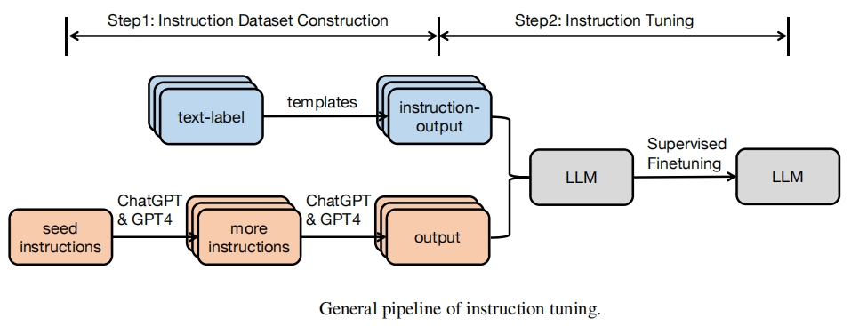

# 大模型指令微调

## 使用场景

大模型虽然在预训练后拥有强大的语言能力，但它们往往缺乏任务意识或交互能力。通过在多任务、多样化的数据集上进行微调，指令微调（Instruction Fine-Tuning）使得模型在应对各种任务时更加灵活并更具泛化能力。  
指令微调首先收集多个不同任务的数据集，并将每个任务转换为指令形式的输入，帮助大模型在多样化任务上提升泛化能力。具体来说，就是通过“指令-输出”的配对样本，使用有监督学习的方式，让模型学会执行具体任务。指令微调的基本原理如下：

  
*图源：[Instruction Tuning for Large Language Models: A Survey.](https://arxiv.org/pdf/2308.10792v5)*

根据指令微调的数据格式，可分为以下三种常见的使用场景：

### [单样本微调](./single_sample_finetune.md)

每条数据为一个独立的任务样本，包括指令和目标回复。适合用于问答、翻译、单轮任务等。

- 数据格式示例：

    ```json
    {
        "instruction": "请将下面的句子翻译成英文：我爱自然语言处理。",
        "response": "I love natural language processing."
    }
    ```

### [多样本pack微调](./multi_sample_pack_finetune.md)

为了提高训练效率，将多个样本拼接打包成一个长序列，减少填充，提高显存利用率。

- 原始样本：

    ```json
    [
        {
            "instruction": "请将以下句子翻译成英文：我们正在开发一款新的人工智能助手。",
            "response": "We are developing a new AI assistant."
        },
        {
            "instruction": "请列出三个可再生能源的例子。",
            "response": "太阳能、风能和水能是三种常见的可再生能源。"
        }
    ]
    ```

- 拼接后输入示例：

    ```json
    <bos> Instruction: 请将以下句子翻译成英文：我们正在开发一款新的人工智能助手。
    Response: We are developing a new AI assistant. <eos>
    Instruction: 请列出三个可再生能源的例子。
    Response: 太阳能、风能和水能是三种常见的可再生能源。 <eos>
    ```

### [多轮对话微调](./multi-turn_conversation.md)

用于训练模型进行连续对话，保留上下文信息。每条样本包含一轮以上的用户和模型对话。

- 数据示例：

    ```json
    {
        "conversations": [
            {"role": "user", "content": "你好"},
            {"role": "assistant", "content": "你好，有什么我可以帮你的吗？"},
            {"role": "user", "content": "什么是强化学习？"},
            {"role": "assistant", "content": "强化学习是一种让智能体通过试错方式学习策略的方法。"}
        ]
    }
    ```

- 构造的输入示例：

    ```json
    <user>: 你好
    <assistant>: 你好，有什么我可以帮你的吗？
    <user>: 什么是强化学习？
    <assistant>: 强化学习是一种让智能体通过试错方式学习策略的方法。
    ```

## 使用约束

- 序列类型的不同，其对应的微调脚本和数据预处理方式也不同，这里以Qwen3的指令微调举例：

    | 序列长度   | 特点                             | 训练脚本 | 数据预处理方式   |
    |--------|--------------------------------|----|---------------------------------------------------------|
    | 固定长度序列 | 性能低，不推荐使用 |  训练时不使用`--no-pad-to-seq-lengths`参数    | 使用默认预处理脚本，如`data_convert_qwen3_instruction.sh`         |
    | 动态长度序列 | sample吞吐高  |   训练脚本需要使用`--no-pad-to-seq-lengths`参数   | 使用默认预处理脚本，如`data_convert_qwen3_instruction.sh`         |
    | 样本拼接序列 | token吞吐高，支持长序列并行 |   训练脚本需要使用`--reset-attention-mask`参数，不启用`--no-pad-to-seq-lengths`   | 使用pack配置的预处理脚本，详见[多样本pack微调](./multi_sample_pack_finetune.md) |

    请根据自己的使用场景，灵活选择对应类型的指令微调训练脚本和数据预处理脚本。

- 当前微调数据预处理使用的默认模板已和LLaMA Factory 0.8.2对齐，如果需要与该版本之后的版本对齐，请在微调数据预处理阶段设置`prompt-type`参数值为`qwen_lf`。