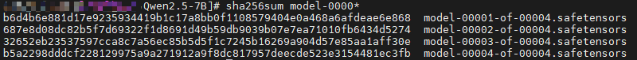
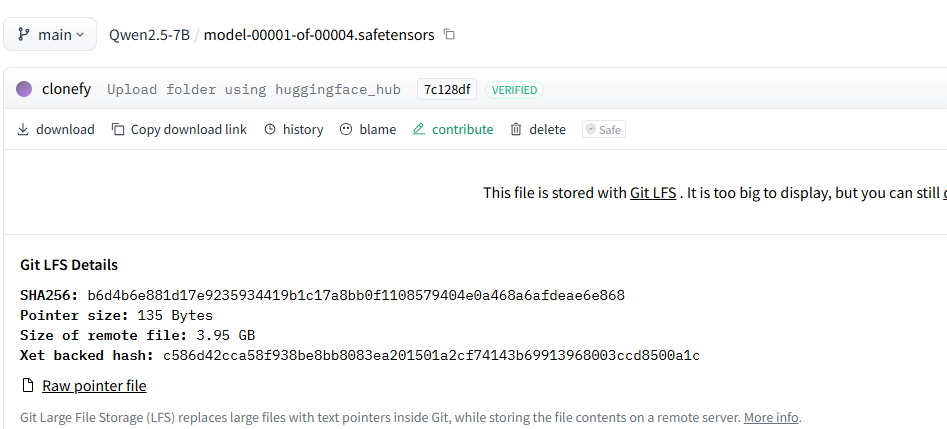
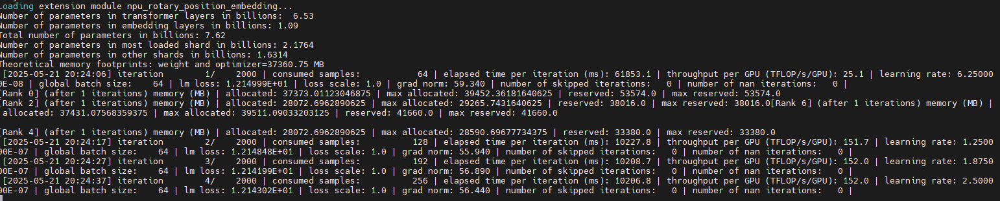
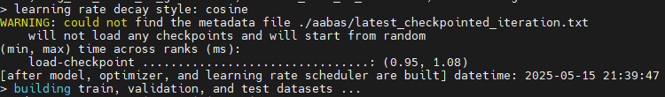
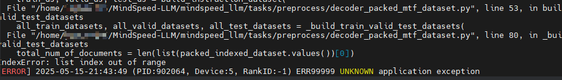
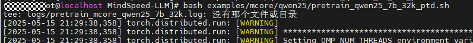

# 快速入门：Qwen2.5 模型预训练

当前文档提供了一个简单示例，方便新接触MindSpeed-LLM的开发者们可以快速上手，将模型训练任务跑起来。下面以Qwen2.5-7B模型为例，指导开发者完成Qwen2.5-7B大语言模型的预训练任务，主要包含如下步骤：
- 环境搭建：基于仓库指导文件搭建环境
- 开源模型权重获取：从HuggingFace下载Qwen2.5-7B原始模型
- 启动预训练：在昇腾NPU上进行模型预训练

开发者入门基础：
- 具备基础PyTorch使用经验
- 具备初等python开发经验
- 对于Megatron-LM仓库有概略的了解

# 1 环境搭建

基于不同的后端，环境搭建请参考[MindSpeed LLM安装指导-PyTorch后端](./pytorch/install_guide.md)和[MindSpeed LLM安装指导-MindSpore后端](./mindspore/install_guide.md)。

# 2 开源模型权重获取

通过 wget 从HuggingFace下载模型文件。

```shell
# 创建一个目录存储huggingface文件
mkdir -p ./model_from_hf/qwen2.5-7b-hf
cd ./model_from_hf/qwen2.5-7b-hf

# wget获取权重文件
wget https://huggingface.co/Qwen/Qwen2.5-7B/resolve/main/config.json
wget https://huggingface.co/Qwen/Qwen2.5-7B/resolve/main/generation_config.json
wget https://huggingface.co/Qwen/Qwen2.5-7B/resolve/main/merges.txt
wget https://huggingface.co/Qwen/Qwen2.5-7B/resolve/main/model-00001-of-00004.safetensors
wget https://huggingface.co/Qwen/Qwen2.5-7B/resolve/main/model-00002-of-00004.safetensors
wget https://huggingface.co/Qwen/Qwen2.5-7B/resolve/main/model-00003-of-00004.safetensors
wget https://huggingface.co/Qwen/Qwen2.5-7B/resolve/main/model-00004-of-00004.safetensors
wget https://huggingface.co/Qwen/Qwen2.5-7B/resolve/main/model.safetensors.index.json
wget https://huggingface.co/Qwen/Qwen2.5-7B/resolve/main/tokenizer.json
wget https://huggingface.co/Qwen/Qwen2.5-7B/resolve/main/tokenizer_config.json
wget https://huggingface.co/Qwen/Qwen2.5-7B/resolve/main/vocab.json
```

国内可从ModelScope寻找对应资源
```shell
# wget获取权重文件
wget https://www.modelscope.cn/models/Qwen/Qwen2.5-7B/resolve/master/config.json
wget https://www.modelscope.cn/models/Qwen/Qwen2.5-7B/resolve/master/generation_config.json
wget https://www.modelscope.cn/models/Qwen/Qwen2.5-7B/resolve/master/merges.txt
wget https://www.modelscope.cn/models/Qwen/Qwen2.5-7B/resolve/master/model-00001-of-00004.safetensors
wget https://www.modelscope.cn/models/Qwen/Qwen2.5-7B/resolve/master/model-00002-of-00004.safetensors
wget https://www.modelscope.cn/models/Qwen/Qwen2.5-7B/resolve/master/model-00003-of-00004.safetensors
wget https://www.modelscope.cn/models/Qwen/Qwen2.5-7B/resolve/master/model-00004-of-00004.safetensors
wget https://www.modelscope.cn/models/Qwen/Qwen2.5-7B/resolve/master/model.safetensors.index.json
wget https://www.modelscope.cn/models/Qwen/Qwen2.5-7B/resolve/master/tokenizer.json
wget https://www.modelscope.cn/models/Qwen/Qwen2.5-7B/resolve/master/tokenizer_config.json
wget https://www.modelscope.cn/models/Qwen/Qwen2.5-7B/resolve/master/vocab.json
```

通过sha256sum验证模型权重文件完整性
```shell
# 利用sha256sum计算sha256数值
# 打开文件明细可获取sha256值，https://huggingface.co/Qwen/Qwen2.5-7B/blob/main/model-00001-of-00004.safetensors
# 如果从ModelScope下载，则打开 https://www.modelscope.cn/models/Qwen/Qwen2.5-7B/file/view/master/model-00001-of-00004.safetensors
sha256sum model-00001-of-00004.safetensors
sha256sum model-00002-of-00004.safetensors
sha256sum model-00003-of-00004.safetensors
sha256sum model-00004-of-00004.safetensors
```




# 3 基于PyTorch后端的预训练

在这一阶段，我们将基于下载的HuggingFace(hf)原数据，完成权重转换、数据集预处理，启动模型预训练，包含步骤如下：

- hf权重转换成megatron权重；
- 预训练数据集处理；
- 预训练任务启动。

## 3.1 权重转换

昇腾MindSpeed-LLM要求模型权重采用Megatron-Mcore格式，在这里我们将原始HuggingFace权重格式转换为Megatron-Mcore格式。
详见[hf2mg权重转换](./pytorch/solutions/checkpoint/checkpoint_convert.md#21-huggingface权重转换到megatron-mcore格式)

使用官方提供的转换脚本，获取对应切分的mg权重。

```shell
cd MindSpeed-LLM

# 请先根据如下指导完成脚本修改配置
bash examples/mcore/qwen25/ckpt_convert_qwen25_hf2mcore.sh
```

如下为调整后的hf2mcore权重转换示例脚本

```shell
source /usr/local/Ascend/cann/set_env.sh  # 修改为实际安装的Toolkit包路径

python convert_ckpt.py \
       --use-mcore-models \
       --model-type GPT \
       --load-model-type hf \
       --save-model-type mg \
       --target-tensor-parallel-size 1 \   # 通过这里将切分调整为tp1pp4
       --target-pipeline-parallel-size 4 \
       --add-qkv-bias \
       --load-dir ./model_from_hf/qwen2.5-7b-hf/ \
       --save-dir ./model_weights/qwen2.5_mcore/ \
       --tokenizer-model ./model_from_hf/qwen2.5-7b-hf/tokenizer.json \
       --model-type-hf llama2 \
       --params-dtype bf16
```

参数解析

| 参数                                  | 说明                                             | 必填 |
|-------------------------------------|------------------------------------------------|---|
| `--model-type GPT`                  | 指定模型类型为GPT系列                                   | ✅ |
| `--use-mcore-models`                | 转换为Megatron-Mcore格式                            | ✅ |
| `--target-tensor-parallel-size 1`   | 张量并行度设置（建议配置1）                                 | ✅ |
| `--target-pipeline-parallel-size 4` | 流水线并行度设置（建议保持4）                                | ✅ |
| `--tokenizer-model`                 | 指定分词器路径                                        | ✅ |
| `--load-model-type`                 | 加载权重的类别（可以是hf、mg）                              | ✅ |
| `--save-model-type`                 | 存储权重的类别（可以是hf、mg）                              | ✅ |
| `--load-dir`                 | 权重文件加载路径                                       | ✅ |
| `--save-dir`                 | 权重文件保存路径                                       | ✅ |
| `--model-type-hf`                 | HuggingFace模型类别，默认为llama2                      |   |
| `--params-dtype`                 | 指定权重转换后的权重精度模式，默认为fp16，如果源文件格式为bf16，则需要设置为bf16 | ✅  |

- 注意：对该qwen2.5-7b模型，此处推荐的切分配置是tp1pp4，对应上述配置。

## 3.2 预训练数据集处理

通过对各种格式的数据做提前预处理，避免原始数据的反复处理加载，将所有的数据都统一存储到.bin和.idx两个文件中，详见[预训练数据处理](./pytorch/solutions/pretrain/pretrain_dataset.md)

常用的预训练数据集包括alpaca、enwiki、c4等，链接中提供了数据集下载地址。

### 预训练数据集下载

如下以alpaca数据集为例，进行预训练数据集示例。

```shell
# 根据链接提供地址，通过wget获取数据集元数据
mkdir dataset
cd dataset/

# HuggingFace数据集链接（择一获取）
wget https://huggingface.co/datasets/tatsu-lab/alpaca/resolve/main/data/train-00000-of-00001-a09b74b3ef9c3b56.parquet
# ModelScope 数据集链接（择一获取）
wget https://www.modelscope.cn/datasets/angelala00/tatsu-lab-alpaca/resolve/master/train-00000-of-00001-a09b74b3ef9c3b56.parquet

cd ..
# 使用仓库提供的数据处理脚本，获取预训练数据集。
# 请根据如下指导完成脚本修改配置
bash examples/mcore/qwen25/data_convert_qwen25_pretrain.sh
```
data_convert_qwen25_pretrain.sh中的配置需做如下修改：
```shell
source /usr/local/Ascend/cann/set_env.sh  # 修改为实际安装的Toolkit包路径

python ./preprocess_data.py \
	--input ./dataset/train-00000-of-00001-a09b74b3ef9c3b56.parquet \
	--tokenizer-name-or-path ./model_from_hf/qwen2.5-7b-hf/ \         # 注意此处路径是否一致
	--output-prefix ./dataset/alpaca \                                # 预训练数据集会生成alpaca_text_document.bin和.idx
	--tokenizer-type PretrainedFromHF \
	--workers 4 \
	--log-interval 1000
```

参数解析

| 参数                       | 说明                                                               | 必填 |
|---------------------------|------------------------------------------------------------------|--|
| `--input`                 | 支持输入数据集目录或文件，目录则处理全部文件, 支持.parquet、.csv、.json、.jsonl、.txt、.arrow格式，同一目录要求数据格式保持一致 | ✅ |
| `--tokenizer-type` | 说明使用tokenizer类别，参数值为PretrainedFromHF时，词表路径填写模型目录即可               | ✅ |
| `--tokenizer-name-or-path`| 配合tokenizer-type，目标模型的tokenizer原数据文件夹，用于数据集的转换                   |  |
| `--tokenizer-model`       | 配合指定分词器模型的路径，路径具体到tokenizer.model文件                              |  |
| `--output-prefix`  | 转换后输出的数据集文件的文件名前缀                                                | ✅ |
| `--workers`               | 多进程数据集处理                                                         | ✅ |

## 3.3 预训练任务启动

完成了数据集处理和权重转换之后，可以开始拉起预训练任务。

### 启动单机预训练

#### 配置预训练参数

 ```shell
# 打开示例脚本
vi examples/mcore/qwen25/pretrain_qwen25_7b_32k_ptd.sh

# 单机配置如下
NPUS_PER_NODE=8           # 使用单节点的8卡NPU
MASTER_ADDR=localhost      # 以本节点ip地址为master_ip
MASTER_PORT=6000          # 本节点端口号为6000
NNODES=1                  # 单机，即一台节点，多机即多节点
NODE_RANK=0               # 单机RANK为0，多机为(0,NNODES-1)，不同节点不可重复
WORLD_SIZE=$(($NPUS_PER_NODE * $NNODES))

# 根据实际情况配置权重保存、权重加载、词表、数据集路径
CKPT_LOAD_DIR="./model_weights/qwen2.5_mcore/"  # 权重加载路径，填入权重转换时保存的权重路径
CKPT_SAVE_DIR="./ckpt/qwen25-7b"                # 训练完成后的权重保存路径
DATA_PATH="./dataset/alpaca_text_document"      # 数据集路径，填入数据预处理时保存的数据路径，注意需要添加后缀
TOKENIZER_PATH="./model_from_hf/qwen2.5-7b-hf/" # 词表路径，填入下载的开源权重词表路径

TP=1                # 权重转换设置--target-tensor-parallel-size 1，修改为1
PP=4                # 权重转换设置--target-pipeline-parallel-size 4，修改为4，与权重转换时一致
SEQ_LEN=4096        # 修改seq_length为4096 
MBS=1               # 设置micro-batch-size为1
GBS=64              # 设置global-batch-size为64

# 完成如上修改后保存关闭脚本
 ```

```shell
source /usr/local/Ascend/cann/set_env.sh  # 修改为实际安装的Toolkit包路径
source /usr/local/Ascend/nnal/atb/set_env.sh # 修改为实际安装的nnal包路径

# 启动预训练脚本
bash examples/mcore/qwen25/pretrain_qwen25_7b_32k_ptd.sh
```


脚本中特性包含训练参数和优化特性，如下部分参数解释

| 参数名                                     | 说明                              |
|-----------------------------------------|---------------------------------| 
| `--use-mcore-models`                    | 使用mcore分支运行模型     |          
| `--disable-bias-linear`                 | 去掉linear的偏移值，与qwen原模型一致         | 
| `--add-qkv-bias`                        | 增加Q、K、V的偏移值，是权重的组成部分            | 
| `--group-query-attention`               | 开启GQA注意力处理机制                    |
| `--num-query-groups 4`                  | 配合GQA使用，设置groups为4              |
| `--position-embedding-type rope`        | 位置编码采用rope方案                    |
| `--untie-embeddings-and-output-weights` | 根据原模型要求将output层和embedding层的权重解耦 |
| `--bf16`                                | 昇腾芯片对BF16精度支持良好，可显著提升训练速度       |

### 启动多机预训练任务

如果需要启动多机预训练任务，那么在单机预训练脚本的基础上，做如下修改，

#### 配置预训练参数

 ```shell
# vi examples/mcore/qwen25/pretrain_qwen25_7b_32k_ptd.sh 打开示例脚本

# 单机配置如下
NPUS_PER_NODE=8           # 同单机
MASTER_ADDR=${master_ip}  # 参与多机训练的节点都配置为master_ip
MASTER_PORT=6000          # 本节点端口号为6000
NNODES=1                  # 根据参与节点数量配置
NODE_RANK=0               # 多机为(0,NNODES-1)，不同节点不可重复，master_node rank为0，其ip为master_ip
WORLD_SIZE=$(($NPUS_PER_NODE * $NNODES))

# 参与节点都要有如下数据
CKPT_LOAD_DIR="./model_weights/qwen2.5_mcore/"  
CKPT_SAVE_DIR="./ckpt/qwen25-7b"                
DATA_PATH="./dataset/alpaca_text_document"      
TOKENIZER_PATH="./model_from_hf/qwen2.5-7b-hf/" 
 ```

**注意**：

- 多机训练需在多个终端同时启动预训练脚本(每个终端的预训练脚本只有NODE_RANK参数不同，其他参数均相同)
- 如果使用多机训练，且没有设置数据共享，需要在训练启动脚本中增加`--no-shared-storage`参数，设置此参数之后将会根据分布式参数判断非主节点是否需要load数据，并检查相应缓存和生成数据

# 4 基于MindSpore后端的预训练

在这一阶段，我们将基于下载的HuggingFace(hf)原数据，完成权重转换、数据集预处理，启动模型预训练，包含步骤如下：

- hf权重转换成megatron权重；
- 预训练数据集处理；
- 预训练任务启动。

## 4.1 权重转换

昇腾MindSpeed-LLM要求模型权重采用Megatron-Mcore格式，在这里我们将原始HuggingFace权重格式转换为Megatron-Mcore格式。
详见[hf2mg权重转换](./pytorch/solutions/checkpoint/checkpoint_convert.md#21-huggingface权重转换到megatron-mcore格式)

使用官方提供的转换脚本，获取对应切分的mg权重。

```shell
cd MindSpeed-LLM

# 请先根据如下指导完成脚本修改配置
bash examples/mindspore/qwen25/ckpt_convert_qwen25_hf2mcore.sh
```

如下为调整后的hf2mcore权重转换示例脚本

```shell
source /usr/local/Ascend/cann/set_env.sh # 修改为实际安装的Toolkit包路径

python mindspeed_llm/mindspore/convert_ckpt.py \
       --use-mcore-models \
       --model-type GPT \
       --load-model-type hf \
       --save-model-type mg \
       --target-tensor-parallel-size 1 \   # 通过这里将切分调整为tp1pp4
       --target-pipeline-parallel-size 4 \ #
       --add-qkv-bias \
       --load-dir ./model_from_hf/qwen2.5-7b-hf/ \
       --save-dir ./model_weights/qwen2.5_mcore/ \
       --tokenizer-model ./model_from_hf/qwen2.5-7b-hf/tokenizer.json \
       --model-type-hf llama2 \
       --params-dtype bf16 \
       --ai-framework mindspore
```

参数解析

| 参数                                  | 说明                                                            | 必填 |
|-------------------------------------|---------------------------------------------------------------|---|
| `--model-type GPT`                  | 指定模型类型为GPT系列                                                  | ✅ |
| `--use-mcore-models`                | 转换为Megatron-Mcore格式                                           | ✅ |
| `--target-tensor-parallel-size 1`   | 张量并行度设置（建议配置1）                                                | ✅ |
| `--target-pipeline-parallel-size 4` | 流水线并行度设置（建议保持4）                                               | ✅ |
| `--tokenizer-model`                 | 指定分词器路径                                                       | ✅ |
| `--load-model-type`                 | 加载权重的类别（可以是hf、mg）                                             | ✅ |
| `--save-model-type`                 | 存储权重的类别（可以是hf、mg）                                             | ✅ |
| `--load-dir`                 | 权重文件加载路径                                                      | ✅ |
| `--save-dir`                 | 权重文件保存路径                                                      | ✅ |
| `--model-type-hf`                 | huggingface模型类别，默认为llama2                                     |   |
| `--params-dtype`                 | 指定权重转换后的权重精度模式，默认为fp16，如果源文件格式为bf16，则需要设置为bf16                | ✅  |
| `--ai-framework`                 | 指定使用的后端，支持“pytorch”和“mindspore”，默认为“pytorch”，需要设置为“mindspore” | ✅  |

**注意**
- 对该qwen2.5-7b模型，此处推荐的切分配置是tp1pp4，对应上述配置。
- 当前尚不支持QLoRA权重量化转换，【--qlora-nf4】参数仅可置为False。
- MindSpore 后端默认在Device侧进行权重转换，在模型较大时存在OOM风险，因此建议用户手动修改`convert_ckpt.py`，在包导入时加入如下代码设置CPU侧执行权重转换：

```python
import mindspore as ms
ms.set_context(device_target="CPU", pynative_synchronize=True)
import torch
torch.configs.set_pyboost(False)
```

- MindSpore 后端转换出的模型权重无法直接用于 PyTorch后端训练或推理。


## 4.2 预训练数据集处理

通过对各种格式的数据做提前预处理，避免原始数据的反复处理加载，将所有的数据都统一存储到后缀为.bin和.idx两个文件中，详见[预训练数据处理](./pytorch/solutions/pretrain/pretrain_dataset.md)。

常用的预训练数据集包括Alpaca、enwiki、C4等，链接中提供了数据集下载地址。

### 预训练数据集下载

如下以alpaca数据集为例，进行预训练数据集示例。

```shell
# 根据链接提供地址，通过wget获取数据集元数据
mkdir dataset
cd dataset/
wget https://huggingface.co/datasets/tatsu-lab/alpaca/resolve/main/data/train-00000-of-00001-a09b74b3ef9c3b56.parquet
cd ..

# 使用仓库提供的数据处理脚本，获取预训练数据集。
# 请根据如下指导完成脚本修改配置
bash examples/mindspore/qwen25/data_convert_qwen25_pretrain.sh
```
data_convert_qwen25_pretrain.sh中的配置需做如下修改：
```shell
source /usr/local/Ascend/cann/set_env.sh # 修改为实际安装的Toolkit包路径

python ./preprocess_data.py \
    --input ./dataset/train-00000-of-00001-a09b74b3ef9c3b56.parquet \
    --tokenizer-name-or-path ./model_from_hf/qwen2.5-7b-hf/ \         # 注意此处路径是否一致
    --output-prefix ./dataset/alpaca \                                # 预训练数据集会生成alpaca_text_document.bin和.idx
    --tokenizer-type PretrainedFromHF \
    --workers 4 \
    --log-interval 1000
```

参数解析

| 参数                       | 说明                                                               | 必填 |
|---------------------------|------------------------------------------------------------------|--|
| `--input`                 | 支持输入数据集目录或文件，目录则处理全部文件, 支持.parquet、.csv、.json、.jsonl、.txt、.arrow格式，同一目录要求数据格式保持一致 | ✅ |
| `--tokenizer-type` | 说明使用tokenizer类别，参数值为PretrainedFromHF时，词表路径填写模型目录即可               | ✅ |
| `--tokenizer-name-or-path`| 配合tokenizer-type，目标模型的tokenizer原数据文件夹，用于数据集的转换                   |  |
| `--tokenizer-model`       | 配合指定分词器模型的路径，路径具体到tokenizer.model文件                              |  |
| `--output-prefix`  | 转换后输出的数据集文件的文件名前缀                                                | ✅ |
| `--workers`               | 多进程数据集处理                                                         | ✅ |

## 4.3 预训练任务启动

完成了数据集处理和权重转换之后，可以开始拉起预训练任务。

### 启动单机预训练

#### 配置预训练参数

 ```shell
# 打开示例脚本
vi examples/mindspore/qwen25/pretrain_qwen25_7b_32k_ms.sh

# 单机配置如下
NPUS_PER_NODE=8           # 使用单节点的8卡NPU
MASTER_ADDR=localhost      # 以本节点ip地址为master_ip
MASTER_PORT=6000          # 本节点端口号为6000
NNODES=1                  # 单机，即一台节点，多机即多节点
NODE_RANK=0               # 单机RANK为0，多机为(0,NNODES-1)，不同节点不可重复
WORLD_SIZE=$(($NPUS_PER_NODE * $NNODES))

# 根据实际情况配置权重保存、权重加载、词表、数据集路径
CKPT_LOAD_DIR="./model_weights/qwen2.5_mcore/"  # 权重加载路径，填入权重转换时保存的权重路径
CKPT_SAVE_DIR="./ckpt/qwen25-7b"                # 训练完成后的权重保存路径
DATA_PATH="./dataset/alpaca_text_document"      # 数据集路径，填入数据预处理时保存的数据路径，注意需要添加后缀
TOKENIZER_PATH="./model_from_hf/qwen2.5-7b-hf/" # 词表路径，填入下载的开源权重词表路径

TP=1                # 权重转换设置--target-tensor-parallel-size 1，修改为1
PP=4                # 权重转换设置--target-pipeline-parallel-size 4，修改为4，与权重转换时一致
SEQ_LEN=4096        # 修改seq_length为4096 
MBS=1               # 设置micro-batch-size为1
GBS=64              # 设置global-batch-size为64

# 完成如上修改后保存关闭脚本
 ```

```shell
source /usr/local/Ascend/cann/set_env.sh # 修改为实际安装的Toolkit包路径
source /usr/local/Ascend/nnal/atb/set_env.sh --cxx_abi=0 # 修改为实际安装的nnal包路径

# 启动预训练脚本
bash examples/mindspore/qwen25/pretrain_qwen25_7b_32k_ms.sh
```


脚本中特性包含训练参数和优化特性，如下部分参数解释

| 参数名                                     | 说明                              |
|-----------------------------------------|---------------------------------| 
| `--use-mcore-models`                    | 使用mcore分支运行模型     |          
| `--disable-bias-linear`                 | 去掉linear的偏移值，与qwen原模型一致         | 
| `--add-qkv-bias`                        | 增加Q、K、V的偏移值，是权重的组成部分            | 
| `--group-query-attention`               | 开启GQA注意力处理机制                    |
| `--num-query-groups 4`                  | 配合GQA使用，设置groups为4              |
| `--position-embedding-type rope`        | 位置编码采用rope方案                    |
| `--untie-embeddings-and-output-weights` | 根据原模型要求将output层和embedding层的权重解耦 |
| `--bf16`                                | 昇腾芯片对BF16精度支持良好，可显著提升训练速度       |

### 启动多机预训练任务

如果需要启动多机预训练任务，那么在单机预训练脚本的基础上，做如下修改，

#### 配置预训练参数

 ```shell
# vi examples/mindspore/qwen25/pretrain_qwen25_7b_32k_ms.sh 打开示例脚本

# 单机配置如下
NPUS_PER_NODE=8           # 同单机
MASTER_ADDR=${master_ip}  # 参与多机训练的节点都配置为master_ip
MASTER_PORT=6000          # 本节点端口号为6000
NNODES=1                  # 根据参与节点数量配置
NODE_RANK=0               # 多机为(0,NNODES-1)，不同节点不可重复，master_node rank为0，其ip为master_ip
WORLD_SIZE=$(($NPUS_PER_NODE * $NNODES))

# 参与节点都要有如下数据
CKPT_LOAD_DIR="./model_weights/qwen2.5_mcore/"  
CKPT_SAVE_DIR="./ckpt/qwen25-7b"                
DATA_PATH="./dataset/alpaca_text_document"      
TOKENIZER_PATH="./model_from_hf/qwen2.5-7b-hf/" 
 ```

**注意**：

- 多机训练需在多个终端同时启动预训练脚本(每个终端的预训练脚本只有NODE_RANK参数不同，其他参数均相同)
- 如果使用多机训练，且没有设置数据共享，需要在训练启动脚本中增加`--no-shared-storage`参数，设置此参数之后将会根据分布式参数判断非主节点是否需要load数据，并检查相应缓存和生成数据


# 附录
## 常见问题
- **问题1：训练日志显示"Checkpoint path not found"？**  
  → 检查`CKPT_LOAD_DIR`是否指向正确的权重转换后路径，确认文件夹内包含`.ckpt`或`.bin`文件，若路径错误，请更正权重路径。



- **问题2：显示数据集加载out of range？**  
  → 微调脚本，没有读取到数据集，请检查脚本中DATA_PATH是否符合上面示例的规范。


 
- **问题3：训练脚本拉起失败？**  
  → 检查有无source CANN包，检查是否有进程残留未清理干净。

- **问题4：没有生成运行日志文件？**  
  → 需要自行创建logs文件夹。



## 加入昇腾开发者生态

- 🌐 **社区资源**：访问[昇腾开源社区](https://gitcode.com/ascend)获取最新模型支持
- 📈 **性能优化**：参考[MindSpeed Profiling](pytorch/features/profiling.md)分析瓶颈
- 💡 **定制需求**：通过`model_cfg.json`扩展自定义模型

---

通过本教程，您已掌握昇腾生态的基础技能，能够正常使用仓库的模型预训练功能。下一步，不妨尝试更深入理解脚本特性和仓库。
- 尝试进阶能力，请参考翻阅[模型迁移指南](https://gitcode.com/ascend/MindSpeed-LLM/wiki/%E6%A8%A1%E5%9E%8B%E8%BF%81%E7%A7%BB)
- 进行模型微调、模型性能优化，模型切分调整，或探索[MOE混合专家模型](https://gitcode.com/ascend/MindSpeed-LLM/blob/master/README.md)等前沿应用！
