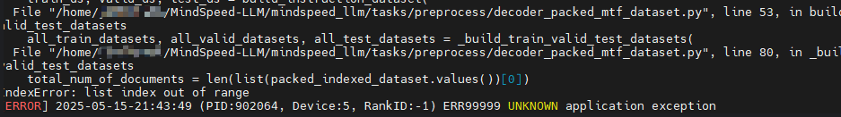

# MindSpeed LLM FAQ

- **问题1**

  Q：训练日志显示"Checkpoint path not found"？

  A：检查`CKPT_LOAD_DIR`是否指向正确的权重转换后路径，确认文件夹内包含`.ckpt`或`.bin`文件，否则请更正权重路径的设置。

- **问题2**

  Q：显示数据集加载"out of range"？

  A：微调脚本未能读取到数据集，请检查脚本中`DATA_PATH`是否符合示例的规范。

  

- **问题3**

  Q：没有生成运行日志文件？

  A：需要自行创建logs文件夹。

  

- **问题4**

  Q: 启动训练时报 dataset xxx not exists 或 AssertionError: alpaca_text_document not exists？

  A: 请先完成数据预处理流程，并确认训练脚本中的 DATA_PATH 或 --data-path 配置正确。对于预训练场景，需要保证 .bin/.idx 文件已成功生成。

- **问题5**

  Q: 权重转换时报错 number of layers should be divisible by the pipeline parallel size？

  A: 模型层数必须能够被 Pipeline Parallel Size（PP）整除。请检查权重转换脚本中的 target_pipeline_parallel_size 配置，或调整 PP 配置后重新执行转换。

- **问题6**

  Q: 训练过程中出现 NPU out of memory (OOM)？

  A: 可通过减小 micro-batch-size、缩短 seq-length、降低并行规模或开启重计算来降低显存占用。同时确认当前硬件规格是否满足对应模型的训练要求。

- **问题7**

  Q: 文档中的数据集格式只写了 Alpaca，是否支持其他格式？

  A: 支持多种指令数据格式，包括 Alpaca、ShareGPT、Pairwise 等，同时支持 .parquet、.json、.jsonl、.csv、.arrow、.txt 等文件格式，通过不同的 handler-name 进行适配。

- **问题8**

  Q: 训练启动时报 Invalid device ID、SetDevice failed 或 NPU 初始化失败？

  A: 当前可见 NPU 数量与启动参数不匹配。例如仅有 2 张 NPU，却使用了 torchrun --nproc_per_node=8。请检查 npu-smi info 输出，并确保 nproc_per_node 与实际设备数量一致。
