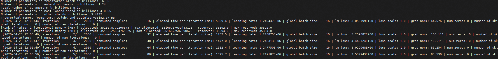

# 快速入门：Qwen3-8B 模型预训练及微调

## 概述

本文档提供了一个简易示例，帮助初次接触MindSpeed LLM的开发者快速启动模型训练任务，并基于预训练语言模型，使用单样本格式数据完成指令单机微调任务。
以下将以Qwen3-8B模型为例，指导开发者完成大语言模型的预训练和微调任务，主要步骤包括：

- 环境准备：根据仓库指导文件搭建环境
- 准备开源模型权重：从HuggingFace下载Qwen3-8B原始模型
- 启动训练任务：在昇腾NPU上进行模型预训练和微调

> [!NOTE]
>
> MindSpeed LLM支持<term>Ascend 950 系列产品</term>、<term>Atlas A3 训练系列产品</term>和<term>Atlas A2 训练系列产品</term>，且要求单NPU的片上内存为64GB及以上，详见[模型支持列表](../models/supported_models.md)。
>
> 当前Qwen3-8B的示例脚本中`NPUS_PER_NODE=8`表示需要8个NPU，如果实际情况低于此配置，可能遇到OOM问题。

开发者入门基础：

- 具备基础的PyTorch使用经验
- 具备初级的Python开发经验
- 对Megatron-LM仓库有基本的了解

## 环境准备

1. 环境搭建

    基于PyTorch框架，环境搭建请参考[MindSpeed LLM安装指导](install_guide.md)。

2. 获取开源模型权重

    通过HuggingFace获取模型权重文件。

    ```shell
    # 创建一个目录存储权重文件
    mkdir -p ./model_from_hf/qwen3_hf
    cd ./model_from_hf/qwen3_hf

    # wget获取权重文件
    wget https://huggingface.co/Qwen/Qwen3-8B/resolve/main/config.json
    wget https://huggingface.co/Qwen/Qwen3-8B/resolve/main/generation_config.json
    wget https://huggingface.co/Qwen/Qwen3-8B/resolve/main/merges.txt
    wget https://huggingface.co/Qwen/Qwen3-8B/resolve/main/model-00001-of-00005.safetensors
    wget https://huggingface.co/Qwen/Qwen3-8B/resolve/main/model-00002-of-00005.safetensors
    wget https://huggingface.co/Qwen/Qwen3-8B/resolve/main/model-00003-of-00005.safetensors
    wget https://huggingface.co/Qwen/Qwen3-8B/resolve/main/model-00004-of-00005.safetensors
    wget https://huggingface.co/Qwen/Qwen3-8B/resolve/main/model-00005-of-00005.safetensors
    wget https://huggingface.co/Qwen/Qwen3-8B/resolve/main/model.safetensors.index.json
    wget https://huggingface.co/Qwen/Qwen3-8B/resolve/main/tokenizer.json
    wget https://huggingface.co/Qwen/Qwen3-8B/resolve/main/tokenizer_config.json
    wget https://huggingface.co/Qwen/Qwen3-8B/resolve/main/vocab.json

    # 利用sha256sum计算sha256数值
    # 打开文件明细可获取sha256值，https://huggingface.co/Qwen/Qwen3-8B/blob/main/model-00001-of-00005.safetensors
    sha256sum ./model-00001-of-00005.safetensors
    sha256sum ./model-00002-of-00005.safetensors
    sha256sum ./model-00003-of-00005.safetensors
    sha256sum ./model-00004-of-00005.safetensors
    sha256sum ./model-00005-of-00005.safetensors
    cd ../..
    ```

3. 获取数据集

    通过HuggingFace获取Alpaca数据集。

    ```shell
    mkdir dataset
    cd dataset/
    # HuggingFace 数据集链接（择一获取）
    wget https://huggingface.co/datasets/tatsu-lab/alpaca/resolve/main/data/train-00000-of-00001-a09b74b3ef9c3b56.parquet
    # ModelScope 数据集链接（择一获取）
    wget https://www.modelscope.cn/datasets/angelala00/tatsu-lab-alpaca/resolve/master/train-00000-of-00001-a09b74b3ef9c3b56.parquet
    cd ..
    ```

4. 设置环境变量

    ```shell
    source /usr/local/Ascend/cann/set_env.sh
    source /usr/local/Ascend/nnal/atb/set_env.sh
    ```

    以上命令以root用户安装后的默认路径为例，请用户根据set_env.sh的实际路径进行替换。

## 启动预训练

在这一阶段，我们将修改预训练示例脚本，启动模型预训练，具体步骤如下：

1. 编辑预训练示例脚本。

    ```shell
    vi examples/mcore/qwen3/pretrain_qwen3_8b_4K_ptd.sh
    ```

2. 修改并保存预训练参数配置，配置示例如下：

    ```bash
    NPUS_PER_NODE=8           # 使用单节点的8卡NPU
    MASTER_ADDR=localhost     # 单机使用本节点ip，多机所有节点都配置为master_ip
    MASTER_PORT=6000          # 本节点端口号为6000
    NNODES=1                  # 根据参与节点数量配置，单机为1，多机即多节点
    NODE_RANK=0               # 单机RANK为0，多机为(0,NNODES-1)，不同节点不可重复，master_node rank为0，其ip为master_ip
    WORLD_SIZE=$(($NPUS_PER_NODE * $NNODES))

    # 根据实际情况配置权重保存、权重加载、词表、数据集路径，多机中所有节点都要有如下数据
    CKPT_SAVE_DIR="./ckpt/qwen3-8b"                # 训练完成后的权重保存路径
    DATA_PATH="./dataset/train-00000-of-00001-a09b74b3ef9c3b56.parquet"     # 数据集路径，填入下载的HuggingFace原数据的路径
    TOKENIZER_PATH="./model_from_hf/qwen3_hf/"     # 词表路径，填入下载的开源权重词表路径
    CKPT_LOAD_DIR="./model_from_hf/qwen3_hf/"      # 权重加载路径，填入下载的HuggingFace权重的路径
    ```

3. 执行预训练脚本。

    ```shell
    bash examples/mcore/qwen3/pretrain_qwen3_8b_4K_ptd.sh
    ```

    **图 1**  启动预训练

    

    脚本中包含训练参数或优化特性，下表为部分参数解释。

    **表 1**  训练脚本参数说明

    |参数名|说明|
    |----|----|
    |`--use-mcore-models`|使用Mcore分支运行模型|
    |`--disable-bias-linear`|去掉linear的偏移值，与Qwen原模型一致|
    |`--group-query-attention`|开启GQA注意力处理机制|
    |`--num-query-groups 8`|配合GQA使用，设置groups为8|
    |`--position-embedding-type rope`|位置编码采用RoPE方案|
    |`--untie-embeddings-and-output-weights`|根据原模型要求将output层和embedding层的权重解耦|
    |`--bf16`|昇腾芯片对bf16精度支持良好，可显著提升训练速度|

> [!NOTE]
>
> - 多机训练需在多个终端同时启动预训练脚本（每个终端的预训练脚本只有NODE_RANK参数不同，其他参数均相同）。
> - 如果使用多机训练，且没有设置数据共享，需要在训练启动脚本中增加`--no-shared-storage`参数，设置此参数之后将会根据分布式参数判断非主节点是否需要load数据，并检查相应缓存和生成数据。

## 启动微调

在这一阶段，我们将修改微调示例脚本，启动模型微调，具体步骤如下：

1. 编辑微调启动示例脚本。

    ```shell
    vi examples/mcore/qwen3/tune_qwen3_8b_4K_full_ptd.sh
    ```

2. 修改并保存微调参数配置，配置示例如下：

    ```bash
    NPUS_PER_NODE=8  # 单节点的卡数
    MASTER_ADDR=localhost
    MASTER_PORT=6000
    NNODES=1
    NODE_RANK=0
    WORLD_SIZE=$(($NPUS_PER_NODE * $NNODES))

    # 根据实际情况配置权重保存、权重加载、词表、数据集路径，多机中所有节点都要有如下数据
    CKPT_LOAD_DIR="./model_from_hf/qwen3_hf/"     # 指向下载的HuggingFace开源权重的位置
    CKPT_SAVE_DIR="./ckpt/qwen3-8b"               # 指向用户指定的微调后权重保存路径
    DATA_PATH="./dataset/train-00000-of-00001-a09b74b3ef9c3b56.parquet"         # 指定获取的数据集原数据路径
    TOKENIZER_PATH="./model_from_hf/qwen3_hf/"    # 指定模型的tokenizer路径
    ```

3. 执行微调脚本。

    ```shell
    bash examples/mcore/qwen3/tune_qwen3_8b_4K_full_ptd.sh
    ```

    **图 2**  启动微调

    

    脚本中包含微调参数或优化特性，下表为部分参数解释。

    **表 2**  微调脚本参数说明

    |参数名|说明|
    |----|----|
    |`--finetune`|启动模型的微调模式。|
    |`--stage`|训练方法。|
    |`--is-instruction-dataset`|用于指定微调过程中采用指令微调数据集，以确保模型依据特定指令数据进行微调。|
    |`--prompt-type`|用于指定模型模板，能够让base模型微调后能具备更好的对话能力。可在[templates.json](../../../../configs/finetune/templates.json)文件内查看`prompt-type`的可选项。|
    |`--no-pad-to-seq-lengths`|支持动态序列长度微调，默认按照8的倍数进行padding。|
    |`--sequence-parallel`|开启序列并行。|
    |`--use-distributed-optimizer`|启用分布式优化器。|
    |`--use-flash-attn`|启用Flash Attention。|
    |`--bf16`|昇腾芯片对bf16精度支持良好，可显著提升训练速度。|
